# Smart Parking Albacete · Plataforma IoT serverless en AWS

> Sistema *end-to-end* de aparcamiento inteligente para el entorno universitario de Albacete: **40 sensores** simulados publicando por MQTT/TLS a **AWS IoT Core**, procesado *serverless* con **Lambda + DynamoDB**, expuesto por **API Gateway REST** (con soporte GeoJSON) y consumido desde un **dashboard Streamlit** con mapa en tiempo real.


---

## Tabla de contenidos

1. [Contexto y objetivo](#1-contexto-y-objetivo)
2. [Demo y capturas](#2-demo-y-capturas)
3. [Arquitectura](#3-arquitectura)
4. [Stack tecnológico](#4-stack-tecnológico)
5. [Características clave](#5-características-clave)
6. [Resultados medidos](#6-resultados-medidos)
7. [Estructura del repositorio](#7-estructura-del-repositorio)
8. [Puesta en marcha](#8-puesta-en-marcha)
9. [Uso del sistema](#9-uso-del-sistema)
10. [API REST](#10-api-rest)
11. [Modelo de datos](#11-modelo-de-datos)
12. [Limitaciones y trabajo futuro](#12-limitaciones-y-trabajo-futuro)
13. [Documentación técnica completa](#13-documentación-técnica-completa)
14. [Autor](#14-autor)

---

## 1. Contexto y objetivo

Trabajo final de la asignatura **Internet de las Cosas y sus Aplicaciones** del *Máster en Big Data y Computación en la Nube* de la **UCLM** (curso 2025-2026). Se plantea una licitación ficticia del **Ayuntamiento de Albacete** para monitorizar en tiempo real las plazas de aparcamiento del **entorno universitario**, exponer su disponibilidad a aplicaciones de movilidad y vehículos conectados (C-V2X), y servir como base para un escalado posterior a toda la ciudad.

**Zona piloto (BBOX real):** `SW 38.976059, -1.858728` → `NE 38.983215, -1.846111`, dividida en 4 sub-zonas operativas (Campus UCLM, Estadio Carlos Belmonte, Hospital Universitario, residencial sur).

**Alcance del prototipo:** despliegue **real** sobre AWS Academy Learner Lab — no es un *mock*. Cada componente (40 *Things* en IoT Core, certificado X.509, *IoT Topic Rule*, 3 funciones Lambda, 2 tablas DynamoDB, API REST publicada) se aprovisiona mediante scripts `boto3` idempotentes y se desmantela con un *teardown* limpio.

---

## 2. Demo y capturas

**Zona piloto — entorno universitario de Albacete:**

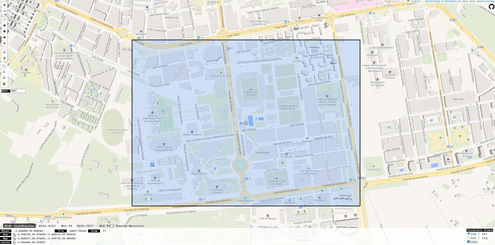

**Dashboard del prototipo consumiendo la API publicada:**

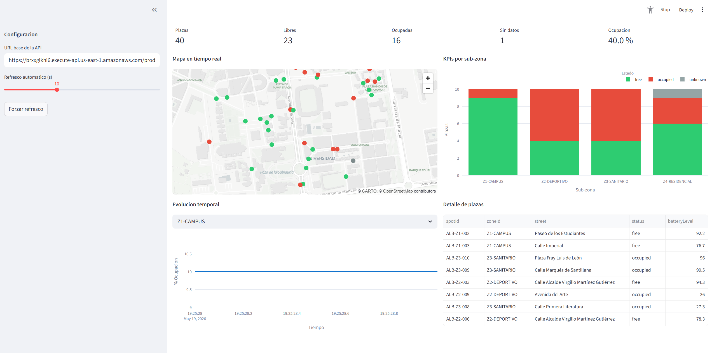

**Evidencias del despliegue AWS usado en la prueba:**

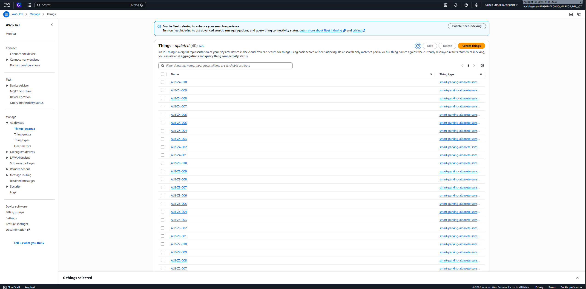

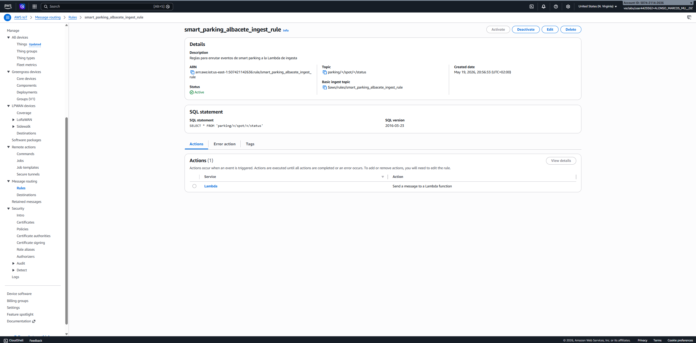

---

## 3. Arquitectura

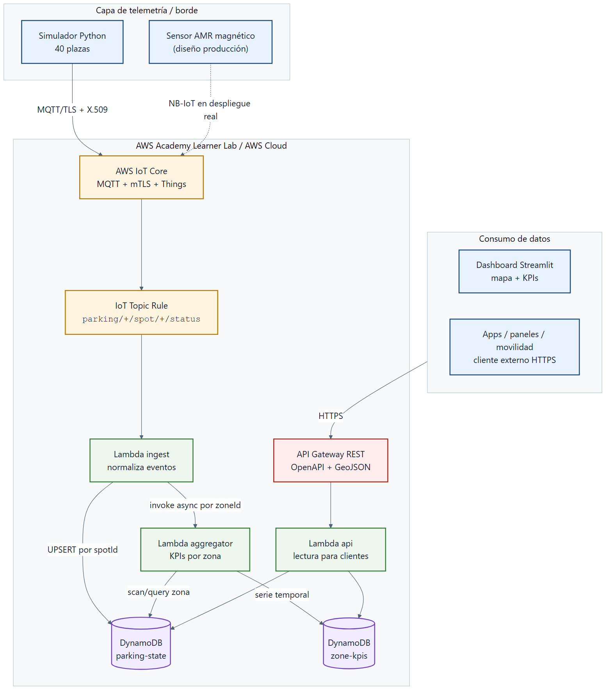

### Flujo de datos

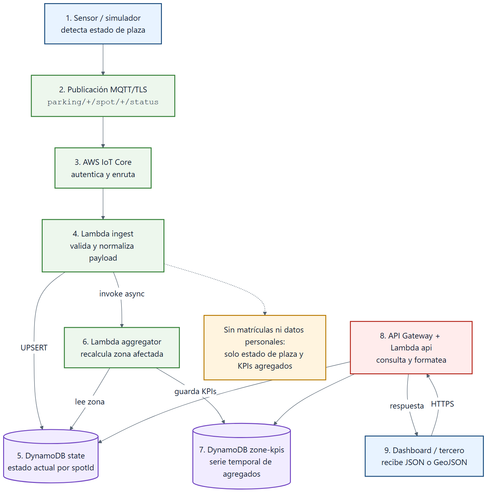

### Escalado

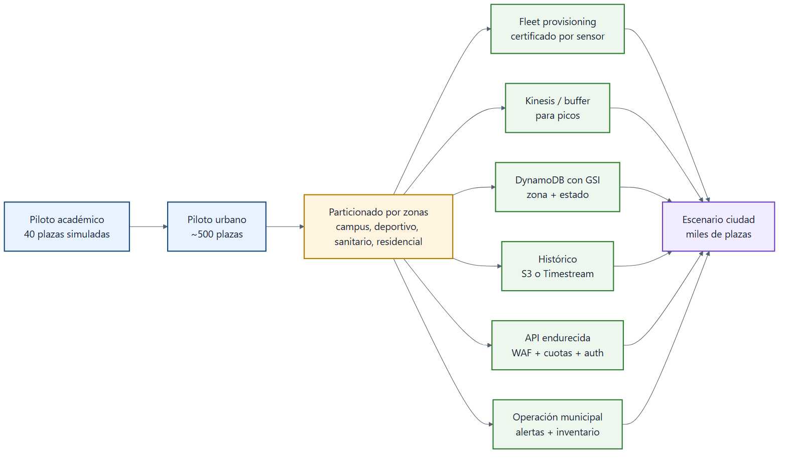

**Decisiones de diseño (resumen).** Todo lo que está a la derecha de IoT Core es infraestructura **serverless real** (paga por uso, multi-AZ por defecto, sin servidores que mantener). El simulador a la izquierda representa la flota física de **sensores magnéticos AMR** sobre **NB-IoT** — descartados explícitamente cámaras ANPR por plaza (privacidad, coste) y Sigfox (incertidumbre comercial). La justificación completa de cada elección está en `memoria/MEMORIA_TECNICA.pdf`.

---

## 4. Stack tecnológico

| Capa | Tecnología | Razón |
|------|-----------|-------|
| Sensor (diseño) | Sensor magnético AMR | >5 años de pila, sin cámara → cumple RGPD, maduro en el sector |
| Conectividad sensor (diseño) | NB-IoT | Cobertura LTE municipal sin desplegar nada propio, ~0,60 €/SIM/mes |
| Ingesta | **AWS IoT Core** (MQTT 3.1.1 + mTLS) | *Broker* gestionado, autenticación X.509 por dispositivo |
| Enrutado | **IoT Topic Rule** (SQL) | Filtra `parking/+/spot/+/status` y dispara la Lambda de ingesta |
| Procesamiento | **AWS Lambda** (Python 3.12) | Serverless puro; *ingest*, *aggregator* y *api handler* desacopladas |
| Estado | **DynamoDB on-demand** — `parking-state` | Latencia ms, absorbe picos sin *throttling* |
| Histórico / KPIs | **DynamoDB on-demand** — `zone-kpis` | PK `zoneId` + SK `windowEnd` → serie temporal nativa |
| API | **API Gateway REST** + OpenAPI 3.0 | Endpoints versionables, integración nativa con Lambda, soporta GeoJSON |
| Dashboard | **Streamlit** + **pydeck** + **plotly** | Mapa con tiles OSM, KPIs en vivo, gráficos interactivos |
| Simulador | **paho-mqtt** + **awsiotsdk** | mTLS contra IoT Core, perfiles de zona realistas |
| IaC | **boto3** + scripts idempotentes | Reproducible al 100 % en una cuenta nueva; *teardown* limpio |
| Lenguaje | **Python 3.13** | Mismo lenguaje en cliente, infra y Lambdas |

---

## 5. Características clave

- **Despliegue 100 % serverless reproducible** desde cero en ~3 minutos con cuatro scripts (`01_setup_iot_core` → `04_setup_api_gateway`).
- **Seguridad por defecto**: mTLS con certificado X.509 y *IoT Policy* restringida a los topics del proyecto (`parking/*` en el piloto; certificado individual por dispositivo en producción).
- **Idempotencia**: cualquier script se puede relanzar sin generar recursos duplicados; el estado del despliegue queda persistido en `infra/infra_state.json`.
- **API estándar y documentada**: especificación OpenAPI 3.0 + soporte GeoJSON RFC 7946 para integración directa con visores cartográficos (Leaflet, MapLibre, `geojson.io`).
- **Dashboard auto-configurado**: lee la URL de la API publicada y arranca sin parámetros.
- **Simulador con patrones realistas**: cada sub-zona tiene un perfil de ocupación distinto (campus, deportivo, hospital, residencial) y simula incluso un sensor caído para ilustrar detección de averías.
- **Teardown limpio**: un único script (`99_teardown.py`) borra en orden seguro toda la infraestructura desplegada.
- **Memoria técnica completa**: memoria en Markdown, LaTeX y PDF, con diagramas y separación entre prototipo implementado y diseño de producción.

---

## 6. Resultados medidos

| Métrica | Valor | Cómo se midió |
|---------|-------|---------------|
| **Latencia end-to-end** (sensor → DynamoDB → API) | **< 2 s** | Diferencia entre *timestamp* de publicación MQTT y `lastUpdated` consultable vía API |
| **Throughput verificado** | 40 sensores · ~4 eventos/min sostenidos | Ejecución continua del simulador durante 3 min sin *throttling* |
| **Tiempo de despliegue completo** | ~3 minutos | Desde `01_setup_iot_core.py` hasta API publicada |
| **Coste estimado del piloto en AWS** | < 5 USD/mes | DynamoDB on-demand + Lambda + IoT Core + API Gateway con tráfico actual |
| **Coste estimado escenario ciudad** (10 000 plazas) | ~600-900 USD/mes en AWS + ~75 €/plaza CAPEX | Extrapolación lineal documentada en el capítulo 10 |

---

## 7. Estructura del repositorio

```text
proyectofinal/
|-- README.md                           <- este documento
|-- memoria/
|   |-- MEMORIA_TECNICA.md              <- memoria unificada en Markdown
|   |-- MEMORIA_TECNICA.tex             <- version LaTeX
|   |-- MEMORIA_TECNICA.pdf             <- PDF final
|   `-- imagenes/
|       |-- bbox.png
|       |-- diagrama_arquitectura.png
|       |-- diagrama_flujo_datos.png
|       `-- diagrama_escalado.png
`-- prototipo/
    |-- README.md
    |-- requirements.txt
    |-- infra/                          <- infraestructura como codigo (boto3)
    |   |-- common.py
    |   |-- 01_setup_iot_core.py        <- Things + certificado + IoT Policy
    |   |-- 02_setup_dynamodb.py        <- 2 tablas on-demand
    |   |-- 03_setup_lambda.py          <- 3 Lambdas + Topic Rule
    |   |-- 04_setup_api_gateway.py     <- REST API + stage prod
    |   |-- 99_teardown.py              <- desmantelamiento limpio
    |   `-- parking_zone_seed.json      <- 40 plazas reales (lat/lon)
    |-- simulator/
    |   |-- parking_sensor.py           <- cliente MQTT/TLS por plaza
    |   `-- fleet_runner.py             <- orquestador de N sensores
    |-- lambdas/
    |   |-- ingest/handler.py           <- UPSERT en parking-state
    |   |-- aggregator/handler.py       <- KPIs por sub-zona
    |   `-- api/handler.py              <- Lambda integrada en API Gateway
    |-- api/openapi.yaml                <- especificacion OpenAPI 3.0
    `-- dashboard/streamlit_app.py      <- dashboard con mapa pydeck
```

---

## 8. Puesta en marcha

### 8.1 Requisitos

- Python 3.11+ (probado en 3.13).
- AWS Academy Learner Lab activo (o cuenta AWS con permisos equivalentes y un rol `LabRole` o similar para las Lambdas).
- Credenciales en `~/.aws/credentials` con región `us-east-1`.

### 8.2 Instalación

```powershell
cd prototipo
python -m pip install -r requirements.txt
```

### 8.3 Despliegue (en orden)

```powershell
python infra/01_setup_iot_core.py      # Things, cert X.509, IoT Policy
python infra/02_setup_dynamodb.py      # 2 tablas on-demand
python infra/03_setup_lambda.py        # 3 Lambdas + IoT Topic Rule
python infra/04_setup_api_gateway.py   # REST API + stage prod
```

La URL pública de la API queda persistida en `prototipo/infra/infra_state.json`.

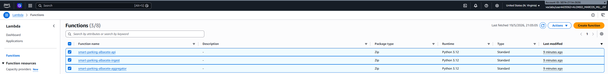

### 8.4 Simulación

```powershell
python simulator/fleet_runner.py --num-spots 40 --duration 180 --heartbeat 20 --tick 2
```

### 8.5 Dashboard

En otra consola (sin parar el simulador):

```powershell
python -m streamlit run dashboard/streamlit_app.py
```

Se abre en `http://localhost:8501` y se autoconfigura leyendo `infra/infra_state.json`.

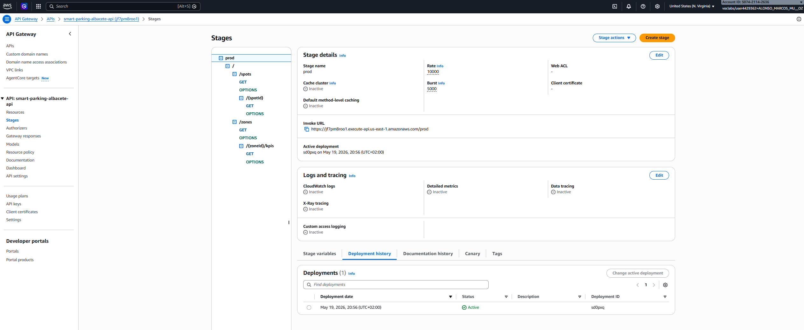

### 8.6 Teardown (al cerrar el lab)

```powershell
python infra/99_teardown.py
```

Borra en orden seguro: API Gateway → Lambdas → IoT Rule → Things → certificado → policy → Thing Group → tablas DynamoDB.

---

## 9. Uso del sistema

### Como operador municipal (dashboard)

KPIs cabecera con plazas libres / ocupadas / sin datos · mapa interactivo de las 40 plazas dentro de la BBOX UCLM · filtro por sub-zona · gráfico de barras de distribución · serie temporal del % de ocupación · tabla detalle filtrable.

### Como sistema externo (vehículo conectado, app móvil, panel informativo)

Consumo directo de la **API REST pública** (OpenAPI 3.0). El endpoint `?format=geojson` devuelve `FeatureCollection` con `properties.color` ya calculado para pintar sobre cualquier visor cartográfico (Leaflet, MapLibre, Google Maps).

---

## 10. API REST

| Verbo | Ruta | Uso |
|-------|------|-----|
| `GET` | `/spots` | Lista completa de plazas |
| `GET` | `/spots?zone=Z1-CAMPUS` | Filtrado por sub-zona |
| `GET` | `/spots?format=geojson` | GeoJSON RFC 7946 para mapas |
| `GET` | `/spots/{spotId}` | Detalle de una plaza |
| `GET` | `/zones` | KPIs vivos por sub-zona |
| `GET` | `/zones/{zoneId}/kpis?limit=N` | Serie temporal de ocupación |

Ejemplo:

```powershell
$base = (Get-Content prototipo/infra/infra_state.json | ConvertFrom-Json).apiBaseUrl
curl "$base/spots?zone=Z2-DEPORTIVO&format=geojson"
curl "$base/zones/Z1-CAMPUS/kpis?limit=10"
```

Especificación completa: `prototipo/api/openapi.yaml`.

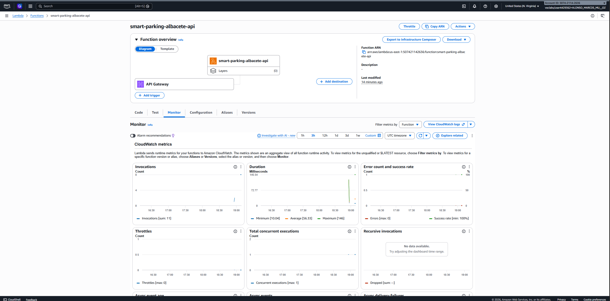

---

## 11. Modelo de datos

**`smart-parking-albacete-state`** (estado actual, PK `spotId`):

| Campo | Tipo | Descripción |
|---|---|---|
| `spotId` | String (PK) | Identificador único de plaza (`ALB-Zx-NNN`) |
| `zoneId` | String | Sub-zona operativa |
| `street`, `lat`, `lon` | String/Number | Ubicación |
| `status` | String | `free` / `occupied` / `unknown` |
| `batteryLevel` | Number | % batería del sensor |
| `confidence` | Number | Confianza de la última medición (0-1) |
| `lastUpdated` | Number | Timestamp ms epoch |

**`smart-parking-albacete-zone-kpis`** (serie temporal, PK `zoneId` + SK `windowEnd`):

| Campo | Tipo | Descripción |
|---|---|---|
| `zoneId` | String (PK) | Sub-zona |
| `windowEnd` | String (SK) | ISO 8601, ordenable |
| `totalSpots`, `freeSpots`, `occupiedSpots`, `unknownSpots` | Number | Conteos |
| `occupancyRate` | Number | Ratio 0-1 |

Se usa `Query` descendente por `windowEnd` para obtener los últimos N KPIs de cada zona.

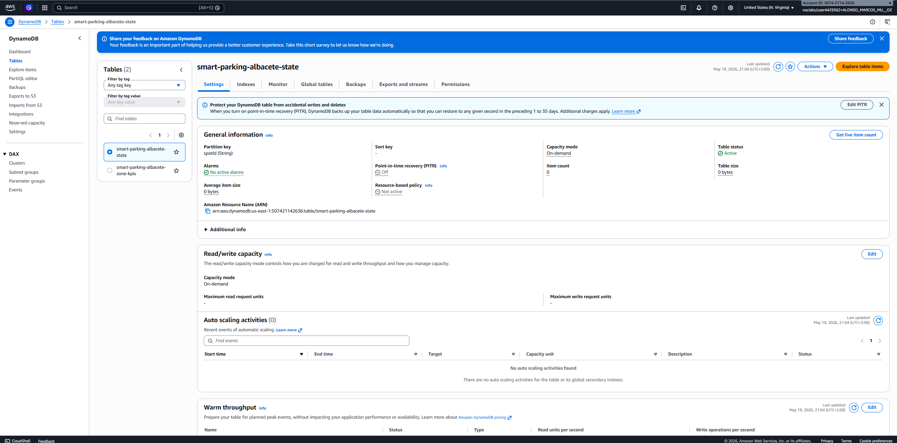

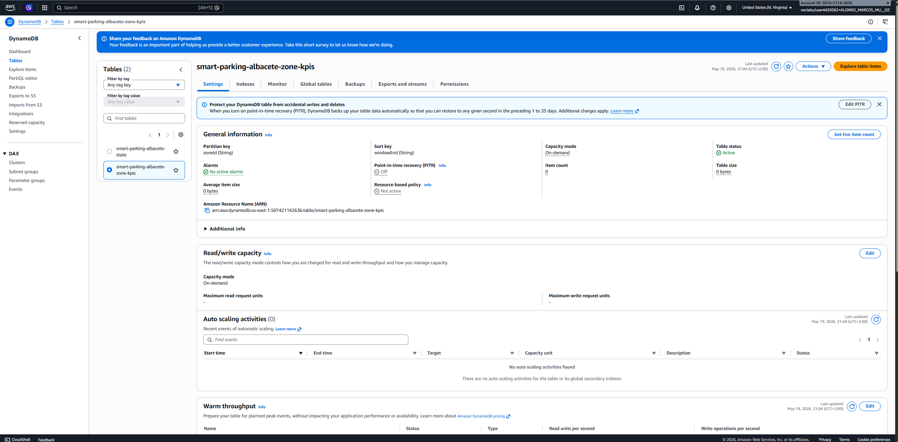

---

## 12. Limitaciones y trabajo futuro

- **Sensores físicos**: el piloto valida la plataforma cloud, no la electrónica del sensor magnético, que se especifica a nivel de diseño.
- **FIWARE / Apache Flink**: documentados a nivel de arquitectura (capítulo 6 de la memoria) como ruta de evolución para el escenario ciudad, no implementados en el piloto.
- **Auth**: en producción se añadiría Cognito + WAF + certificado X.509 *por dispositivo* (no compartido); no se implementan en el piloto porque `LabRole` no permite crear roles IAM propios.
- **Persistencia histórica**: en escenario ciudad se migraría la tabla de KPIs a **Amazon Timestream** (nativo para series temporales).
- **Procesamiento**: para >10 000 plazas con eventos complejos (CEP, ventanas deslizantes) se introduciría **Apache Flink** sobre Amazon Managed Service for Apache Flink.

Detalle completo en el capítulo 12 de la memoria técnica.

---

## 13. Documentación técnica completa

La memoria técnica (PDF compilado con xelatex) cubre en detalle:

| Capítulo | Contenido |
|---|---|
| 01 | Descripción del problema y contexto del cliente |
| 02 | Requisitos funcionales y no funcionales |
| 03 | Capa de telemetría (selección de sensor) |
| 04 | Conectividad (NB-IoT, LoRaWAN, 5G, comparativa) |
| 05 | Arquitectura cloud en AWS (con diagramas) |
| 06 | Integración futura con FIWARE Orion y Apache Flink |
| 07 | Modelo maestro de datos y APIs |
| 08 | Seguridad (mTLS, IoT Policy, RGPD) |

> Archivo: [`memoria/MEMORIA_TECNICA.pdf`](memoria/MEMORIA_TECNICA.pdf)

---

## 14. Autor

**Alonso Marcos Muñoz** — alonso.marcos@alu.uclm.es
*Máster Universitario en Big Data y Computación en la Nube* — Universidad de Castilla-La Mancha (UCLM)
Asignatura: *Internet de las Cosas y sus Aplicaciones* (cód. 311482), curso 2025-2026.

Cliente ficticio del enunciado: **TECO S.L.** · Cliente real (licitador): **Ayuntamiento de Albacete**.

---

> Proyecto académico entregado en mayo de 2026. Toda la infraestructura desplegada en AWS Academy Learner Lab; el *teardown* (`99_teardown.py`) garantiza que no quedan recursos huérfanos al cerrar el laboratorio.
