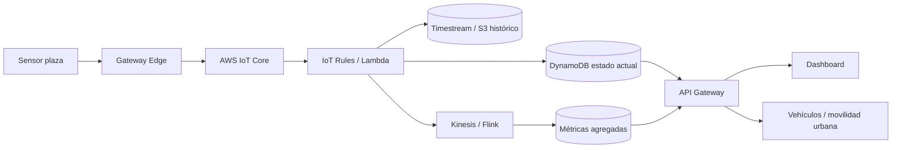
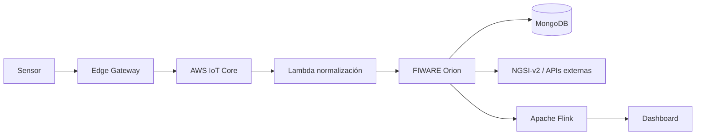

# Guía del proyecto final - Smart Parking IoT

## Contexto para agente IA

Este documento transforma el enunciado del campus virtual en una guía operativa para que un agente pueda planificar, diseñar, implementar y revisar el proyecto final de la asignatura "Internet de las Cosas y sus aplicaciones".

El proyecto consiste en diseñar una solución IoT completa para monitorizar en tiempo real plazas de aparcamiento en una zona piloto de Albacete, cercana a la universidad, y exponer la disponibilidad a sistemas externos como vehículos autónomos o plataformas de movilidad urbana.

## Objetivo del proyecto

Diseñar, justificar e implementar parcialmente una arquitectura IoT completa que cubra:

- Captura de datos físicos mediante sensores.
- Transmisión de datos desde nodos IoT.
- Procesamiento en edge y/o cloud.
- Exposición de información a sistemas externos.
- Escalabilidad desde piloto hasta ciudad completa.

La solución debe permitir conocer en todo momento el estado de ocupación de las plazas con:

- Baja latencia.
- Alta fiabilidad.
- Capacidad de escalado.
- Integración con terceros.

## Cliente y caso de uso

- Cliente ficticio: TECO S.L.
- Licitación: Ayuntamiento de Albacete.
- Dominio: smart city, movilidad urbana, coche autónomo.
- Zona piloto: entorno universitario de Albacete.
- Producto esperado: sistema de smart parking en tiempo real.

## Alcance mínimo

El proyecto debe incluir:

- Documento técnico.
- Arquitectura propuesta con diagramas.
- Análisis de costes aproximado.
- Discusión de escalabilidad.
- Prototipo funcional mínimo.
- Dashboard, panel de control o aplicación sencilla.
- Simulación de la capa de sensorización si no se despliegan sensores reales.

## Requisitos funcionales

El sistema debe:

- Detectar si una plaza está libre u ocupada.
- Asociar cada dato a una plaza o zona.
- Transmitir eventos desde sensores o simuladores.
- Mantener el estado actual de ocupación.
- Mostrar disponibilidad en un dashboard.
- Exponer datos a sistemas externos mediante API.
- Permitir análisis por zona.
- Generar información útil para movilidad urbana.

## Requisitos no funcionales

La solución debe analizar:

- Latencia.
- Cobertura.
- Coste.
- Consumo energético.
- Fiabilidad.
- Seguridad.
- Privacidad.
- Escalabilidad.
- Mantenibilidad.
- Limitaciones de despliegue.

## Capa de telemetría

El agente debe seleccionar y justificar sensores adecuados.

Opciones posibles:

- Sensores magnéticos.
- Cámaras con visión artificial.
- Sensores ultrasónicos.
- Radar.
- LIDAR.
- Sensores ambientales.

### Criterios de selección

Para cada tecnología justificar:

- Precisión.
- Coste unitario.
- Consumo energético.
- Robustez ante clima y tráfico.
- Dificultad de instalación.
- Mantenimiento.
- Riesgos de privacidad.
- Adecuación al piloto y al escenario ciudad.

### Recomendación técnica inicial

Para una solución realista y defendible:

- Usar sensores magnéticos o radar de plaza como opción principal por bajo consumo y detección directa.
- Usar cámaras solo en puntos estratégicos si se necesita visión de zona, evitando depender de ellas para cada plaza por privacidad y complejidad.
- Añadir sensores ambientales solo como información complementaria, no como base de ocupación.

## Recolección y conectividad

El proyecto debe diseñar la estrategia de comunicación.

Tecnologías a considerar:

- 5G NR.
- NB-IoT.
- LoRaWAN.
- WiFi.
- Ethernet.
- C-V2X.

### Criterios de comparación

- Latencia.
- Cobertura.
- Coste de despliegue.
- Coste operativo.
- Consumo energético.
- Disponibilidad de red.
- Capacidad de escalado.
- Adecuación a coche autónomo o movilidad conectada.

### Recomendación técnica inicial

Una arquitectura defendible puede usar:

- LoRaWAN o NB-IoT para sensores de baja potencia.
- Gateway edge por zona para validación y agregación.
- Ethernet, fibra, 5G o red municipal para backhaul.
- C-V2X o API externa para comunicación con sistemas de vehículo conectado, si se justifica como integración futura.

## Arquitectura cloud en AWS

El enunciado exige diseñar una arquitectura cloud con tecnología Amazon AWS.

Debe contemplar:

- Modelado de nodos IoT y sensores.
- Gateway o capa edge.
- Servicios cloud usados.
- Modelo maestro de datos.
- APIs internas.
- APIs expuestas a terceros.
- Procesamiento por nivel.
- Flujo de información extremo a extremo.

### Servicios AWS candidatos

- AWS IoT Core para ingesta IoT.
- AWS IoT Greengrass para edge computing.
- Amazon API Gateway para APIs externas.
- AWS Lambda para lógica serverless.
- Amazon DynamoDB para estado operacional.
- Amazon Timestream o S3 para histórico.
- Amazon Kinesis o Amazon MSK para streaming.
- AWS Glue o Athena para analítica.
- Amazon QuickSight o dashboard propio para visualización.
- Amazon Cognito o IAM para autenticación y autorización.
- Amazon CloudWatch para observabilidad.

## Arquitectura recomendada

## Relación con FIWARE

Aunque el enunciado pide AWS, los temas de la asignatura incluyen FIWARE. El agente puede proponer una integración híbrida si está bien justificada.

Opciones:

- AWS como plataforma cloud principal y FIWARE como capa de contexto interoperable.
- FIWARE Orion como Context Broker desplegado en contenedor dentro de AWS.
- AWS IoT Core como ingesta y Orion como modelo NGSI-v2 para exponer contexto a terceros.

Arquitectura híbrida posible:

## Procesamiento edge y cloud

### En edge

- Lectura de sensores.
- Filtrado de ruido.
- Detección de cambios reales.
- Reintentos ante pérdida de conectividad.
- Caché temporal.
- Agregación simple por zona.

### En cloud

- Normalización de datos.
- Persistencia de estado.
- Histórico.
- Agregaciones.
- APIs.
- Dashboard.
- Seguridad.
- Observabilidad.
- Analítica avanzada.

## Escenarios obligatorios

### Escenario piloto

Debe describirse con detalle.

Parámetros asumibles:

- Zona: entorno universitario de Albacete.
- Plazas: centenares.
- Sensores: uno por plaza o combinación por zona.
- Gateways: varios, según cobertura.
- Latencia objetivo: segundos.
- Dashboard: mapa con ocupación actual.

### Escenario ciudad

Debe escalar a miles de plazas.

Analizar:

- Volumen de eventos.
- Coste de sensores.
- Coste de conectividad.
- Coste cloud.
- Particionado por zonas.
- Alta disponibilidad.
- Observabilidad.
- Seguridad.
- Mantenimiento.

## Volumen de datos

El agente debe estimar el volumen con supuestos explícitos.

Ejemplo:

- 500 plazas en piloto.
- 1 evento por cambio de estado.
- Heartbeat cada 5 minutos.
- Evento medio: 0,5 KB a 2 KB.
- Tráfico piloto: bajo o moderado.
- Ciudad: multiplicar por número de plazas y frecuencia real de rotación.

## Seguridad

Incluir como mínimo:

- Identidad por dispositivo.
- Certificados o credenciales seguras.
- Cifrado en tránsito.
- Control de acceso a APIs.
- Separación entre API pública e interna.
- Registro de eventos.
- Protección ante datos falsos o suplantación.
- Gestión de firmware y actualizaciones.

## Entregables

### Documento técnico

Debe incluir:

- Descripción del problema.
- Características del entorno.
- Requisitos funcionales y no funcionales.
- Supuestos realistas.
- Arquitectura propuesta detallada.
- Diagramas.
- Análisis de costes aproximado.
- Discusión de escalabilidad.
- Limitaciones.
- Seguridad.
- Justificación de decisiones.

### Prototipo funcional mínimo

Debe demostrar:

- Simulación de sensores.
- Flujo completo de datos.
- Ingesta.
- Procesamiento básico.
- Persistencia o estado actual.
- API o endpoint de consulta.
- Dashboard, panel o aplicación sencilla.

## Criterios de evaluación

Se valorará especialmente:

- Coherencia y detalle de la arquitectura.
- Justificación técnica de decisiones.
- Integración de componentes.
- Capacidad de análisis.
- Calidad del prototipo.
- Defensa del proyecto en entrevista personal.

Se penalizarán:

- Soluciones genéricas.
- Decisiones no justificadas.
- Arquitecturas sin conexión clara entre capas.
- Prototipos que no demuestran flujo completo.
- Falta de análisis de escalabilidad o costes.

## Checklist para agente

- [ ] Definir supuestos realistas del piloto.
- [ ] Seleccionar sensores y justificar alternativas.
- [ ] Diseñar conectividad.
- [ ] Diseñar arquitectura edge/cloud.
- [ ] Incluir AWS de forma explícita.
- [ ] Decidir si FIWARE se integra y cómo.
- [ ] Incluir procesamiento streaming si aporta valor.
- [ ] Diseñar modelo de datos.
- [ ] Diseñar APIs.
- [ ] Incluir dashboard.
- [ ] Estimar costes.
- [ ] Analizar piloto y ciudad.
- [ ] Documentar seguridad.
- [ ] Preparar defensa técnica.

## Preguntas que el agente debe poder responder en defensa

- Por qué se eligieron esos sensores.
- Qué ocurre si falla un sensor o gateway.
- Cómo se evita reportar falsos libres u ocupados.
- Cómo escala la arquitectura de 500 a 10.000 plazas.
- Qué latencia se espera y de dónde sale.
- Qué datos se almacenan como estado y cuáles como histórico.
- Cómo se protegen las APIs.
- Qué parte implementa realmente el prototipo.
- Qué limitaciones tiene la solución.
