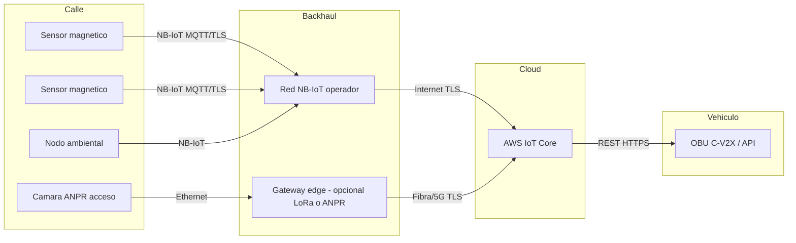

# 04. Conectividad y recolección de datos

La conectividad es probablemente la decisión que más condiciona el TCO del proyecto: una vez instalado, el sensor genera tráfico durante años y la elección equivocada de red puede multiplicar el coste operativo por 10. Este capítulo describe la estrategia de comunicación adoptada, compara las tecnologías candidatas y presenta un plan de despliegue preliminar.

## 4.1 Criterios de evaluación

| Criterio | Por qué importa |
|----------|------------------|
| Latencia | Determina el objetivo de RNF-01 (≤ 5 s end-to-end). |
| Cobertura | Define si hace falta desplegar infraestructura propia (gateways). |
| Coste de despliegue (CAPEX) | Inversión inicial: gateways, antenas, alimentación. |
| Coste operativo (OPEX) | Suscripción SIM, mantenimiento del backhaul. |
| Consumo energético del nodo | Determina la vida útil de la batería del sensor. |
| Disponibilidad de red | Cobertura real medida en la zona; SLA del operador. |
| Escalabilidad | Capacidad de añadir miles de nodos sin saturar. |
| Idoneidad para V2X | Soporte futuro al diálogo con vehículos conectados. |

## 4.2 Tecnologías candidatas y análisis

### 4.2.1 NB-IoT (3GPP LPWAN sobre LTE)

- **Latencia típica**: 1,6-10 s (modo CP, half-duplex).
- **Cobertura**: usa la infraestructura LTE existente; Albacete está cubierta por los tres operadores nacionales (Movistar, Vodafone, Orange).
- **CAPEX**: 0 € (red del operador).
- **OPEX**: 0,30-1,00 €/SIM/mes en contratos M2M de gran volumen.
- **Consumo**: muy bajo (modo PSM y eDRX); permite >5 años con pila D.
- **Pros**: cobertura nacional, sin gateways propios, soporte certificado.
- **Contras**: dependencia del operador; cuotas mínimas por SIM.

### 4.2.2 LoRaWAN

- **Latencia típica**: 1-2 s en clase A (depende del downlink).
- **Cobertura**: red privada (gateways propios) o The Things Network (cobertura parcial).
- **CAPEX**: ~600-1500 € por gateway exterior; con 3-4 gateways se cubre la BBOX.
- **OPEX**: ~0 (red privada); o cuota TTN Industries.
- **Consumo**: muy bajo, comparable a NB-IoT.
- **Pros**: control total, sin dependencia de operador; ideal en zonas industriales o municipales con red propia.
- **Contras**: capacidad de downlink limitada; gestión de la red municipal recae en TECO S.L. o el ayuntamiento.

### 4.2.3 Sigfox

- Cobertura europea madura pero **incertidumbre comercial** tras la quiebra de la matriz en 2022 y la reorganización posterior. Se descarta por riesgo de continuidad.

### 4.2.4 Wi-Fi / Ethernet

- **Latencia**: <100 ms.
- **Cobertura**: limitada al edificio o radio del AP; no aplicable a plazas exteriores en cordón.
- **Consumo**: alto; incompatible con el modelo de pila.
- **Uso adecuado**: gateways edge, cámaras, paneles de mensajería variable, no sensores.

### 4.2.5 5G NR

- **Latencia**: <10 ms en URLLC; 30-50 ms en eMBB.
- **Cobertura**: en expansión; en zona piloto disponible parcialmente.
- **Consumo y coste por sensor**: aún elevados frente a NB-IoT.
- **Uso adecuado**: backhaul de gateways edge, cámaras ANPR, conexión a vehículo conectado.

### 4.2.6 C-V2X (Cellular V2X)

- Tecnología específica para comunicación vehículo-infraestructura sobre LTE/5G.
- En este proyecto se considera **como interfaz de salida** hacia los vehículos autónomos, no como red de subida del sensor. El sistema expone los datos vía API REST y, si el operador del vehículo dispone de OBU C-V2X, puede consumir esa misma información a través de un broker MEC.

## 4.3 Decisión razonada

| Capa | Tecnología | Razones |
|------|-----------|---------|
| Sensor → Cloud | **NB-IoT** | Cobertura municipal sin desplegar infraestructura; OPEX bajo; consumo compatible con vida útil multianual. |
| Plan B / red privada | **LoRaWAN** | En zonas donde el ayuntamiento ya disponga de gateways propios, se prefiere por independencia y coste cero por mensaje. |
| Backhaul gateway / cámara | **Ethernet / fibra / 5G** | Necesario para volumen y alimentación eléctrica. |
| Comunicación con vehículo autónomo | **API REST (HTTPS) + C-V2X (futuro)** | Estándar y desacoplado; permite a cualquier OEM consumir. |

Esta combinación es **defendible y realista**: refleja la práctica habitual de los proyectos de smart parking municipales actualmente en operación en España (Santander, Málaga, Pontevedra) donde el grueso de la flota va sobre NB-IoT/LoRaWAN y los puntos críticos sobre fibra/5G.

## 4.4 Plan de despliegue preliminar

### Fase 0 – Diseño detallado y permisos (semanas 1-4)

- Mapa exacto de plazas a sensorizar (≈ 500) con coordenadas, dimensiones y prioridades.
- Coordinación con la Concejalía de Movilidad y la EMT para cortes nocturnos.
- Acuerdo con operador NB-IoT (tarifa SIM M2M, ventana de provisión, APN privado).
- Acuerdo con el responsable de la red WAN municipal para el backhaul de los gateways y cámaras.

### Fase 1 – Piloto técnico (semanas 5-10)

- Despliegue de los **3 gateways edge** (Z1, Z2/Z3, Z4) sobre farolas o mobiliario urbano municipal, alimentados por la red eléctrica de alumbrado público.
- Instalación de **20 sensores piloto** en Z1-CAMPUS para validar señal, consumo y patrones.
- Despliegue del backend AWS (esta memoria).
- Validación operativa durante 2-3 semanas.

### Fase 2 – Despliegue completo del piloto (semanas 11-20)

- Instalación nocturna de los ~500 sensores restantes (cuadrillas de 2 personas, ~35 sensores/noche).
- 6-8 cámaras ANPR en los accesos.
- 4 nodos ambientales puntuales.
- Onboarding masivo en IoT Core mediante AWS IoT Provisioning Templates.

### Fase 3 – Operación y métricas (mes 6-12)

- KPIs de servicio: % uptime, latencia E2E, tasa de falsos positivos, % de baterías sustituidas.
- Iteración del modelo de Lambda agregador en función de los patrones observados.
- Integración con el sistema municipal de paneles de mensajería variable.

### Fase 4 – Escalado a ciudad (año 2)

- Onboarding por barrios; despliegue de gateways adicionales si LoRaWAN es la red elegida.
- Integración con C-V2X (RSU / MEC) si el ayuntamiento o un OEM lo solicitan.
- Migración del histórico operacional a Amazon Timestream o S3 + Athena.

## 4.5 Estimación de tráfico

Asumiendo el escenario de operación normal:

- 500 plazas × 5 cambios/día medios = 2500 eventos de cambio/día.
- 500 plazas × 288 heartbeats/día (cada 5 min) = 144 000 eventos/día.
- Tamaño medio del payload: 0,5-2 KB.
- Volumen diario: ~150 000 mensajes / ~150 MB / día.
- Volumen pico (evento deportivo): hasta 1000 cambios/min durante 15 min.

Estos números son perfectamente asumibles tanto por NB-IoT (canal por sector LTE) como por la combinación AWS IoT Core + Lambda + DynamoDB on-demand, según se detalla en los capítulos 9 y 10.

## 4.6 Diagrama de red

