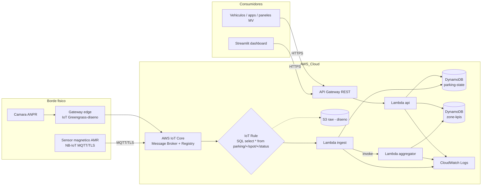

# 05. Arquitectura cloud en AWS

Este capítulo describe la arquitectura cloud completa desplegada en AWS para el piloto. Se justifican los servicios elegidos, se enseña el flujo de información extremo a extremo y se detalla qué responsabilidad asume cada nivel (edge vs cloud).

## 5.1 Servicios AWS utilizados

| Servicio | Rol en la solución | Justificación |
|----------|---------------------|----------------|
| **AWS IoT Core** | Broker MQTT/TLS, registro de Things, certificados, IoT Rules. | Servicio gestionado, integración nativa con resto de AWS, mTLS estándar industrial. |
| **AWS IoT Rule** | Filtrado SQL del topic y enrutado a Lambda. | Sin servidores; precio por evento; permite múltiples acciones. |
| **AWS Lambda** | Funciones de ingesta, agregación y API. | Serverless, paga por uso, integración directa con IoT, DynamoDB y API Gateway. |
| **Amazon DynamoDB** | Estado actual + serie temporal de KPIs. | Latencia ms; on-demand absorbe picos; modelado clave-valor sencillo. |
| **Amazon API Gateway** | Fachada REST hacia terceros y dashboard. | TLS, throttling, cuotas, autenticación, integración nativa con Lambda. |
| **Amazon S3** (futuro/diseño) | Data lake bronze (raw events). | Persistencia barata; integrable con Athena/Glue. |
| **AWS IoT Greengrass** (diseño) | Edge computing en gateway de zona. | Para preprocesado y operación local sin conectividad. |
| **Amazon CloudWatch** | Logs y métricas de las Lambdas y reglas IoT. | Incluido por defecto, observabilidad inmediata. |
| **IAM (LabRole)** | Identidad de las Lambdas. | Restricción del AWS Academy: no se pueden crear roles propios. |

Servicios **diseñados pero no desplegados** en el prototipo (por restricciones del lab o por enfoque): IoT Greengrass, Timestream, Kinesis Data Streams, Cognito, QuickSight.

## 5.2 Diagrama de arquitectura (general)



## 5.3 Flujo de información extremo a extremo

1. **Sensor**: detecta cambio de estado, aplica debounce y publica un mensaje JSON en `parking/{zoneId}/spot/{spotId}/status` mediante MQTT/TLS contra el endpoint `iot:Data-ATS` de IoT Core.
2. **IoT Core**: autentica mediante mTLS (certificado X.509), valida la policy adjunta y entrega el mensaje al broker.
3. **IoT Rule**: la regla `smart_parking_albacete_ingest_rule` filtra todos los topics que casan con `parking/+/spot/+/status` mediante el SQL `SELECT * FROM 'parking/+/spot/+/status'` y dispara una acción Lambda.
4. **Lambda ingest** (`smart-parking-albacete-ingest`): normaliza el payload, hace UPSERT en `parking-state`, y si el estado cambia respecto al anterior, invoca de forma asíncrona a la Lambda agregador con el `zoneId`.
5. **Lambda aggregator** (`smart-parking-albacete-aggregator`): hace un scan filtrado por zona en `parking-state`, calcula libres/ocupadas/ratio y escribe una fila en `zone-kpis` con la marca temporal `windowEnd`.
6. **API Gateway** expone los endpoints REST (`/spots`, `/spots/{id}`, `/zones`, `/zones/{id}/kpis`) y los integra con la Lambda `smart-parking-albacete-api`, que consulta DynamoDB y formatea la respuesta (JSON o GeoJSON).
7. **Cliente** (dashboard Streamlit o un tercero) consume la API por HTTPS.
8. **CloudWatch** recoge automáticamente logs y métricas de cada Lambda.

## 5.4 Modelado de los nodos en IoT Core

Cada plaza se modela como un **Thing** dentro de un **Thing Type** común (`smart-parking-albacete-sensor-type`) y de un **Thing Group** (`smart-parking-albacete-fleet`) que facilita acciones masivas (despliegue OTA, búsqueda por atributos).

Cada Thing lleva como atributos buscables (`searchableAttributes`):

- `zoneId`: sub-zona operacional (Z1-CAMPUS, Z2-DEPORTIVO, Z3-SANITARIO, Z4-RESIDENCIAL).
- `street`: nombre de calle (sanitizado para cumplir las restricciones de IoT).
- `lat`, `lon`: coordenadas geográficas.

Todos los Things del piloto comparten un único **certificado X.509** y una única **policy** (`smart-parking-albacete-sensor-policy`). En producción se generaría un certificado por dispositivo para revocaciones granulares; en el piloto se prioriza simplicidad operativa.

La policy autoriza únicamente las acciones MQTT necesarias y solo en los topics del proyecto:

```json
{
  "Version": "2012-10-17",
  "Statement": [
    {"Effect": "Allow", "Action": "iot:Connect", "Resource": "*"},
    {"Effect": "Allow", "Action": "iot:Publish",   "Resource": "arn:aws:iot:*:*:topic/parking/*"},
    {"Effect": "Allow", "Action": "iot:Subscribe", "Resource": "arn:aws:iot:*:*:topicfilter/parking/*"},
    {"Effect": "Allow", "Action": "iot:Receive",   "Resource": "arn:aws:iot:*:*:topic/parking/*"}
  ]
}
```

## 5.5 Capa edge

La guía del proyecto distingue claramente entre procesamiento **en edge** y **en cloud**. En el diseño:

### En edge (Gateway con AWS IoT Greengrass v2 – diseño)

- Recogida de los sensores que no hablan NB-IoT directamente (LoRaWAN, Bluetooth de servicio).
- Filtrado de ruido (descartar lecturas espurias del magnetómetro).
- **Debounce y detección de cambios reales**: evita que un coche que apaga el motor y arranca rápido genere dos eventos.
- **Caché temporal** si la conexión a AWS está caída: hasta 24 horas de buffer con reenvío al recuperarse.
- **Agregación simple por zona** para reducir tráfico (por ejemplo, enviar "8 plazas libres en Z2-DEPORTIVO" como evento agregado en vez de los 8 individuales en intervalos cortos).
- **Procesamiento de cámaras ANPR**: ejecución local de un modelo ligero que solo envía a la cloud un evento con dirección y matrícula hash (sin texto plano).

### En cloud (lo implementado realmente)

- **Normalización** del payload (Lambda ingest).
- **Persistencia del estado actual** (DynamoDB `parking-state`).
- **Cálculo de agregados** (Lambda aggregator → DynamoDB `zone-kpis`).
- **Histórico operacional** como serie temporal.
- **APIs** internas y externas.
- **Seguridad** (mTLS, IAM, RGPD).
- **Observabilidad** (CloudWatch).
- **Analítica avanzada** (S3 raw + Athena en escenario ciudad).

## 5.6 Patrones de comunicación

- **Sensor → IoT Core**: pub MQTT QoS 1 sobre TLS 1.2.
- **IoT Rule → Lambda**: invocación síncrona del runtime IoT (mantiene la semántica QoS 1).
- **Lambda ingest → Lambda aggregator**: invocación asíncrona (`InvocationType=Event`) para no bloquear la ingesta.
- **API Gateway → Lambda api**: integración AWS_PROXY, sin transformaciones en el gateway.
- **CORS habilitado** en la API para que el dashboard (servido en `localhost:8501`) pueda consumirla.

## 5.7 Modelo serverless y trade-offs

La elección de IoT Core + Lambda + DynamoDB + API Gateway responde a un patrón **serverless puro**:

| Ventaja | Justificación |
|---------|---------------|
| Sin servidores que mantener | El equipo se centra en el problema de negocio. |
| Coste proporcional al uso | Si no hay tráfico, no hay coste. |
| Escalado automático | Lambda y DynamoDB on-demand absorben picos sin reconfigurar. |
| Alta disponibilidad nativa | Multi-AZ por defecto en cada servicio gestionado. |

| Limitación | Mitigación |
|------------|-----------|
| Cold-start de Lambda | Manejable en este caso (< 500 ms en Python 3.12). Para producción crítica, Provisioned Concurrency. |
| Escaneos en DynamoDB | Aceptable para el volumen del piloto. En ciudad: GSI o particionado. |
| Coste por evento puede crecer con el volumen | En ciudad, evaluar Kinesis + Flink para batchear. |

## 5.8 Implementación efectiva en el prototipo (resumen)

| Recurso | Nombre | Estado |
|---------|--------|--------|
| Thing Type | `smart-parking-albacete-sensor-type` | Creado |
| Thing Group | `smart-parking-albacete-fleet` | Creado |
| Things | `ALB-Z1-001` ... `ALB-Z4-010` (40 unidades) | Creados |
| Certificado X.509 | Compartido | Creado |
| IoT Policy | `smart-parking-albacete-sensor-policy` | Creada |
| IoT Topic Rule | `smart_parking_albacete_ingest_rule` | Creada |
| Tabla DynamoDB | `smart-parking-albacete-state` | Creada |
| Tabla DynamoDB | `smart-parking-albacete-zone-kpis` | Creada |
| Lambda | `smart-parking-albacete-ingest` | Desplegada |
| Lambda | `smart-parking-albacete-aggregator` | Desplegada |
| Lambda | `smart-parking-albacete-api` | Desplegada |
| API Gateway | `smart-parking-albacete-api` (id `85fbp0svzc`) | Desplegada en stage `prod` |
| URL pública | `https://85fbp0svzc.execute-api.us-east-1.amazonaws.com/prod` | Operativa durante la sesión del lab |

El cuaderno de despliegue, comandos exactos y verificación end-to-end están en el `README_GUIA.md` raíz y en el capítulo 11.
