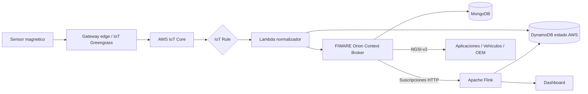
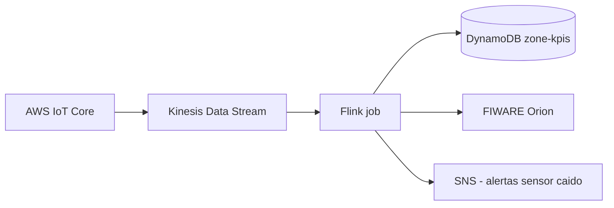

# 06. Integración con FIWARE y Apache Flink (diseño)

El enunciado del campus virtual exige una arquitectura cloud sobre AWS. Sin embargo, los temas 4 y 5 de la asignatura introducen **FIWARE** (con Orion Context Broker y la API NGSI-v2) y **Apache Flink** como pieza de procesamiento de streams. Este capítulo razona cómo integrar ambos componentes en la solución, qué ventajas aportan respecto a la arquitectura serverless básica, y por qué se ha decidido **documentarlos en el diseño sin incluirlos en la implementación del prototipo**.

## 6.1 Por qué considerar FIWARE en un proyecto sobre AWS

FIWARE es un ecosistema *open source* impulsado por la Unión Europea y adoptado masivamente por proyectos de smart cities a nivel europeo. Sus puntos fuertes son:

- **Modelo de datos compartido** (NGSI-v2 y, más recientemente, NGSI-LD) que facilita la **interoperabilidad** entre ciudades y entre dominios verticales (movilidad, calidad del aire, residuos…).
- **Catálogo de Smart Data Models** estandarizados (existen modelos específicos para `Parking`, `ParkingSpot`, `OffStreetParking`, `OnStreetParking`).
- **Orion Context Broker** como gestor de contexto en tiempo real con un mecanismo nativo de **suscripciones** (push) hacia consumidores arbitrarios.

Para un ayuntamiento, adoptar (al menos a nivel de contrato de API) NGSI-v2 simplifica:

- La participación en redes europeas de smart cities (proyectos H2020 / Horizon Europe).
- La sustitución del proveedor cloud sin que las aplicaciones consumidoras tengan que rehacerse.
- La compatibilidad con proyectos del propio ayuntamiento ya basados en FIWARE.

## 6.2 Arquitectura híbrida AWS + FIWARE

La propuesta de TECO S.L. para fases posteriores del proyecto contempla una **arquitectura híbrida** en la que AWS sigue siendo la espina dorsal de ingesta y persistencia (decisión imposible de revertir tras la inversión del piloto) y FIWARE Orion actúa como capa de **contexto interoperable** expuesta a terceros y a otros dominios verticales municipales.



Patrón de operación propuesto:

1. El sensor publica MQTT como hasta ahora.
2. La IoT Rule sigue invocando la Lambda de ingesta, que:
   - Persiste el estado en DynamoDB (rápido, gestionado, sin downtime).
   - Hace un POST a Orion (`/v2/entities/{id}/attrs`) con el nuevo estado, manteniendo el contexto NGSI-v2 sincronizado.
3. Orion ofrece la API estándar a terceros que la prefieran a la REST nativa.
4. Orion notifica a Flink mediante una suscripción HTTP cada vez que cambia el atributo `status`.
5. Flink calcula agregados por ventanas y los devuelve a DynamoDB o a una nueva entidad NGSI-v2 (`Zone:UCLM:A` con atributos `freeSpots`, `occupiedSpots`, `occupancyRate`).

## 6.3 Modelo de entidades NGSI-v2

Para alinearse con los Smart Data Models públicos:

### Entidad `ParkingSpot`

```json
{
  "id": "ParkingSpot:Albacete:ALB-Z1-001",
  "type": "ParkingSpot",
  "status": {
    "type": "Text",
    "value": "free",
    "metadata": {
      "timestamp": {
        "type": "DateTime",
        "value": "2026-05-16T10:00:00Z"
      }
    }
  },
  "location": {
    "type": "geo:json",
    "value": {"type": "Point", "coordinates": [-1.85745, 38.97765]}
  },
  "refParkingZone": {"type": "Relationship", "value": "ParkingZone:Albacete:Z1-CAMPUS"},
  "refParkingSensor": {"type": "Relationship", "value": "ParkingSensor:Albacete:ALB-Z1-001"}
}
```

### Entidad `ParkingSensor`

```json
{
  "id": "ParkingSensor:Albacete:ALB-Z1-001",
  "type": "ParkingSensor",
  "sensorType": {"type": "Text", "value": "magnetic"},
  "batteryLevel": {"type": "Number", "value": 92},
  "assignedSpot": {"type": "Relationship", "value": "ParkingSpot:Albacete:ALB-Z1-001"}
}
```

### Entidad `ParkingZone`

```json
{
  "id": "ParkingZone:Albacete:Z1-CAMPUS",
  "type": "ParkingZone",
  "totalSpots": {"type": "Number", "value": 125},
  "freeSpots":  {"type": "Number", "value": 56},
  "occupancyRate": {"type": "Number", "value": 0.55}
}
```

## 6.4 Apache Flink: cuándo y para qué

Para el **piloto** (≈500 plazas, ~150 000 eventos/día), una Lambda agregador escrita en Python es más que suficiente: latencia milisegundo, coste mensual irrelevante, complejidad de mantenimiento nula.

En cambio, en el **escenario ciudad** (≥ 10 000 plazas, ≥ 3 000 000 eventos/día) Flink aporta ventajas que justifican introducirlo:

| Capacidad de Flink | Aplicación en smart parking |
|---------------------|------------------------------|
| **Procesamiento de streams** real (ventanas, watermarks) | Cálculo continuo de ocupación con tolerancia a eventos fuera de orden. |
| **Ventanas tumbling** | KPIs por intervalo fijo (cada 1 min, 5 min, 1 h) sin recalcular toda la zona. |
| **Ventanas sliding** | Tendencias suavizadas (% ocupación últimos 10 min refrescado cada 1 min) para paneles ciudadanos. |
| **Ventanas session** | Tiempo medio de estacionamiento real por plaza, base para tarificación dinámica. |
| **CEP (Complex Event Processing)** | Detección de patrones: sensores que reportan ocupación con intermitencia anómala (signo de avería). |
| **Escalabilidad horizontal** | Paralelización por particiones del topic Kafka/Kinesis. |

Patrón típico recomendado:



Snippet conceptual de un job Flink que produce ocupación por zona cada minuto:

```java
DataStream<ParkingEvent> events = env
    .addSource(kinesisSource)
    .assignTimestampsAndWatermarks(WatermarkStrategy
        .<ParkingEvent>forBoundedOutOfOrderness(Duration.ofSeconds(10))
        .withTimestampAssigner((e, t) -> e.timestamp));

events
    .keyBy(ParkingEvent::getZoneId)
    .window(TumblingEventTimeWindows.of(Time.minutes(1)))
    .aggregate(new ZoneOccupancyAggregator())
    .addSink(new DynamoDBSink(kpisTable));
```

## 6.5 Decisión final: implementar solo en AWS para el piloto

Razones para **no** desplegar FIWARE/Flink en el prototipo:

1. El AWS Academy Learner Lab tiene 3 h de vida y permisos restringidos (no se pueden crear roles IAM nuevos para servicios fuera de AWS).
2. Levantar Orion + MongoDB + Flink añade ~3 contenedores Docker y, en una sesión académica, multiplica los puntos de fallo sin aportar valor académico extra (los conceptos quedan demostrados con la implementación AWS y este diseño).
3. La curva de coste/beneficio de Flink solo es positiva en el escenario ciudad. En el piloto, la Lambda agregador cumple los requisitos con un orden de magnitud menos de complejidad.
4. La interoperabilidad NGSI-v2 puede **simularse a nivel de contrato**: el cliente que quiera consumir vía NGSI-v2 verá la misma información que la API REST nativa, y la Lambda API podría exponer una segunda ruta que emule el formato NGSI-v2 a partir de DynamoDB (trabajo futuro de bajo coste).

## 6.6 Mapping AWS REST ↔ NGSI-v2 (referencia para defensa)

| Endpoint REST (esta solución) | Endpoint NGSI-v2 equivalente |
|-------------------------------|------------------------------|
| `GET /spots`                  | `GET /v2/entities?type=ParkingSpot` |
| `GET /spots/{id}`             | `GET /v2/entities/{id}` |
| `GET /zones`                  | `GET /v2/entities?type=ParkingZone` |
| `GET /zones/{id}/kpis`        | `GET /v2/entities/{id}?attrs=freeSpots,occupiedSpots,occupancyRate` (más histórico en STH-Comet o Cygnus) |
| Notificación push a tercero   | `POST /v2/subscriptions` con `notification.http.url` |
