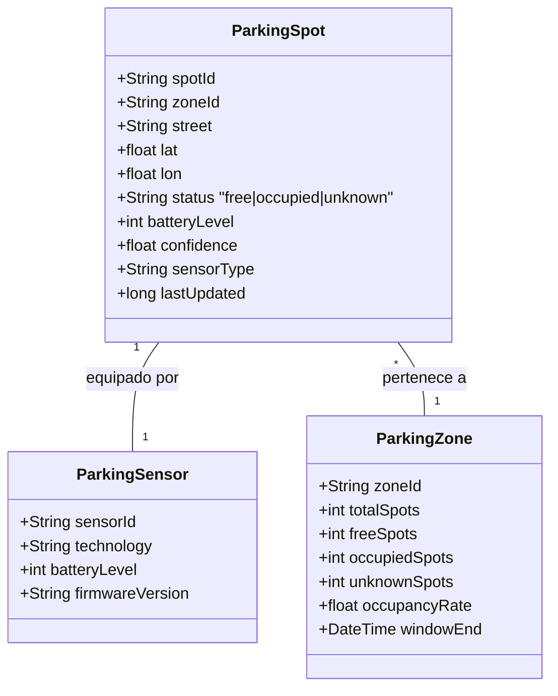

# 07. Modelo maestro de datos y APIs

Este capítulo formaliza el **modelo de datos** que circula y se persiste en el sistema, así como la **API REST** que se expone al dashboard, a las aplicaciones del operador y a sistemas de terceros (vehículos autónomos, plataformas municipales de movilidad).

## 7.1 Modelo conceptual

Las entidades principales del dominio son:



## 7.2 Modelado físico en DynamoDB

### Tabla `smart-parking-albacete-state`

| Atributo | Tipo | Rol |
|----------|------|-----|
| `spotId` | String | Clave de partición (PK) |
| `zoneId` | String | Sub-zona |
| `street` | String | Calle |
| `lat`, `lon` | Number | Coordenadas |
| `status` | String | `free` / `occupied` / `unknown` |
| `batteryLevel` | Number | % batería |
| `confidence` | Number | Confianza de la última medición |
| `sensorType` | String | `magnetic` por defecto |
| `lastUpdated` | Number | Timestamp ms epoch |

Modo de facturación: **PAY_PER_REQUEST** (on-demand): elimina la necesidad de provisionar capacidad y absorbe picos sin throttling.

Operaciones más frecuentes:

- `PutItem` (UPSERT) desde Lambda ingest.
- `Scan` filtrado por `zoneId` desde Lambda aggregator y Lambda api.

En escenario ciudad se introduciría un **GSI** con `zoneId` como PK para sustituir el `Scan + Filter` por `Query`.

### Tabla `smart-parking-albacete-zone-kpis`

| Atributo | Tipo | Rol |
|----------|------|-----|
| `zoneId` | String | Clave de partición (PK) |
| `windowEnd` | String | Clave de ordenación (SK), ISO 8601 |
| `totalSpots` | Number | Plazas totales en la zona |
| `freeSpots` | Number | Plazas libres |
| `occupiedSpots` | Number | Plazas ocupadas |
| `unknownSpots` | Number | Plazas sin datos |
| `occupancyRate` | Number | Ratio 0..1 |
| `computedAtMs` | Number | Timestamp ms del cálculo |

Esta tabla actúa como **serie temporal** indexada por zona. Permite consultas como "últimos N KPIs de Z1-CAMPUS" con `Query` natural (descendiente por `windowEnd`).

En el escenario ciudad esta tabla podría migrarse a **Amazon Timestream** para aprovechar funciones temporales nativas y agregaciones eficientes.

## 7.3 Esquema del payload MQTT (sensor → IoT Core)

```json
{
  "spotId": "ALB-Z1-001",
  "zoneId": "Z1-CAMPUS",
  "street": "C. Imperial",
  "lat": 38.97765,
  "lon": -1.85745,
  "status": "occupied",
  "batteryLevel": 92.2,
  "confidence": 0.94,
  "sensorType": "magnetic",
  "timestamp": 1778929200072
}
```

Topic: `parking/{zoneId}/spot/{spotId}/status`

## 7.4 API REST: contrato OpenAPI 3.0

El archivo `prototipo/api/openapi.yaml` contiene la especificación completa. Resumen de endpoints:

| Método | Ruta | Descripción | Parámetros |
|--------|------|-------------|------------|
| GET | `/spots` | Lista plazas (estado actual) | `?zone=` (filtra), `?format=geojson` (RFC 7946) |
| GET | `/spots/{spotId}` | Detalle de una plaza | — |
| GET | `/zones` | Lista de sub-zonas con KPIs vivos | — |
| GET | `/zones/{zoneId}/kpis` | Serie temporal de KPIs | `?limit=` (default 100) |

Todos los endpoints devuelven `Content-Type: application/json; charset=utf-8`. CORS habilitado para el dashboard local.

### Ejemplo de petición

```bash
curl https://85fbp0svzc.execute-api.us-east-1.amazonaws.com/prod/zones
```

### Ejemplo de respuesta

```json
{
  "count": 4,
  "items": [
    {"zoneId": "Z1-CAMPUS",    "total": 10, "free": 6, "occupied": 4, "unknown": 0, "occupancyRate": 0.4},
    {"zoneId": "Z2-DEPORTIVO", "total": 10, "free": 4, "occupied": 6, "unknown": 0, "occupancyRate": 0.6},
    {"zoneId": "Z3-SANITARIO", "total": 10, "free": 6, "occupied": 4, "unknown": 0, "occupancyRate": 0.4},
    {"zoneId": "Z4-RESIDENCIAL","total": 9,  "free": 7, "occupied": 2, "unknown": 0, "occupancyRate": 0.222}
  ]
}
```

### Ejemplo GeoJSON (consumido por mapas / OEM)

```bash
curl 'https://.../prod/spots?zone=Z1-CAMPUS&format=geojson'
```

```json
{
  "type": "FeatureCollection",
  "features": [
    {
      "type": "Feature",
      "geometry": {"type": "Point", "coordinates": [-1.8572, 38.9781]},
      "properties": {
        "spotId": "ALB-Z1-002",
        "zoneId": "Z1-CAMPUS",
        "status": "occupied",
        "color": "#e74c3c",
        "batteryLevel": 92.2,
        "lastUpdated": 1778929200072
      }
    }
  ]
}
```

## 7.5 APIs internas vs externas

La especificación distingue dos capas:

| Capa | Audiencia | Características |
|------|-----------|----------------|
| **API pública** | Vehículos autónomos, apps ciudadanas, OEM, ayuntamiento | Solo lectura (GET); rate-limit; cuotas; eventualmente API keys o Cognito. |
| **API interna** | Backoffice operador / mantenimiento | Lectura/escritura sobre `parking-state`; permite forzar `unknown` para plazas en obras; protegida con IAM/Cognito y red privada. |

En el prototipo solo se ha desplegado la API pública (lectura). La API interna se documenta como ampliación.

## 7.6 Idempotencia y consistencia

- **Idempotencia de ingesta**: la Lambda ingest hace `PutItem` (UPSERT). Si el mismo evento llega dos veces (QoS 1 puede entregar duplicados), el resultado es el mismo.
- **Consistencia eventual** en DynamoDB: aceptable; la latencia es de pocos milisegundos.
- **Orden de eventos**: el sistema confía en el `timestamp` del sensor. Para escenarios donde un evento más antiguo no debe sobrescribir uno más reciente, se introduciría una condición `ConditionExpression: lastUpdated < :ts`.

## 7.7 Versionado de la API

Política de versionado adoptada:

- Versión en el path: `https://.../v1/spots`. (En el piloto se usa el stage `prod` de API Gateway sin versionado explícito; al pasar a productivo se introducirá `/v1/`).
- Cambios retrocompatibles: adición de atributos opcionales en el JSON.
- Cambios no retrocompatibles: nueva versión `/v2/`; las dos versiones conviven seis meses para migrar a los consumidores.

## 7.8 Documentación legible y autodescriptiva

El fichero `openapi.yaml` se sirve también desde un sitio estático en S3 + CloudFront (no implementado en el prototipo) y puede explorarse con Swagger UI / Redoc. Esto cubre **RNF-18** (autodescriptiva y estándar).

## 7.9 Modelos de eventos y catálogo de KPIs

Catálogo de KPIs operacionales que la solución entrega al ayuntamiento:

| KPI | Periodicidad | Origen |
|-----|--------------|--------|
| % ocupación por sub-zona | Tiempo real | Lambda aggregator |
| % ocupación por calle | A demanda | `Scan` sobre `parking-state` |
| Plazas libres absolutas por sub-zona | Tiempo real | Lambda aggregator |
| Tiempo medio de ocupación por plaza | Diario | Trabajo futuro (Flink) |
| Rotación por plaza | Diario | Trabajo futuro (Flink) |
| Sensores caídos / batería baja | Cada hora | Trabajo futuro (auditoría) |
| Saturación pico (max % ocupación) | Diario | Trabajo futuro (S3 + Athena) |
