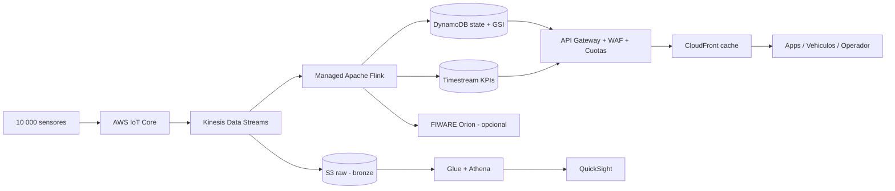

# 09. Escalabilidad: del piloto a la ciudad

El enunciado exige analizar dos escenarios bien diferenciados: un **piloto** de centenares de plazas y un **escenario ciudad** de miles. Este capítulo cuantifica volumen, capacidad de procesamiento, límites del sistema y plan de migración entre ambos escenarios.

## 9.1 Escenario piloto (≈ 500 plazas)

### Volumen de datos

- 500 plazas × ~5 cambios/día = 2 500 eventos/día.
- 500 plazas × 288 heartbeats/día (cada 5 min) = 144 000 eventos/día.
- Total ≈ **150 000 mensajes/día** (≈ 1,7 msg/s medio; pico ~10 msg/s).
- Tamaño medio del mensaje: ~600 bytes → **~85 MB/día** de tráfico bruto.

### Capacidad de procesamiento

| Recurso | Límite del servicio | Uso esperado del piloto | Margen |
|---------|---------------------|-------------------------|--------|
| AWS IoT Core | 20 000 conn/s, 30 000 pub/s por cuenta | 1,7 msg/s | x10 000 |
| IoT Rule | ilimitado dentro de la cuenta | 1 regla | OK |
| Lambda concurrente | 1 000 por cuenta default | 1-2 simultáneas | OK |
| DynamoDB on-demand | 40 000 WCU absorbidos sin throttling | 1,7 WCU/s | x10 000 |
| API Gateway REST | 10 000 req/s soft limit | <1 req/s | OK |

### Limitaciones observadas en el piloto

- El `Scan` filtrado por zona crece linealmente. Hasta ~10 000 plazas no es problema. A partir de ahí conviene migrar a `Query` con GSI por `zoneId`.
- La invocación asíncrona de la Lambda agregador puede generar múltiples ejecuciones por cambio de estado simultáneo, pero el resultado es idempotente (se reescribe el KPI con el último cálculo).

## 9.2 Escenario ciudad (≈ 10 000 plazas)

### Volumen de datos

- 10 000 plazas × ~5 cambios/día = 50 000 eventos/día.
- 10 000 plazas × 288 heartbeats/día = 2 880 000 eventos/día.
- Total ≈ **3 millones de mensajes/día** (≈ 35 msg/s medio; pico ~200 msg/s en eventos deportivos).
- Tráfico bruto: ~1,7 GB/día.

### Cambios arquitectónicos recomendados

| Componente | Cambio |
|------------|--------|
| **Sensores** | Onboarding masivo con AWS IoT Fleet Provisioning Templates. Certificado por dispositivo (no compartido). |
| **IoT Core** | Sin cambios; sobra capacidad. Habilitar Device Defender para auditoría continua. |
| **Procesamiento** | Sustituir la Lambda agregador por un job de **Apache Flink en Amazon Kinesis Data Analytics** (o Amazon Managed Service for Apache Flink). Ventanas tumbling de 1 min para KPIs por zona. |
| **Buffer** | Intercalar **Amazon Kinesis Data Streams** entre IoT Core y el procesador. Desacopla picos y permite consumidores múltiples (Flink, archivado en S3, replicación a Orion). |
| **Estado actual** | DynamoDB on-demand sigue sirviendo, pero añadir un GSI `zoneId-status-index` para responder consultas por zona sin `Scan`. |
| **Histórico** | Migrar serie temporal a **Amazon Timestream**: agregaciones temporales nativas, retención automática (memoria caliente + almacenamiento frío). |
| **Datalake** | S3 raw como capa bronze; AWS Glue + Athena para analítica ad-hoc; opcionalmente Redshift/Snowflake para BI municipal. |
| **APIs** | API Gateway con cuotas y API keys; CloudFront para caché de las respuestas más leídas (lista de plazas estática + estado refrescado cada 5 s). |
| **Multi-AZ** | Confirmar uso de servicios gestionados con redundancia multi-AZ activada (DynamoDB Global Tables si fuera multi-región). |

### Arquitectura objetivo para ciudad

### Coste agregado estimado (ciudad)

Detalle en el capítulo 10. Resumen: **600-900 USD/mes** en AWS para los 10 000 sensores en operación normal, no incluyendo el CAPEX de los sensores (~75 €/unidad).

## 9.3 Estrategia de particionado

| Partición | Criterio | Beneficio |
|-----------|----------|-----------|
| Sub-zona operativa | `zoneId` | Localiza KPIs a la unidad de gestión del ayuntamiento. |
| Geográfica gruesa | Distrito o código postal | Permite reportes municipales por distrito. |
| Temporal | Por mes (en S3) | Hace eficiente la analítica retrospectiva con Athena. |
| Por operador concesionario | Tag por concesión | Para zonas reguladas con gestor externo. |

## 9.4 Estrategia de alta disponibilidad

- Todos los servicios gestionados (IoT Core, Lambda, DynamoDB, API Gateway, S3, Kinesis, Timestream) son **multi-AZ por defecto** en `us-east-1` / `eu-west-1`.
- Para tolerancia a la caída de toda una región se planificaría una segunda región pasiva con **DynamoDB Global Tables** y replicación de Lambda + API Gateway desplegable por CI/CD (Terraform / CDK).
- **Sensores**: caché local de hasta 24 horas; reenvío en orden al recuperarse la conectividad.

## 9.5 Estrategia de despliegue continuo (CI/CD)

Para el piloto, los scripts `infra/*.py` son suficientes y se ejecutan a mano. Para producción se recomienda:

- **AWS CDK** (TypeScript o Python) o **Terraform** para infraestructura como código versionable.
- **Pipeline de CI/CD** con GitHub Actions o CodePipeline: tests → build → despliegue blue/green con rollback automático.
- **Tests de carga** trimestrales con Locust o Artillery contra la API y un simulador a escala (5 000+ sensores en local).

## 9.6 Plan de pruebas a escala

| Prueba | Objetivo | Métrica |
|--------|----------|---------|
| Carga sostenida | Validar 35 msg/s constantes durante 24 h | p99 latencia API < 2 s |
| Pico de evento deportivo | 1 000 eventos/min durante 15 min | Sin throttling DynamoDB ni Lambda |
| Caída de IoT Core (simulada) | Comprobar buffering en sensor y reenvío | Pérdida 0 eventos en cola de < 24 h |
| Caída de Lambda agregador | Comprobar continuidad de la ingesta | KPIs eventualmente consistentes al recuperar |
| Fuga de credencial sensor | Revocación rápida del certificado | < 5 min entre detección y revocación |

## 9.7 Riesgos específicos del escalado

| Riesgo | Mitigación |
|--------|-----------|
| Coste cloud creciendo más rápido que el número de plazas | Revisar arquitectura: pasar a Kinesis + Flink, batching, ventanas mayores. |
| Saturación de la API durante eventos | CloudFront caching + WAF rate-limiting + scale-out automático de Lambda. |
| Sensores fuera de cobertura LPWAN | Auditoría periódica con `lastUpdated`; envío de cuadrilla. |
| Modelos NGSI-v2 / Smart Data Models incompatibles entre versiones | Mantener mapping en una Lambda dedicada; tests de contrato semanales. |
| Crecimiento de la tabla `zone-kpis` | Política de TTL (DynamoDB TTL nativo) para purgar datos > N meses o migrar a Timestream. |
