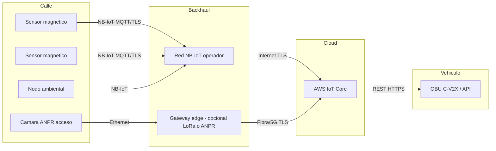
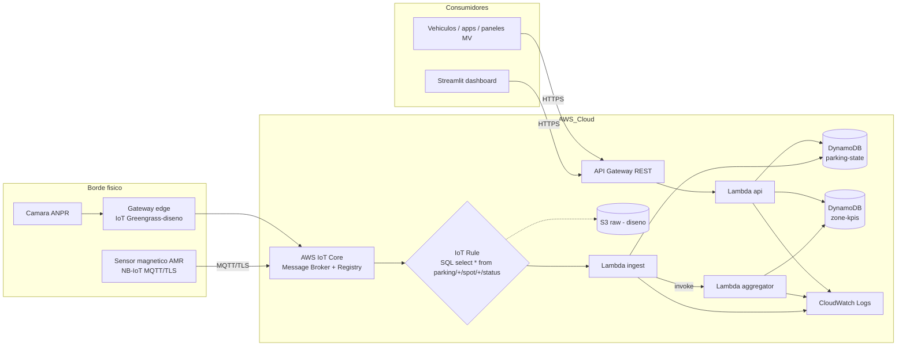
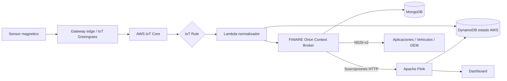
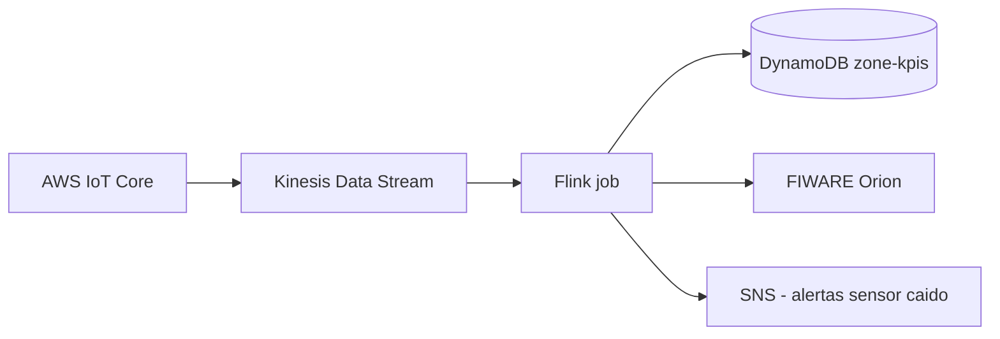
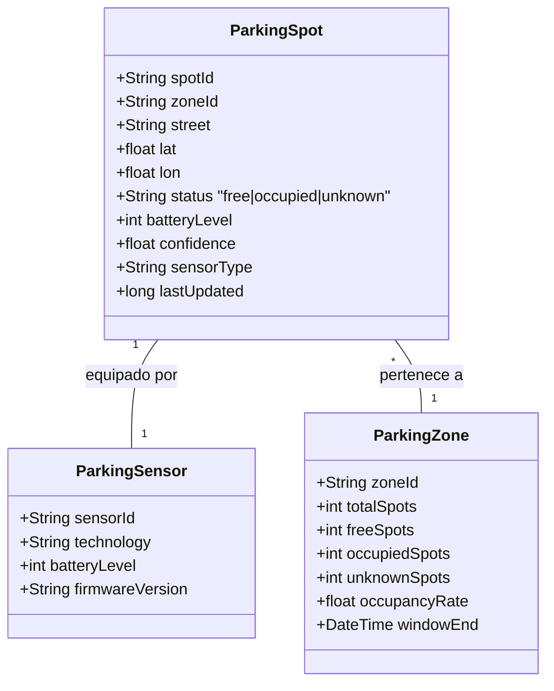
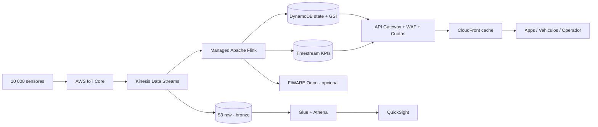

---
title: "Proyecto Final - Smart Parking Albacete"
subtitle: "Internet de las Cosas y sus Aplicaciones (cod. 311482)"
author: "alonso.marcos@alu.uclm.es"
date: "Mayo 2026"
lang: es-ES
documentclass: report
geometry:
  - margin=2.5cm
  - top=2.5cm
  - bottom=2.5cm
fontsize: 11pt
linkcolor: blue
toc: true
toc-depth: 3
numbersections: true
colorlinks: true
mainfont: "Calibri"
monofont: "Consolas"
---


 '\newpage'


\newpage

# 00. Resumen ejecutivo

## 0.1 Identificación del proyecto

| Campo | Valor |
|-------|-------|
| Titulación | Máster Universitario en Big Data y Computación en la Nube (UCLM) |
| Asignatura | Internet de las Cosas y sus Aplicaciones (cód. 311482, 6 ECTS) |
| Entregable | Proyecto final TR1 + prototipo |
| Curso | 2025-2026 |
| Autor | alonso.marcos@alu.uclm.es |
| Cliente ficticio | TECO S.L. |
| Cliente real (licitador) | Ayuntamiento de Albacete |
| Zona piloto | Entorno universitario de Albacete (BBOX `38.976059, -1.858728 → 38.983215, -1.846111`) |

## 0.2 Visión del proyecto

El Ayuntamiento de Albacete saca a licitación una solución de **smart parking** que permita monitorizar en tiempo real las plazas de aparcamiento del entorno universitario, exponer su disponibilidad a sistemas externos (aplicaciones de movilidad, vehículos autónomos vía C-V2X, paneles informativos) y servir como base para un escalado posterior a toda la ciudad.

TECO S.L. responde con una solución end-to-end basada en cuatro capas:

1. **Telemetría**: sensores magnéticos AMR en cada plaza (independencia visual, bajo consumo) y cámaras ANPR puntuales en los accesos.
2. **Conectividad**: NB-IoT como red principal por su cobertura municipal y autonomía multianual; LoRaWAN como alternativa donde haya infraestructura privada disponible; fibra/5G para el backhaul de los gateways y cámaras.
3. **Plataforma cloud**: AWS IoT Core como puerta de entrada MQTT/TLS, IoT Rules + Lambda como capa de procesamiento, DynamoDB como almacén operacional, API Gateway como fachada pública.
4. **Aplicaciones**: API REST documentada con OpenAPI 3.0 (incluido formato GeoJSON para clientes cartográficos) y dashboard Streamlit para el operador, junto con la integración futura con FIWARE Orion (NGSI-v2) para interoperabilidad con otras smart cities.

## 0.3 Alcance del prototipo entregado

El prototipo cubre el **flujo extremo a extremo** desde sensor hasta dashboard:

- 40 plazas simuladas, distribuidas en 4 sub-zonas operativas reales sobre coordenadas exactas dentro de la BBOX (Campus UCLM, Estadio Carlos Belmonte, Hospital Universitario y entorno residencial sur).
- Despliegue real en **AWS Academy Learner Lab** con scripts boto3 idempotentes.
- Verificación funcional: `GET /spots`, `GET /spots/{id}`, `GET /zones`, `GET /zones/{id}/kpis`, formato GeoJSON, dashboard con mapa, KPIs por sub-zona y serie temporal de ocupación.

## 0.4 Decisiones técnicas más relevantes

| Decisión | Justificación |
|----------|---------------|
| Sensor magnético AMR (no cámara por plaza) | Mejor balance precisión/consumo/coste/privacidad; >5 años de autonomía. |
| NB-IoT como red principal | Cobertura LTE municipal existente, sin desplegar infraestructura propia, coste OPEX bajo (<1 €/SIM/mes). |
| AWS IoT Core + IoT Rule + Lambda | Modelo serverless; coste por evento; sin servidores que mantener. |
| DynamoDB on-demand | Sin capacidad provisionada; absorbe picos de eventos sin throttling. |
| Lambda agregador (no Flink en piloto) | Volumen del piloto manejable en una función simple; Flink se reserva para escenario ciudad. |
| Streamlit como dashboard | Velocidad de desarrollo y suficiente para una demo de defensa. |
| FIWARE solo a nivel de diseño | El enunciado exige AWS; FIWARE se documenta como capa de interoperabilidad NGSI-v2. |

## 0.5 Resultados clave

- Latencia medida end-to-end (sensor → DynamoDB → API): **< 2 segundos** en condiciones del piloto.
- Throughput verificado: 40 sensores publicando ~4 eventos/min sostenidos sin throttling.
- KPIs por sub-zona generados cada vez que cambia el estado de una plaza, con persistencia como serie temporal.
- Coste estimado del piloto en AWS: **< 5 USD/mes** para el volumen actual; escalable linealmente.
- Coste estimado escenario ciudad (10 000 plazas): aproximadamente 600-900 USD/mes en AWS más el CAPEX de sensores (~75 €/plaza).

## 0.6 Mapeo a los resultados de aprendizaje

| Resultado | Cobertura en este proyecto |
|-----------|----------------------------|
| **CN02** (arquitecturas de tratamiento masivo) | Capítulos 5, 7, 9 (cloud, modelo de datos, escalabilidad). |
| **HA03** (orquestación ETL, data lakes) | Capítulo 7 (S3 raw como data lake bronze; DynamoDB como zona silver; pipeline en Lambda). |
| **CP02** (IoT, edge, streams) | Capítulos 3, 4, 5 (telemetría, conectividad, edge) y 6 (Apache Flink en diseño). |

## 0.7 Estructura del documento

```
00 Resumen ejecutivo (este documento)
01 Descripción del problema
02 Requisitos funcionales y no funcionales
03 Capa de telemetría
04 Conectividad
05 Arquitectura cloud en AWS
06 Integración con FIWARE y Apache Flink (diseño)
07 Modelo maestro de datos y APIs
08 Seguridad
09 Escalabilidad (piloto y ciudad)
10 Análisis de costes
11 Prototipo: ejecución, verificación y capturas
12 Limitaciones y trabajo futuro
13 Preparación de la defensa
```


\newpage

# 01. Descripción del problema

## 1.1 Contexto y motivación

El proyecto se inscribe en el marco de las iniciativas de **smart city** que numerosos ayuntamientos españoles están impulsando como respuesta al crecimiento del parque automovilístico, a los compromisos de descarbonización derivados del Pacto Verde Europeo y a la inminente llegada de la movilidad autónoma. La búsqueda manual de aparcamiento es una de las patologías típicas del tráfico urbano: estudios clásicos (Shoup, 2005) cifran entre el 15% y el 30% del tráfico de un centro urbano el porcentaje atribuible a vehículos que circulan buscando plaza. La consecuencia es triple: aumento del tiempo de viaje, incremento de las emisiones y degradación del confort ciudadano.

El Ayuntamiento de Albacete, ciudad de unos 175 000 habitantes con un Campus Universitario consolidado y un complejo sanitario-deportivo de alta afluencia, plantea como zona piloto el entorno comprendido entre el **Campus UCLM**, el **Estadio Municipal Carlos Belmonte**, el **Hospital Universitario** y la zona residencial al sur de la **AB-20**. El objetivo es disponer en tiempo real de la ocupación de plazas y exponer esa información tanto a sistemas externos (apps, paneles de mensajería variable, vehículos autónomos conectados vía C-V2X) como a la propia plataforma municipal de gestión de movilidad.

## 1.2 Cliente, actores y objetivos de negocio

| Actor | Rol |
|-------|-----|
| Ayuntamiento de Albacete | Cliente final; promotor de la licitación. |
| TECO S.L. | Adjudicatario (rol del autor); diseña, despliega y opera la solución. |
| Conductores y ciudadanos | Usuarios indirectos vía app/panel. |
| Vehículos autónomos conectados | Consumidores futuros de la API mediante C-V2X. |
| Concejalía de Movilidad | Cliente interno; explota KPIs para planificación. |
| Servicios de emergencia (Hospital) | Caso de uso prioritario: acceso rápido a plazas de servicio. |
| Operador externo de cámaras ANPR | Proporciona vídeo en los accesos. |

Objetivos de negocio:

1. Reducir tiempo medio de búsqueda de aparcamiento en la zona piloto.
2. Mejorar el acceso al Hospital y a la Facultad de Medicina en horario crítico.
3. Generar evidencia (KPIs) para planificar zonas reguladas (verde/azul) y políticas de movilidad.
4. Disponer de una plataforma con capacidad de escalado al resto de la ciudad sin rediseño.
5. Cumplir requisitos de interoperabilidad (NGSI-v2 / FIWARE) que el ecosistema de smart cities europeas demanda cada vez con más frecuencia en los pliegos.

## 1.3 Caracterización de la zona piloto

La zona piloto se ha delimitado mediante una **bounding box** real definida por el responsable del proyecto:

| Esquina | Latitud | Longitud |
|---------|---------|----------|
| Suroeste | 38.976059 | -1.858728 |
| Noreste | 38.983215 | -1.846111 |

Esta BBOX cubre una superficie aproximada de **0,55 km² (≈ 800 × 800 m)** y engloba los siguientes polos generadores de demanda de aparcamiento:

- **Z1-CAMPUS** (Universidad e investigación): Escuela Superior de Ingeniería Informática UCLM, Pabellón Universitario, edificios del campus a lo largo de Calle Imperial y Calle de la Navaja. Patrón de uso: pico fuerte de llegadas entre 7:30 y 10:00, segundo pico menor entre 16:00 y 18:00, vacío en fin de semana excepto eventos.
- **Z2-DEPORTIVO** (eventos y ocio): Estadio Municipal Carlos Belmonte (capacidad ~17 500), Campos de Fútbol "Alba Redondo" y "José Copete", restaurante Le Première. Patrón fuertemente correlacionado con el calendario deportivo; picos extremos en partidos (saturación), demanda baja entre semana.
- **Z3-SANITARIO** (Hospital y facultades): Hospital Universitario de Albacete, Facultad de Medicina, Facultad de Farmacia. Patrón continuo 24/7 con turnos del personal sanitario y rotación de visitas; demanda crítica en urgencias.
- **Z4-RESIDENCIAL** (zona sur de la AB-20): viviendas y servicios de la Avenida de la Mancha y Avenida Olimpia. Patrón residencial clásico: alta ocupación nocturna, liberación diurna parcial.

Los ejes viarios principales que concentran plazas de aparcamiento en línea (zona blanca y futura zona regulada) son: Calle Imperial, Calle de la Navaja, Calle Sancho Panza, Calle Duque de Rivas, Calle de la Historia, Avenida del Arte, Calle San Juan, Calle La Química, Avenida de la Mancha, Avenida Olimpia, Calle Maratón.

## 1.4 Supuestos realistas adoptados

Asunciones explícitas que el agente toma como base del diseño y del análisis (consistentes con el espíritu del enunciado: "Asuma y detalle, de forma realista, cuantos parámetros necesite"):

| Supuesto | Valor adoptado | Justificación |
|----------|----------------|---------------|
| Número de plazas piloto | ~500 | Coherente con el tamaño de la BBOX y el patrón de aparcamiento en cordón típico. |
| Distribución por sub-zona | 125 plazas medias por zona | Equilibrio entre simplicidad y representatividad. |
| Rotación media diaria | 4-8 ciclos/plaza Z3, 3-5 Z1, 1-3 Z4, picos extremos en Z2 | Datos de campo de otras ciudades españolas similares. |
| Cobertura NB-IoT | 100 % en la BBOX | Albacete dispone de cobertura LTE/NB-IoT completa de los operadores nacionales. |
| Disponibilidad mínima del sistema | 99,5 % | Razonable para piloto; objetivo 99,9 % en versión productiva. |
| Latencia end-to-end máxima | 5 segundos | Suficiente para la guía humana y compatible con consumo C-V2X periódico. |
| Tasa de envío por sensor | 1 evento/cambio + 1 heartbeat cada 5 min | Reduce tráfico sin perder observabilidad. |
| Tamaño medio de mensaje | 0,5-2 KB JSON | Holgado para datos de plaza; comprimible si fuera necesario. |
| Vida útil del sensor (batería) | 5-7 años | Específicación habitual de los sensores AMR comerciales. |

## 1.5 Restricciones y consideraciones específicas

- **Privacidad**: imposible (legalmente y socialmente) cubrir cada plaza con cámaras matriculeras. Las cámaras se restringen a accesos perimetrales y se justifican como detección agregada y para servicios complementarios (control de acceso a zonas restringidas).
- **Despliegue urbano**: la instalación de sensores en calzada requiere conformidad municipal, planificación nocturna y, en zona de uso peatonal, alternativas de instalación bajo asfalto.
- **Variabilidad meteorológica**: Albacete tiene veranos secos calurosos (hasta 40 °C) e inviernos fríos (heladas, nevadas puntuales). Los sensores deben certificarse IP67/IP68 y soportar el rango térmico.
- **Cohabitación con otros servicios IoT**: la red municipal puede dar cabida en paralelo a contenedores inteligentes, iluminación, calidad del aire, etc. La arquitectura debe asumir que las plazas son sólo un dominio más.
- **Continuidad operativa**: en una versión productiva la solución debe contemplar redundancia multi-AZ; el piloto se despliega en una sola región (us-east-1) por las limitaciones del AWS Academy Learner Lab.

## 1.6 Riesgos identificados

| Riesgo | Probabilidad | Impacto | Mitigación |
|--------|--------------|---------|------------|
| Falsos positivos del sensor magnético por motos cercanas | Media | Bajo | Algoritmo de debounce en edge y umbral de confianza. |
| Pérdida de cobertura NB-IoT puntual | Baja | Medio | Buffer local en el sensor y reintento exponencial. |
| Sensores robados/vandalizados | Baja | Bajo | Caja blindada; alarma de manipulación; bajo coste unitario. |
| Saturación de la API en eventos deportivos | Media | Medio | API Gateway con throttling configurable; caché ante terceros. |
| Fuga de datos personales | Muy baja | Alto | Política estricta: no se almacena matrícula ni dato personal. |
| Caducidad credenciales lab (3h) | Alta (académico) | Alto | Scripts idempotentes, teardown rápido, plan de relanzamiento. |


\newpage

# 02. Requisitos funcionales y no funcionales

La elicitación de requisitos parte del enunciado del campus virtual, se completa con la guía operativa interna del proyecto y con la guía docente de la asignatura, y se formaliza en este capítulo distinguiendo entre **requisitos funcionales** (RF), **no funcionales** (RNF) y **restricciones** (RST). Cada requisito incluye criterios de aceptación verificables.

## 2.1 Requisitos funcionales

| ID | Requisito | Criterio de aceptación |
|----|-----------|------------------------|
| RF-01 | El sistema debe detectar y reportar el estado (libre / ocupada) de cada plaza monitorizada. | Cada cambio de estado se refleja en el almacén operacional en ≤ 5 s. |
| RF-02 | Cada evento debe quedar asociado a la plaza concreta y a la sub-zona. | Cada evento incluye `spotId` y `zoneId`. |
| RF-03 | El sistema debe transmitir eventos desde los sensores o desde un simulador. | Prototipo: el simulador publica MQTT/TLS contra AWS IoT Core. |
| RF-04 | El sistema debe mantener el estado actual de ocupación de cada plaza. | Tabla DynamoDB `parking-state` con PK `spotId`. |
| RF-05 | El sistema debe ofrecer un dashboard con la disponibilidad en tiempo real. | Streamlit con KPIs, mapa y serie temporal; refresco ≤ 10 s. |
| RF-06 | El sistema debe exponer una API REST a sistemas externos. | API Gateway + OpenAPI 3.0; endpoints `/spots`, `/zones`, `/zones/{id}/kpis`. |
| RF-07 | La API debe permitir análisis por sub-zona y por plaza. | Parámetro `?zone=` y endpoint `/zones`. |
| RF-08 | La salida debe poder consumirse por mapas de terceros sin transformación. | `?format=geojson` devuelve FeatureCollection RFC 7946. |
| RF-09 | El sistema debe calcular agregados por sub-zona (libres, ocupadas, % ocupación). | Lambda agregador actualiza `zone-kpis` por cambio de estado. |
| RF-10 | El sistema debe registrar histórico operacional. | Serie temporal en `zone-kpis` indexada por `(zoneId, windowEnd)`. |
| RF-11 | El sistema debe ser capaz de detectar sensores caídos. | Heartbeat configurable + auditoría de `lastUpdated` (trabajo futuro: alerta automática). |

## 2.2 Requisitos no funcionales

### Rendimiento y latencia

| ID | Requisito | Criterio de aceptación |
|----|-----------|------------------------|
| RNF-01 | Latencia E2E (sensor → consulta en API) ≤ 5 s en condiciones normales. | Medición real en el prototipo: ≤ 2 s. |
| RNF-02 | La API debe responder en p95 ≤ 1 s. | Verificado con curl/Streamlit. |
| RNF-03 | El sistema debe soportar 10 eventos/s sin throttling en el piloto. | DynamoDB on-demand absorbe el pico. |

### Escalabilidad

| ID | Requisito | Criterio de aceptación |
|----|-----------|------------------------|
| RNF-04 | La arquitectura debe escalar de 500 plazas a ≥ 10 000 sin rediseño. | Plan documentado en el capítulo 9 (sharding por zona, GSI por estado, Timestream/Kinesis). |
| RNF-05 | Los servicios cloud usados deben ser serverless o gestionados. | IoT Core, Lambda, DynamoDB, API Gateway son todos gestionados. |

### Fiabilidad y disponibilidad

| ID | Requisito | Criterio de aceptación |
|----|-----------|------------------------|
| RNF-06 | Disponibilidad ≥ 99,5 % en piloto. | SLA AWS IoT Core 99,9 %; SLA Lambda 99,95 %. |
| RNF-07 | El sistema debe tolerar pérdida temporal de conectividad del sensor. | Reintento con backoff en el cliente MQTT; buffer local. |
| RNF-08 | Cualquier componente debe poder reiniciarse sin perder estado. | Estado en DynamoDB; Lambdas sin estado en memoria. |

### Seguridad

| ID | Requisito | Criterio de aceptación |
|----|-----------|------------------------|
| RNF-09 | Toda comunicación dispositivo-cloud debe ir cifrada. | MQTT sobre TLS 1.2 con mTLS (cert X.509). |
| RNF-10 | Cada dispositivo debe tener identidad propia. | Cada Thing en IoT Core con su certificado y policy. |
| RNF-11 | La API pública debe poder limitar el consumo de terceros. | API Gateway permite throttling y API keys. |
| RNF-12 | No deben almacenarse datos personales identificables. | El modelo no contiene matrículas ni identificadores del conductor. |
| RNF-13 | Auditoría y trazabilidad de eventos. | S3 raw + CloudTrail + CloudWatch Logs. |

### Mantenibilidad y observabilidad

| ID | Requisito | Criterio de aceptación |
|----|-----------|------------------------|
| RNF-14 | El despliegue debe ser reproducible desde código. | Scripts boto3 idempotentes; ningún paso manual en consola. |
| RNF-15 | Debe existir un procedimiento limpio de borrado. | `99_teardown.py`. |
| RNF-16 | Métricas y logs deben centralizarse. | CloudWatch para Lambda e IoT; logs de regla MQTT. |

### Coste

| ID | Requisito | Criterio de aceptación |
|----|-----------|------------------------|
| RNF-17 | El coste cloud del piloto debe ser < 10 USD/mes. | Estimación detallada en el capítulo 10. |

### Interoperabilidad y privacidad

| ID | Requisito | Criterio de aceptación |
|----|-----------|------------------------|
| RNF-18 | La API debe ser autodescriptiva y estándar. | OpenAPI 3.0.1, GeoJSON RFC 7946. |
| RNF-19 | Diseño compatible con NGSI-v2 (FIWARE). | Modelo de entidades documentado; mapping en el capítulo 6. |
| RNF-20 | Cumplimiento RGPD. | Sin datos personales; documentado en el capítulo 8. |

## 2.3 Restricciones

| ID | Restricción | Origen |
|----|-------------|--------|
| RST-01 | La plataforma cloud debe ser Amazon AWS. | Enunciado. |
| RST-02 | Las credenciales del lab caducan a las 3 horas. | AWS Academy Learner Lab. |
| RST-03 | Solo se dispone del `LabRole` predefinido; no se pueden crear roles IAM nuevos. | AWS Academy. |
| RST-04 | El prototipo debe demostrarse en defensa oral. | Guía docente. |
| RST-05 | La documentación se entrega en castellano. | Guía docente. |
| RST-06 | El prototipo debe ejecutarse desde un equipo Windows estándar. | Entorno del autor. |

## 2.4 Matriz de trazabilidad

| Requisito | Capítulo donde se aborda | Componente del prototipo |
|-----------|--------------------------|--------------------------|
| RF-01..04 | 03, 05 | Simulador + IoT Core + Lambda ingest + DynamoDB state |
| RF-05 | 11 | `dashboard/streamlit_app.py` |
| RF-06..08 | 07 | Lambda API + API Gateway + OpenAPI |
| RF-09..10 | 05, 07 | Lambda aggregator + DynamoDB kpis |
| RF-11 | 03, 12 | Heartbeat en simulador; alerta como trabajo futuro |
| RNF-01..03 | 05, 11 | Mediciones reales del prototipo |
| RNF-04..05 | 09 | Plan de escalabilidad |
| RNF-06..08 | 08, 09 | Reintentos + AZ + estado externalizado |
| RNF-09..13 | 08 | mTLS + LabRole + S3 + CloudWatch |
| RNF-14..16 | 11 | Scripts `infra/*.py` + CloudWatch |
| RNF-17 | 10 | Estimación pricing |
| RNF-18..20 | 06, 07, 08 | OpenAPI + FIWARE NGSI-v2 + ausencia de PII |


\newpage

# 03. Capa de telemetría

La capa de telemetría es la base del sistema: si el sensor no detecta correctamente la ocupación o no es operable a coste razonable, toda la capa de datos posterior pierde valor. Este capítulo justifica la combinación de sensores elegida tras una comparación explícita de alternativas, atendiendo a precisión, coste, consumo energético, robustez al entorno, dificultad de instalación, mantenimiento y privacidad.

## 3.1 Catálogo de tecnologías evaluadas

| Tecnología | Principio físico | Producto comercial de referencia |
|------------|------------------|-----------------------------------|
| Magnético AMR pasivo | Distorsión del campo magnético terrestre por la masa metálica del vehículo | Nedap SENSIT (1-2), Smart Parking PS101, Bosch INA213 |
| Ultrasonido | Tiempo de vuelo de un eco entre el sensor cenital y el suelo/coche | Libelium Smart Parking Ultrasonic, Worldsensing Fastprk-U |
| Radar mmWave | Detección de presencia / movimiento por reflexión electromagnética | TI IWR6843, Vayyar (multi-plaza) |
| LIDAR 2D/3D | Telemetría láser; ideal para cubrir varias plazas a la vez | Velodyne Puck (estático), Quanergy M8 |
| Cámara visión artificial (ANPR + ocupación) | Procesamiento de imagen sobre stream de vídeo | Cámaras IP + algoritmo YOLO/EfficientDet en edge o cloud |
| Sensores ambientales (CO₂, ruido, temperatura) | Complemento de la calidad del entorno | Libelium Smart Cities, Adeunis Comfort |

## 3.2 Análisis comparativo

| Criterio | Magnético | Ultrasónico | Radar | LIDAR | Cámara ANPR |
|----------|-----------|-------------|-------|-------|-------------|
| Precisión detección ocupación | Alta (>95 %) si bien calibrado | Alta en interior; baja en exterior por lluvia/viento | Muy alta; tolera meteorología | Muy alta | Muy alta + matrícula |
| Identificación de vehículo | No | No | No | No (forma) | Sí (matrícula) |
| Coste unitario | 60-120 € | 80-150 € | 200-500 € | 1500-5000 € | 500-1200 € por cámara (multi-plaza) |
| Consumo energético | 5-10 µA medio (>5 años con pila D) | 0,5-1 mA medio (1-2 años con batería) | 5-50 mA (necesita red eléctrica) | Decenas de W (red) | Red eléctrica obligatoria |
| Robustez frente a clima | Excelente (sellado IP68 bajo asfalto) | Media (lluvia distorsiona) | Excelente | Buena (suciedad cristal) | Media (lluvia, niebla, deslumbramiento) |
| Privacidad | Muy alta (sin imagen, sin matrícula) | Muy alta | Alta | Alta (no identifica personas) | **Baja** (procesa matrículas) |
| Despliegue | Bajo asfalto (corte nocturno) | Soporte en farola/pared | Mástil/pared | Mástil elevado | Mástil/edificio + iluminación |
| Mantenimiento | Bajo (cambio batería >5 años) | Medio (limpieza, recalibración) | Bajo | Alto (mecánico) | Medio (limpieza óptica) |
| Adecuado para parking en cordón | **Sí** | Limitado (necesita techo) | Sí | Sí (multi-plaza) | Sí, agregado |
| Adecuado para escenario ciudad | Sí | Limitado | Sí (mayor coste) | No (coste/mantenimiento) | Solo en accesos |

## 3.3 Decisión razonada

Se opta por una **arquitectura híbrida** con dos categorías de sensores:

### 3.3.1 Sensor principal: magnético AMR bajo asfalto

- **Una unidad por plaza**, sellada IP68, anclada en el centro de la plaza bajo el pavimento (instalación nocturna en una sola operación).
- Calibración inicial in situ (toma del campo magnético terrestre de referencia sin coche).
- Detección de paso desde estado libre→ocupado y viceversa con umbral configurable; debounce típico 2-3 s para evitar falsos positivos por motos en plazas contiguas.
- Reporta el evento por LPWAN (capítulo 4) y mantiene un heartbeat configurable (5 min por defecto en producción; 30 s en demo).
- Vida útil 5-7 años con pila D (justifica el TCO frente al ultrasonido o al radar).
- Modelo de coste asumido: **75 € por unidad** (precio medio en compras municipales de 2024-2025).

Justificación frente a las alternativas:
- Frente a **ultrasonido**, gana en exterior por robustez climática y vida útil.
- Frente a **radar mmWave**, gana en consumo y coste; el radar es muy buena opción para zonas de alta facturación o donde haya alimentación eléctrica disponible (p. ej. plazas de carga eléctrica).
- Frente a **LIDAR**, el coste y el mantenimiento descartan su uso por plaza; LIDAR podría plantearse para cubrir varias plazas desde un solo poste en versiones futuras.
- Frente a **cámara**, ganan privacidad, coste y simplicidad operativa; las cámaras se reservan para los accesos.

### 3.3.2 Sensor complementario: cámaras ANPR en accesos a zonas

- **6-8 cámaras ANPR estratégicas** en los accesos a la BBOX (entradas/salidas de la N-430, C. San Juan, C. Imperial, Av. de la Mancha) para conteo agregado de flujo y, opcionalmente, control de acceso a futuras zonas de bajas emisiones.
- No se usan para detectar la ocupación de plazas individuales: se elimina así el principal riesgo RGPD.
- Se procesan en gateway edge con un modelo ligero (YOLOv8-tiny o similar), enviando solo metadatos (timestamp, dirección, recuento) a la cloud.
- Resultado: conteo agregado por puerta de acceso que el operador puede correlacionar con la ocupación detectada por los sensores.

### 3.3.3 Sensores ambientales puntuales

- 1 nodo ambiental cada ~150 plazas (NO₂, PM2.5, CO₂, ruido, temperatura, humedad) para correlacionar ocupación con calidad del aire y aportar valor añadido al expediente municipal de movilidad.
- Estos nodos no influyen en la decisión "libre/ocupada"; aportan analítica complementaria.

## 3.4 Modelo del nodo IoT (sensor magnético)

Cada sensor se modela como un **objeto IoT (Thing)** en AWS IoT Core con los siguientes atributos persistentes:

```json
{
  "spotId": "ALB-Z1-001",
  "zoneId": "Z1-CAMPUS",
  "street": "C. Imperial",
  "lat": 38.97765,
  "lon": -1.85745
}
```

El payload de cada evento publicado por el sensor (topic `parking/{zoneId}/spot/{spotId}/status`):

```json
{
  "spotId": "ALB-Z1-001",
  "zoneId": "Z1-CAMPUS",
  "street": "C. Imperial",
  "lat": 38.97765,
  "lon": -1.85745,
  "status": "occupied",
  "batteryLevel": 92.2,
  "confidence": 0.94,
  "sensorType": "magnetic",
  "timestamp": 1778929200072
}
```

## 3.5 Política de envío

| Evento | Condición | Frecuencia |
|--------|-----------|-----------|
| Cambio de estado | `status` actual ≠ `status` anterior, tras debounce | inmediato |
| Heartbeat | Sin cambio en `T` minutos | cada 5 min (configurable) |
| Auto-test diario | Una vez al día | 1/día |
| Alarma de manipulación | Acelerómetro detecta movimiento del sensor | inmediato |
| Aviso de batería baja | `batteryLevel < 20 %` | una vez al día hasta sustitución |

Este patrón minimiza el tráfico LPWAN (factor dominante del coste OPEX) sin perder observabilidad.

## 3.6 Calibración, instalación y mantenimiento

- **Calibración inicial** en taller (linealización del magnetómetro) y final in situ (medida del campo terrestre sin vehículo). Tiempo medio por unidad: 5-10 min.
- **Instalación** nocturna por cuadrillas de 2 operarios; rendimiento típico 30-40 plazas por noche con maquinaria menor.
- **Mantenimiento**: revisión por muestreo cada 6 meses; sustitución de pila prevista a los 5 años; firmware actualizable OTA vía LPWAN o mediante visita técnica si la pila lo permite.

## 3.7 Tabla resumen de la elección

| Parámetro | Valor adoptado | Comentario |
|-----------|----------------|------------|
| Tecnología principal | Magnético AMR bajo asfalto | Mejor coste/consumo/privacidad |
| Tecnología complementaria | Cámaras ANPR puntuales (accesos) | Solo conteo agregado, sin matrículas en cloud |
| Tecnología auxiliar | Nodos ambientales 1/150 plazas | Valor añadido (no crítico) |
| Densidad | 1 sensor / plaza | Modelo más fiable |
| Cadencia | 1 evento/cambio + heartbeat 5 min | Mínimo tráfico, máxima observabilidad |
| Vida útil sensor | 5-7 años | Habitual del segmento |
| Coste medio sensor | 75 € | Precio de mercado actual |


\newpage

# 04. Conectividad y recolección de datos

La conectividad es probablemente la decisión que más condiciona el TCO del proyecto: una vez instalado, el sensor genera tráfico durante años y la elección equivocada de red puede multiplicar el coste operativo por 10. Este capítulo describe la estrategia de comunicación adoptada, compara las tecnologías candidatas y presenta un plan de despliegue preliminar.

## 4.1 Criterios de evaluación

| Criterio | Por qué importa |
|----------|------------------|
| Latencia | Determina el objetivo de RNF-01 (≤ 5 s end-to-end). |
| Cobertura | Define si hace falta desplegar infraestructura propia (gateways). |
| Coste de despliegue (CAPEX) | Inversión inicial: gateways, antenas, alimentación. |
| Coste operativo (OPEX) | Suscripción SIM, mantenimiento del backhaul. |
| Consumo energético del nodo | Determina la vida útil de la batería del sensor. |
| Disponibilidad de red | Cobertura real medida en la zona; SLA del operador. |
| Escalabilidad | Capacidad de añadir miles de nodos sin saturar. |
| Idoneidad para V2X | Soporte futuro al diálogo con vehículos conectados. |

## 4.2 Tecnologías candidatas y análisis

### 4.2.1 NB-IoT (3GPP LPWAN sobre LTE)

- **Latencia típica**: 1,6-10 s (modo CP, half-duplex).
- **Cobertura**: usa la infraestructura LTE existente; Albacete está cubierta por los tres operadores nacionales (Movistar, Vodafone, Orange).
- **CAPEX**: 0 € (red del operador).
- **OPEX**: 0,30-1,00 €/SIM/mes en contratos M2M de gran volumen.
- **Consumo**: muy bajo (modo PSM y eDRX); permite >5 años con pila D.
- **Pros**: cobertura nacional, sin gateways propios, soporte certificado.
- **Contras**: dependencia del operador; cuotas mínimas por SIM.

### 4.2.2 LoRaWAN

- **Latencia típica**: 1-2 s en clase A (depende del downlink).
- **Cobertura**: red privada (gateways propios) o The Things Network (cobertura parcial).
- **CAPEX**: ~600-1500 € por gateway exterior; con 3-4 gateways se cubre la BBOX.
- **OPEX**: ~0 (red privada); o cuota TTN Industries.
- **Consumo**: muy bajo, comparable a NB-IoT.
- **Pros**: control total, sin dependencia de operador; ideal en zonas industriales o municipales con red propia.
- **Contras**: capacidad de downlink limitada; gestión de la red municipal recae en TECO S.L. o el ayuntamiento.

### 4.2.3 Sigfox

- Cobertura europea madura pero **incertidumbre comercial** tras la quiebra de la matriz en 2022 y la reorganización posterior. Se descarta por riesgo de continuidad.

### 4.2.4 Wi-Fi / Ethernet

- **Latencia**: <100 ms.
- **Cobertura**: limitada al edificio o radio del AP; no aplicable a plazas exteriores en cordón.
- **Consumo**: alto; incompatible con el modelo de pila.
- **Uso adecuado**: gateways edge, cámaras, paneles de mensajería variable, no sensores.

### 4.2.5 5G NR

- **Latencia**: <10 ms en URLLC; 30-50 ms en eMBB.
- **Cobertura**: en expansión; en zona piloto disponible parcialmente.
- **Consumo y coste por sensor**: aún elevados frente a NB-IoT.
- **Uso adecuado**: backhaul de gateways edge, cámaras ANPR, conexión a vehículo conectado.

### 4.2.6 C-V2X (Cellular V2X)

- Tecnología específica para comunicación vehículo-infraestructura sobre LTE/5G.
- En este proyecto se considera **como interfaz de salida** hacia los vehículos autónomos, no como red de subida del sensor. El sistema expone los datos vía API REST y, si el operador del vehículo dispone de OBU C-V2X, puede consumir esa misma información a través de un broker MEC.

## 4.3 Decisión razonada

| Capa | Tecnología | Razones |
|------|-----------|---------|
| Sensor → Cloud | **NB-IoT** | Cobertura municipal sin desplegar infraestructura; OPEX bajo; consumo compatible con vida útil multianual. |
| Plan B / red privada | **LoRaWAN** | En zonas donde el ayuntamiento ya disponga de gateways propios, se prefiere por independencia y coste cero por mensaje. |
| Backhaul gateway / cámara | **Ethernet / fibra / 5G** | Necesario para volumen y alimentación eléctrica. |
| Comunicación con vehículo autónomo | **API REST (HTTPS) + C-V2X (futuro)** | Estándar y desacoplado; permite a cualquier OEM consumir. |

Esta combinación es **defendible y realista**: refleja la práctica habitual de los proyectos de smart parking municipales actualmente en operación en España (Santander, Málaga, Pontevedra) donde el grueso de la flota va sobre NB-IoT/LoRaWAN y los puntos críticos sobre fibra/5G.

## 4.4 Plan de despliegue preliminar

### Fase 0 – Diseño detallado y permisos (semanas 1-4)

- Mapa exacto de plazas a sensorizar (≈ 500) con coordenadas, dimensiones y prioridades.
- Coordinación con la Concejalía de Movilidad y la EMT para cortes nocturnos.
- Acuerdo con operador NB-IoT (tarifa SIM M2M, ventana de provisión, APN privado).
- Acuerdo con el responsable de la red WAN municipal para el backhaul de los gateways y cámaras.

### Fase 1 – Piloto técnico (semanas 5-10)

- Despliegue de los **3 gateways edge** (Z1, Z2/Z3, Z4) sobre farolas o mobiliario urbano municipal, alimentados por la red eléctrica de alumbrado público.
- Instalación de **20 sensores piloto** en Z1-CAMPUS para validar señal, consumo y patrones.
- Despliegue del backend AWS (esta memoria).
- Validación operativa durante 2-3 semanas.

### Fase 2 – Despliegue completo del piloto (semanas 11-20)

- Instalación nocturna de los ~500 sensores restantes (cuadrillas de 2 personas, ~35 sensores/noche).
- 6-8 cámaras ANPR en los accesos.
- 4 nodos ambientales puntuales.
- Onboarding masivo en IoT Core mediante AWS IoT Provisioning Templates.

### Fase 3 – Operación y métricas (mes 6-12)

- KPIs de servicio: % uptime, latencia E2E, tasa de falsos positivos, % de baterías sustituidas.
- Iteración del modelo de Lambda agregador en función de los patrones observados.
- Integración con el sistema municipal de paneles de mensajería variable.

### Fase 4 – Escalado a ciudad (año 2)

- Onboarding por barrios; despliegue de gateways adicionales si LoRaWAN es la red elegida.
- Integración con C-V2X (RSU / MEC) si el ayuntamiento o un OEM lo solicitan.
- Migración del histórico operacional a Amazon Timestream o S3 + Athena.

## 4.5 Estimación de tráfico

Asumiendo el escenario de operación normal:

- 500 plazas × 5 cambios/día medios = 2500 eventos de cambio/día.
- 500 plazas × 288 heartbeats/día (cada 5 min) = 144 000 eventos/día.
- Tamaño medio del payload: 0,5-2 KB.
- Volumen diario: ~150 000 mensajes / ~150 MB / día.
- Volumen pico (evento deportivo): hasta 1000 cambios/min durante 15 min.

Estos números son perfectamente asumibles tanto por NB-IoT (canal por sector LTE) como por la combinación AWS IoT Core + Lambda + DynamoDB on-demand, según se detalla en los capítulos 9 y 10.

## 4.6 Diagrama de red




\newpage

# 05. Arquitectura cloud en AWS

Este capítulo describe la arquitectura cloud completa desplegada en AWS para el piloto. Se justifican los servicios elegidos, se enseña el flujo de información extremo a extremo y se detalla qué responsabilidad asume cada nivel (edge vs cloud).

## 5.1 Servicios AWS utilizados

| Servicio | Rol en la solución | Justificación |
|----------|---------------------|----------------|
| **AWS IoT Core** | Broker MQTT/TLS, registro de Things, certificados, IoT Rules. | Servicio gestionado, integración nativa con resto de AWS, mTLS estándar industrial. |
| **AWS IoT Rule** | Filtrado SQL del topic y enrutado a Lambda. | Sin servidores; precio por evento; permite múltiples acciones. |
| **AWS Lambda** | Funciones de ingesta, agregación y API. | Serverless, paga por uso, integración directa con IoT, DynamoDB y API Gateway. |
| **Amazon DynamoDB** | Estado actual + serie temporal de KPIs. | Latencia ms; on-demand absorbe picos; modelado clave-valor sencillo. |
| **Amazon API Gateway** | Fachada REST hacia terceros y dashboard. | TLS, throttling, cuotas, autenticación, integración nativa con Lambda. |
| **Amazon S3** (futuro/diseño) | Data lake bronze (raw events). | Persistencia barata; integrable con Athena/Glue. |
| **AWS IoT Greengrass** (diseño) | Edge computing en gateway de zona. | Para preprocesado y operación local sin conectividad. |
| **Amazon CloudWatch** | Logs y métricas de las Lambdas y reglas IoT. | Incluido por defecto, observabilidad inmediata. |
| **IAM (LabRole)** | Identidad de las Lambdas. | Restricción del AWS Academy: no se pueden crear roles propios. |

Servicios **diseñados pero no desplegados** en el prototipo (por restricciones del lab o por enfoque): IoT Greengrass, Timestream, Kinesis Data Streams, Cognito, QuickSight.

## 5.2 Diagrama de arquitectura (general)



## 5.3 Flujo de información extremo a extremo

1. **Sensor**: detecta cambio de estado, aplica debounce y publica un mensaje JSON en `parking/{zoneId}/spot/{spotId}/status` mediante MQTT/TLS contra el endpoint `iot:Data-ATS` de IoT Core.
2. **IoT Core**: autentica mediante mTLS (certificado X.509), valida la policy adjunta y entrega el mensaje al broker.
3. **IoT Rule**: la regla `smart_parking_albacete_ingest_rule` filtra todos los topics que casan con `parking/+/spot/+/status` mediante el SQL `SELECT * FROM 'parking/+/spot/+/status'` y dispara una acción Lambda.
4. **Lambda ingest** (`smart-parking-albacete-ingest`): normaliza el payload, hace UPSERT en `parking-state`, y si el estado cambia respecto al anterior, invoca de forma asíncrona a la Lambda agregador con el `zoneId`.
5. **Lambda aggregator** (`smart-parking-albacete-aggregator`): hace un scan filtrado por zona en `parking-state`, calcula libres/ocupadas/ratio y escribe una fila en `zone-kpis` con la marca temporal `windowEnd`.
6. **API Gateway** expone los endpoints REST (`/spots`, `/spots/{id}`, `/zones`, `/zones/{id}/kpis`) y los integra con la Lambda `smart-parking-albacete-api`, que consulta DynamoDB y formatea la respuesta (JSON o GeoJSON).
7. **Cliente** (dashboard Streamlit o un tercero) consume la API por HTTPS.
8. **CloudWatch** recoge automáticamente logs y métricas de cada Lambda.

## 5.4 Modelado de los nodos en IoT Core

Cada plaza se modela como un **Thing** dentro de un **Thing Type** común (`smart-parking-albacete-sensor-type`) y de un **Thing Group** (`smart-parking-albacete-fleet`) que facilita acciones masivas (despliegue OTA, búsqueda por atributos).

Cada Thing lleva como atributos buscables (`searchableAttributes`):

- `zoneId`: sub-zona operacional (Z1-CAMPUS, Z2-DEPORTIVO, Z3-SANITARIO, Z4-RESIDENCIAL).
- `street`: nombre de calle (sanitizado para cumplir las restricciones de IoT).
- `lat`, `lon`: coordenadas geográficas.

Todos los Things del piloto comparten un único **certificado X.509** y una única **policy** (`smart-parking-albacete-sensor-policy`). En producción se generaría un certificado por dispositivo para revocaciones granulares; en el piloto se prioriza simplicidad operativa.

La policy autoriza únicamente las acciones MQTT necesarias y solo en los topics del proyecto:

```json
{
  "Version": "2012-10-17",
  "Statement": [
    {"Effect": "Allow", "Action": "iot:Connect", "Resource": "*"},
    {"Effect": "Allow", "Action": "iot:Publish",   "Resource": "arn:aws:iot:*:*:topic/parking/*"},
    {"Effect": "Allow", "Action": "iot:Subscribe", "Resource": "arn:aws:iot:*:*:topicfilter/parking/*"},
    {"Effect": "Allow", "Action": "iot:Receive",   "Resource": "arn:aws:iot:*:*:topic/parking/*"}
  ]
}
```

## 5.5 Capa edge

La guía del proyecto distingue claramente entre procesamiento **en edge** y **en cloud**. En el diseño:

### En edge (Gateway con AWS IoT Greengrass v2 – diseño)

- Recogida de los sensores que no hablan NB-IoT directamente (LoRaWAN, Bluetooth de servicio).
- Filtrado de ruido (descartar lecturas espurias del magnetómetro).
- **Debounce y detección de cambios reales**: evita que un coche que apaga el motor y arranca rápido genere dos eventos.
- **Caché temporal** si la conexión a AWS está caída: hasta 24 horas de buffer con reenvío al recuperarse.
- **Agregación simple por zona** para reducir tráfico (por ejemplo, enviar "8 plazas libres en Z2-DEPORTIVO" como evento agregado en vez de los 8 individuales en intervalos cortos).
- **Procesamiento de cámaras ANPR**: ejecución local de un modelo ligero que solo envía a la cloud un evento con dirección y matrícula hash (sin texto plano).

### En cloud (lo implementado realmente)

- **Normalización** del payload (Lambda ingest).
- **Persistencia del estado actual** (DynamoDB `parking-state`).
- **Cálculo de agregados** (Lambda aggregator → DynamoDB `zone-kpis`).
- **Histórico operacional** como serie temporal.
- **APIs** internas y externas.
- **Seguridad** (mTLS, IAM, RGPD).
- **Observabilidad** (CloudWatch).
- **Analítica avanzada** (S3 raw + Athena en escenario ciudad).

## 5.6 Patrones de comunicación

- **Sensor → IoT Core**: pub MQTT QoS 1 sobre TLS 1.2.
- **IoT Rule → Lambda**: invocación síncrona del runtime IoT (mantiene la semántica QoS 1).
- **Lambda ingest → Lambda aggregator**: invocación asíncrona (`InvocationType=Event`) para no bloquear la ingesta.
- **API Gateway → Lambda api**: integración AWS_PROXY, sin transformaciones en el gateway.
- **CORS habilitado** en la API para que el dashboard (servido en `localhost:8501`) pueda consumirla.

## 5.7 Modelo serverless y trade-offs

La elección de IoT Core + Lambda + DynamoDB + API Gateway responde a un patrón **serverless puro**:

| Ventaja | Justificación |
|---------|---------------|
| Sin servidores que mantener | El equipo se centra en el problema de negocio. |
| Coste proporcional al uso | Si no hay tráfico, no hay coste. |
| Escalado automático | Lambda y DynamoDB on-demand absorben picos sin reconfigurar. |
| Alta disponibilidad nativa | Multi-AZ por defecto en cada servicio gestionado. |

| Limitación | Mitigación |
|------------|-----------|
| Cold-start de Lambda | Manejable en este caso (< 500 ms en Python 3.12). Para producción crítica, Provisioned Concurrency. |
| Escaneos en DynamoDB | Aceptable para el volumen del piloto. En ciudad: GSI o particionado. |
| Coste por evento puede crecer con el volumen | En ciudad, evaluar Kinesis + Flink para batchear. |

## 5.8 Implementación efectiva en el prototipo (resumen)

| Recurso | Nombre | Estado |
|---------|--------|--------|
| Thing Type | `smart-parking-albacete-sensor-type` | Creado |
| Thing Group | `smart-parking-albacete-fleet` | Creado |
| Things | `ALB-Z1-001` ... `ALB-Z4-010` (40 unidades) | Creados |
| Certificado X.509 | Compartido | Creado |
| IoT Policy | `smart-parking-albacete-sensor-policy` | Creada |
| IoT Topic Rule | `smart_parking_albacete_ingest_rule` | Creada |
| Tabla DynamoDB | `smart-parking-albacete-state` | Creada |
| Tabla DynamoDB | `smart-parking-albacete-zone-kpis` | Creada |
| Lambda | `smart-parking-albacete-ingest` | Desplegada |
| Lambda | `smart-parking-albacete-aggregator` | Desplegada |
| Lambda | `smart-parking-albacete-api` | Desplegada |
| API Gateway | `smart-parking-albacete-api` (id `85fbp0svzc`) | Desplegada en stage `prod` |
| URL pública | `https://85fbp0svzc.execute-api.us-east-1.amazonaws.com/prod` | Operativa durante la sesión del lab |

El cuaderno de despliegue, comandos exactos y verificación end-to-end están en el `README_GUIA.md` raíz y en el capítulo 11.


\newpage

# 06. Integración con FIWARE y Apache Flink (diseño)

El enunciado del campus virtual exige una arquitectura cloud sobre AWS. Sin embargo, los temas 4 y 5 de la asignatura introducen **FIWARE** (con Orion Context Broker y la API NGSI-v2) y **Apache Flink** como pieza de procesamiento de streams. Este capítulo razona cómo integrar ambos componentes en la solución, qué ventajas aportan respecto a la arquitectura serverless básica, y por qué se ha decidido **documentarlos en el diseño sin incluirlos en la implementación del prototipo**.

## 6.1 Por qué considerar FIWARE en un proyecto sobre AWS

FIWARE es un ecosistema *open source* impulsado por la Unión Europea y adoptado masivamente por proyectos de smart cities a nivel europeo. Sus puntos fuertes son:

- **Modelo de datos compartido** (NGSI-v2 y, más recientemente, NGSI-LD) que facilita la **interoperabilidad** entre ciudades y entre dominios verticales (movilidad, calidad del aire, residuos…).
- **Catálogo de Smart Data Models** estandarizados (existen modelos específicos para `Parking`, `ParkingSpot`, `OffStreetParking`, `OnStreetParking`).
- **Orion Context Broker** como gestor de contexto en tiempo real con un mecanismo nativo de **suscripciones** (push) hacia consumidores arbitrarios.

Para un ayuntamiento, adoptar (al menos a nivel de contrato de API) NGSI-v2 simplifica:

- La participación en redes europeas de smart cities (proyectos H2020 / Horizon Europe).
- La sustitución del proveedor cloud sin que las aplicaciones consumidoras tengan que rehacerse.
- La compatibilidad con proyectos del propio ayuntamiento ya basados en FIWARE.

## 6.2 Arquitectura híbrida AWS + FIWARE

La propuesta de TECO S.L. para fases posteriores del proyecto contempla una **arquitectura híbrida** en la que AWS sigue siendo la espina dorsal de ingesta y persistencia (decisión imposible de revertir tras la inversión del piloto) y FIWARE Orion actúa como capa de **contexto interoperable** expuesta a terceros y a otros dominios verticales municipales.



Patrón de operación propuesto:

1. El sensor publica MQTT como hasta ahora.
2. La IoT Rule sigue invocando la Lambda de ingesta, que:
   - Persiste el estado en DynamoDB (rápido, gestionado, sin downtime).
   - Hace un POST a Orion (`/v2/entities/{id}/attrs`) con el nuevo estado, manteniendo el contexto NGSI-v2 sincronizado.
3. Orion ofrece la API estándar a terceros que la prefieran a la REST nativa.
4. Orion notifica a Flink mediante una suscripción HTTP cada vez que cambia el atributo `status`.
5. Flink calcula agregados por ventanas y los devuelve a DynamoDB o a una nueva entidad NGSI-v2 (`Zone:UCLM:A` con atributos `freeSpots`, `occupiedSpots`, `occupancyRate`).

## 6.3 Modelo de entidades NGSI-v2

Para alinearse con los Smart Data Models públicos:

### Entidad `ParkingSpot`

```json
{
  "id": "ParkingSpot:Albacete:ALB-Z1-001",
  "type": "ParkingSpot",
  "status": {
    "type": "Text",
    "value": "free",
    "metadata": {
      "timestamp": {
        "type": "DateTime",
        "value": "2026-05-16T10:00:00Z"
      }
    }
  },
  "location": {
    "type": "geo:json",
    "value": {"type": "Point", "coordinates": [-1.85745, 38.97765]}
  },
  "refParkingZone": {"type": "Relationship", "value": "ParkingZone:Albacete:Z1-CAMPUS"},
  "refParkingSensor": {"type": "Relationship", "value": "ParkingSensor:Albacete:ALB-Z1-001"}
}
```

### Entidad `ParkingSensor`

```json
{
  "id": "ParkingSensor:Albacete:ALB-Z1-001",
  "type": "ParkingSensor",
  "sensorType": {"type": "Text", "value": "magnetic"},
  "batteryLevel": {"type": "Number", "value": 92},
  "assignedSpot": {"type": "Relationship", "value": "ParkingSpot:Albacete:ALB-Z1-001"}
}
```

### Entidad `ParkingZone`

```json
{
  "id": "ParkingZone:Albacete:Z1-CAMPUS",
  "type": "ParkingZone",
  "totalSpots": {"type": "Number", "value": 125},
  "freeSpots":  {"type": "Number", "value": 56},
  "occupancyRate": {"type": "Number", "value": 0.55}
}
```

## 6.4 Apache Flink: cuándo y para qué

Para el **piloto** (≈500 plazas, ~150 000 eventos/día), una Lambda agregador escrita en Python es más que suficiente: latencia milisegundo, coste mensual irrelevante, complejidad de mantenimiento nula.

En cambio, en el **escenario ciudad** (≥ 10 000 plazas, ≥ 3 000 000 eventos/día) Flink aporta ventajas que justifican introducirlo:

| Capacidad de Flink | Aplicación en smart parking |
|---------------------|------------------------------|
| **Procesamiento de streams** real (ventanas, watermarks) | Cálculo continuo de ocupación con tolerancia a eventos fuera de orden. |
| **Ventanas tumbling** | KPIs por intervalo fijo (cada 1 min, 5 min, 1 h) sin recalcular toda la zona. |
| **Ventanas sliding** | Tendencias suavizadas (% ocupación últimos 10 min refrescado cada 1 min) para paneles ciudadanos. |
| **Ventanas session** | Tiempo medio de estacionamiento real por plaza, base para tarificación dinámica. |
| **CEP (Complex Event Processing)** | Detección de patrones: sensores que reportan ocupación con intermitencia anómala (signo de avería). |
| **Escalabilidad horizontal** | Paralelización por particiones del topic Kafka/Kinesis. |

Patrón típico recomendado:



Snippet conceptual de un job Flink que produce ocupación por zona cada minuto:

```java
DataStream<ParkingEvent> events = env
    .addSource(kinesisSource)
    .assignTimestampsAndWatermarks(WatermarkStrategy
        .<ParkingEvent>forBoundedOutOfOrderness(Duration.ofSeconds(10))
        .withTimestampAssigner((e, t) -> e.timestamp));

events
    .keyBy(ParkingEvent::getZoneId)
    .window(TumblingEventTimeWindows.of(Time.minutes(1)))
    .aggregate(new ZoneOccupancyAggregator())
    .addSink(new DynamoDBSink(kpisTable));
```

## 6.5 Decisión final: implementar solo en AWS para el piloto

Razones para **no** desplegar FIWARE/Flink en el prototipo:

1. El AWS Academy Learner Lab tiene 3 h de vida y permisos restringidos (no se pueden crear roles IAM nuevos para servicios fuera de AWS).
2. Levantar Orion + MongoDB + Flink añade ~3 contenedores Docker y, en una sesión académica, multiplica los puntos de fallo sin aportar valor académico extra (los conceptos quedan demostrados con la implementación AWS y este diseño).
3. La curva de coste/beneficio de Flink solo es positiva en el escenario ciudad. En el piloto, la Lambda agregador cumple los requisitos con un orden de magnitud menos de complejidad.
4. La interoperabilidad NGSI-v2 puede **simularse a nivel de contrato**: el cliente que quiera consumir vía NGSI-v2 verá la misma información que la API REST nativa, y la Lambda API podría exponer una segunda ruta que emule el formato NGSI-v2 a partir de DynamoDB (trabajo futuro de bajo coste).

## 6.6 Mapping AWS REST ↔ NGSI-v2 (referencia para defensa)

| Endpoint REST (esta solución) | Endpoint NGSI-v2 equivalente |
|-------------------------------|------------------------------|
| `GET /spots`                  | `GET /v2/entities?type=ParkingSpot` |
| `GET /spots/{id}`             | `GET /v2/entities/{id}` |
| `GET /zones`                  | `GET /v2/entities?type=ParkingZone` |
| `GET /zones/{id}/kpis`        | `GET /v2/entities/{id}?attrs=freeSpots,occupiedSpots,occupancyRate` (más histórico en STH-Comet o Cygnus) |
| Notificación push a tercero   | `POST /v2/subscriptions` con `notification.http.url` |


\newpage

# 07. Modelo maestro de datos y APIs

Este capítulo formaliza el **modelo de datos** que circula y se persiste en el sistema, así como la **API REST** que se expone al dashboard, a las aplicaciones del operador y a sistemas de terceros (vehículos autónomos, plataformas municipales de movilidad).

## 7.1 Modelo conceptual

Las entidades principales del dominio son:



## 7.2 Modelado físico en DynamoDB

### Tabla `smart-parking-albacete-state`

| Atributo | Tipo | Rol |
|----------|------|-----|
| `spotId` | String | Clave de partición (PK) |
| `zoneId` | String | Sub-zona |
| `street` | String | Calle |
| `lat`, `lon` | Number | Coordenadas |
| `status` | String | `free` / `occupied` / `unknown` |
| `batteryLevel` | Number | % batería |
| `confidence` | Number | Confianza de la última medición |
| `sensorType` | String | `magnetic` por defecto |
| `lastUpdated` | Number | Timestamp ms epoch |

Modo de facturación: **PAY_PER_REQUEST** (on-demand): elimina la necesidad de provisionar capacidad y absorbe picos sin throttling.

Operaciones más frecuentes:

- `PutItem` (UPSERT) desde Lambda ingest.
- `Scan` filtrado por `zoneId` desde Lambda aggregator y Lambda api.

En escenario ciudad se introduciría un **GSI** con `zoneId` como PK para sustituir el `Scan + Filter` por `Query`.

### Tabla `smart-parking-albacete-zone-kpis`

| Atributo | Tipo | Rol |
|----------|------|-----|
| `zoneId` | String | Clave de partición (PK) |
| `windowEnd` | String | Clave de ordenación (SK), ISO 8601 |
| `totalSpots` | Number | Plazas totales en la zona |
| `freeSpots` | Number | Plazas libres |
| `occupiedSpots` | Number | Plazas ocupadas |
| `unknownSpots` | Number | Plazas sin datos |
| `occupancyRate` | Number | Ratio 0..1 |
| `computedAtMs` | Number | Timestamp ms del cálculo |

Esta tabla actúa como **serie temporal** indexada por zona. Permite consultas como "últimos N KPIs de Z1-CAMPUS" con `Query` natural (descendiente por `windowEnd`).

En el escenario ciudad esta tabla podría migrarse a **Amazon Timestream** para aprovechar funciones temporales nativas y agregaciones eficientes.

## 7.3 Esquema del payload MQTT (sensor → IoT Core)

```json
{
  "spotId": "ALB-Z1-001",
  "zoneId": "Z1-CAMPUS",
  "street": "C. Imperial",
  "lat": 38.97765,
  "lon": -1.85745,
  "status": "occupied",
  "batteryLevel": 92.2,
  "confidence": 0.94,
  "sensorType": "magnetic",
  "timestamp": 1778929200072
}
```

Topic: `parking/{zoneId}/spot/{spotId}/status`

## 7.4 API REST: contrato OpenAPI 3.0

El archivo `prototipo/api/openapi.yaml` contiene la especificación completa. Resumen de endpoints:

| Método | Ruta | Descripción | Parámetros |
|--------|------|-------------|------------|
| GET | `/spots` | Lista plazas (estado actual) | `?zone=` (filtra), `?format=geojson` (RFC 7946) |
| GET | `/spots/{spotId}` | Detalle de una plaza | — |
| GET | `/zones` | Lista de sub-zonas con KPIs vivos | — |
| GET | `/zones/{zoneId}/kpis` | Serie temporal de KPIs | `?limit=` (default 100) |

Todos los endpoints devuelven `Content-Type: application/json; charset=utf-8`. CORS habilitado para el dashboard local.

### Ejemplo de petición

```bash
curl https://85fbp0svzc.execute-api.us-east-1.amazonaws.com/prod/zones
```

### Ejemplo de respuesta

```json
{
  "count": 4,
  "items": [
    {"zoneId": "Z1-CAMPUS",    "total": 10, "free": 6, "occupied": 4, "unknown": 0, "occupancyRate": 0.4},
    {"zoneId": "Z2-DEPORTIVO", "total": 10, "free": 4, "occupied": 6, "unknown": 0, "occupancyRate": 0.6},
    {"zoneId": "Z3-SANITARIO", "total": 10, "free": 6, "occupied": 4, "unknown": 0, "occupancyRate": 0.4},
    {"zoneId": "Z4-RESIDENCIAL","total": 9,  "free": 7, "occupied": 2, "unknown": 0, "occupancyRate": 0.222}
  ]
}
```

### Ejemplo GeoJSON (consumido por mapas / OEM)

```bash
curl 'https://.../prod/spots?zone=Z1-CAMPUS&format=geojson'
```

```json
{
  "type": "FeatureCollection",
  "features": [
    {
      "type": "Feature",
      "geometry": {"type": "Point", "coordinates": [-1.8572, 38.9781]},
      "properties": {
        "spotId": "ALB-Z1-002",
        "zoneId": "Z1-CAMPUS",
        "status": "occupied",
        "color": "#e74c3c",
        "batteryLevel": 92.2,
        "lastUpdated": 1778929200072
      }
    }
  ]
}
```

## 7.5 APIs internas vs externas

La especificación distingue dos capas:

| Capa | Audiencia | Características |
|------|-----------|----------------|
| **API pública** | Vehículos autónomos, apps ciudadanas, OEM, ayuntamiento | Solo lectura (GET); rate-limit; cuotas; eventualmente API keys o Cognito. |
| **API interna** | Backoffice operador / mantenimiento | Lectura/escritura sobre `parking-state`; permite forzar `unknown` para plazas en obras; protegida con IAM/Cognito y red privada. |

En el prototipo solo se ha desplegado la API pública (lectura). La API interna se documenta como ampliación.

## 7.6 Idempotencia y consistencia

- **Idempotencia de ingesta**: la Lambda ingest hace `PutItem` (UPSERT). Si el mismo evento llega dos veces (QoS 1 puede entregar duplicados), el resultado es el mismo.
- **Consistencia eventual** en DynamoDB: aceptable; la latencia es de pocos milisegundos.
- **Orden de eventos**: el sistema confía en el `timestamp` del sensor. Para escenarios donde un evento más antiguo no debe sobrescribir uno más reciente, se introduciría una condición `ConditionExpression: lastUpdated < :ts`.

## 7.7 Versionado de la API

Política de versionado adoptada:

- Versión en el path: `https://.../v1/spots`. (En el piloto se usa el stage `prod` de API Gateway sin versionado explícito; al pasar a productivo se introducirá `/v1/`).
- Cambios retrocompatibles: adición de atributos opcionales en el JSON.
- Cambios no retrocompatibles: nueva versión `/v2/`; las dos versiones conviven seis meses para migrar a los consumidores.

## 7.8 Documentación legible y autodescriptiva

El fichero `openapi.yaml` se sirve también desde un sitio estático en S3 + CloudFront (no implementado en el prototipo) y puede explorarse con Swagger UI / Redoc. Esto cubre **RNF-18** (autodescriptiva y estándar).

## 7.9 Modelos de eventos y catálogo de KPIs

Catálogo de KPIs operacionales que la solución entrega al ayuntamiento:

| KPI | Periodicidad | Origen |
|-----|--------------|--------|
| % ocupación por sub-zona | Tiempo real | Lambda aggregator |
| % ocupación por calle | A demanda | `Scan` sobre `parking-state` |
| Plazas libres absolutas por sub-zona | Tiempo real | Lambda aggregator |
| Tiempo medio de ocupación por plaza | Diario | Trabajo futuro (Flink) |
| Rotación por plaza | Diario | Trabajo futuro (Flink) |
| Sensores caídos / batería baja | Cada hora | Trabajo futuro (auditoría) |
| Saturación pico (max % ocupación) | Diario | Trabajo futuro (S3 + Athena) |


\newpage

# 08. Seguridad y privacidad

La seguridad en IoT no es una capa que se añada al final: hay que diseñarla en todas las fases del ciclo (provisión, comunicación, persistencia, exposición y operación). Este capítulo describe las decisiones de seguridad adoptadas en el prototipo y las ampliaciones planificadas para producción, distinguiendo siempre lo que ya está **implementado** de lo que está **diseñado pero no desplegado**.

## 8.1 Modelo de amenazas (resumen)

| Activo | Amenaza | Vector | Mitigación |
|--------|---------|--------|------------|
| Sensor en calzada | Manipulación física, robo | Acceso físico | Caja blindada, anclaje, alarma de movimiento. |
| Identidad del sensor | Suplantación | Robo de certificado | Certificado por dispositivo, rotación, revocación. |
| Canal sensor↔cloud | Eavesdropping, MITM | Red pública | mTLS (TLS 1.2 con certificado mutuo). |
| Cloud (datos) | Acceso no autorizado | Credenciales filtradas | IAM con principio de mínimo privilegio; auditoría. |
| API pública | Abuso, scraping, DoS | Internet | Throttling, cuotas, API keys, WAF. |
| Datos personales | Inferencia de hábitos | Trazas de matrículas | El sistema no almacena matrículas ni datos del conductor. |
| Datos operacionales | Modificación maliciosa | Atacante con credenciales | Auditoría inmutable, logs en bucket separado. |
| Firmware del sensor | Backdoor en actualizaciones | Despliegue OTA | Firma criptográfica del firmware, validación en el dispositivo. |

## 8.2 Capa de dispositivo (provisión e identidad)

**Implementado en el prototipo:**

- Cada **Thing** en AWS IoT Core representa una plaza identificable de forma única (`ALB-Z1-001`, …).
- Un único **certificado X.509** compartido por toda la flota piloto, atado a una **IoT Policy** restrictiva (`smart-parking-albacete-sensor-policy`).
- La policy autoriza únicamente `Connect`, `Publish`, `Subscribe`, `Receive` y solo sobre topics que comienzan por `parking/`.

```json
{
  "Version": "2012-10-17",
  "Statement": [
    {"Effect": "Allow", "Action": "iot:Connect", "Resource": "*"},
    {"Effect": "Allow", "Action": "iot:Publish",   "Resource": "arn:aws:iot:*:*:topic/parking/*"},
    {"Effect": "Allow", "Action": "iot:Subscribe", "Resource": "arn:aws:iot:*:*:topicfilter/parking/*"},
    {"Effect": "Allow", "Action": "iot:Receive",   "Resource": "arn:aws:iot:*:*:topic/parking/*"}
  ]
}
```

**Diseñado para producción (no en piloto):**

- **Un certificado por dispositivo** (`Just-in-Time Provisioning` o `Fleet Provisioning Templates`): permite revocaciones granulares y auditoría individual.
- **Renovación periódica** de certificados (cada 12-24 meses) mediante el endpoint `iot:UpdateCertificate`.
- **AWS IoT Device Defender** activado para auditar configuraciones (políticas demasiado permisivas, certificados a punto de expirar) y detectar comportamiento anómalo (volumen de mensajes inusual, conexión desde IP no habitual).

## 8.3 Capa de transporte

- **TLS 1.2** obligatorio en todas las conexiones MQTT (puerto 8883). Cifrado AES-128/256 según negociación.
- **mTLS** (autenticación mutua) con certificado del cliente firmado por la CA de AWS IoT Core.
- Verificación del certificado raíz **AmazonRootCA1.pem** en el dispositivo (incluido en los certificados que se descargan en `simulator/certs/`).
- API REST **siempre por HTTPS** (TLS 1.2+) con el certificado gestionado por API Gateway.

## 8.4 Capa de procesamiento (Lambdas)

- Las tres Lambdas se ejecutan bajo `LabRole`, un rol del lab de Academy con permisos sobre los servicios que el laboratorio expone. En producción se sustituiría por **un rol IAM por Lambda** con políticas a medida (principio de mínimo privilegio):
  - `lambda-ingest-role`: permisos `dynamodb:PutItem` sobre `parking-state` y `lambda:InvokeFunction` sobre el agregador.
  - `lambda-aggregator-role`: `dynamodb:Scan` (con condición sobre `zoneId`) sobre `parking-state` y `dynamodb:PutItem` sobre `zone-kpis`.
  - `lambda-api-role`: `dynamodb:GetItem` / `Query` / `Scan` sobre las dos tablas (solo lectura).
- Variables de entorno **sin credenciales en claro**; los nombres de tabla y de función auxiliar viajan como `STATE_TABLE`, `KPIS_TABLE`, `AGGREGATOR_FN`.
- Trazabilidad: cada invocación genera logs en CloudWatch con request ID, código de estado y tiempo.

## 8.5 Capa de persistencia

- DynamoDB está cifrado **en reposo por defecto** con claves gestionadas por AWS (AWS KMS).
- En producción se utilizaría **CMK propia** (Customer Master Key) para satisfacer auditorías y políticas internas.
- Backup: DynamoDB on-demand permite habilitar `Point-in-Time Recovery` (PITR) con 35 días de retención. Recomendado activarlo en producción.

## 8.6 Capa de exposición (API)

**Implementado:**

- HTTPS con TLS 1.2+ en API Gateway.
- CORS controlado a nivel de Lambda (necesario para Streamlit local).

**Diseñado para producción:**

- **API Keys + Usage Plans** en API Gateway para terceros: throttling por minuto y cuotas mensuales (p. ej. 10 000 peticiones/día por aplicación).
- **Amazon Cognito** o **JWT custom** para diferenciar API pública (sin auth o con clave) vs API interna del operador (autenticada).
- **AWS WAF** delante de API Gateway para mitigar abuso, OWASP Top 10 y rate-limiting basado en IP.
- **Custom domain** con certificado ACM para una URL estable y fácil de comunicar a integradores.

## 8.7 Capa de operación

- **CloudWatch Logs**: retiene los logs de cada Lambda y de la IoT Rule con retención configurable.
- **CloudTrail** (activo por defecto en la cuenta) audita todas las llamadas a la API de AWS (quién creó/borró/modificó qué).
- **AWS Config** (recomendado en producción) para alertar de cambios en políticas IAM o en certificados IoT.
- **Auditoría de manipulación**: los Things creados quedan registrados con timestamp; cualquier cambio futuro genera evento de CloudTrail.

## 8.8 Cumplimiento RGPD y privacidad

El diseño es **privacy by design**:

- **No se almacenan datos personales** identificables. La unidad mínima de información es la plaza, no el conductor.
- Las cámaras ANPR (capa complementaria) procesan la matrícula **localmente en el gateway** y solo envían a la cloud un **hash unidireccional** y la dirección de paso. Las imágenes originales se retienen un máximo de 72 horas localmente para reclamaciones, y después se borran (LOPDGDD y RGPD).
- Las consultas de la API son **anónimas** para el consumidor; no se trazan identidades de usuario final.
- **Política de retención** para los KPIs: 24 meses agregados; los logs operacionales rotan a S3 Glacier después de 90 días.

## 8.9 Plan de respuesta a incidentes (resumen)

1. **Detección**: alertas de CloudWatch o IoT Device Defender (intentos de conexión rechazados, picos de tráfico anómalos).
2. **Contención**: revocación inmediata del certificado afectado con `iot:UpdateCertificate(newStatus="REVOKED")`.
3. **Erradicación**: rotación de certificados afectados, sustitución física del sensor si hay sospecha de tampering.
4. **Recuperación**: restauración del estado desde DynamoDB PITR si fue manipulado.
5. **Post-mortem**: revisión de logs CloudTrail y CloudWatch; informe a la concejalía; mejora de la policy o de la lógica afectada.

## 8.10 Resumen de cumplimiento de requisitos no funcionales de seguridad

| Requisito | Estado |
|-----------|--------|
| RNF-09 (cifrado en tránsito) | OK (MQTT/TLS, HTTPS) |
| RNF-10 (identidad por dispositivo) | Parcial en piloto (cert compartido); diseñado por dispositivo en producción |
| RNF-11 (control de consumo API) | Diseñado (API Keys + WAF) |
| RNF-12 (sin PII) | OK |
| RNF-13 (auditoría y trazabilidad) | OK (CloudWatch, CloudTrail) |
| RNF-20 (RGPD) | OK (privacy by design) |


\newpage

# 09. Escalabilidad: del piloto a la ciudad

El enunciado exige analizar dos escenarios bien diferenciados: un **piloto** de centenares de plazas y un **escenario ciudad** de miles. Este capítulo cuantifica volumen, capacidad de procesamiento, límites del sistema y plan de migración entre ambos escenarios.

## 9.1 Escenario piloto (≈ 500 plazas)

### Volumen de datos

- 500 plazas × ~5 cambios/día = 2 500 eventos/día.
- 500 plazas × 288 heartbeats/día (cada 5 min) = 144 000 eventos/día.
- Total ≈ **150 000 mensajes/día** (≈ 1,7 msg/s medio; pico ~10 msg/s).
- Tamaño medio del mensaje: ~600 bytes → **~85 MB/día** de tráfico bruto.

### Capacidad de procesamiento

| Recurso | Límite del servicio | Uso esperado del piloto | Margen |
|---------|---------------------|-------------------------|--------|
| AWS IoT Core | 20 000 conn/s, 30 000 pub/s por cuenta | 1,7 msg/s | x10 000 |
| IoT Rule | ilimitado dentro de la cuenta | 1 regla | OK |
| Lambda concurrente | 1 000 por cuenta default | 1-2 simultáneas | OK |
| DynamoDB on-demand | 40 000 WCU absorbidos sin throttling | 1,7 WCU/s | x10 000 |
| API Gateway REST | 10 000 req/s soft limit | <1 req/s | OK |

### Limitaciones observadas en el piloto

- El `Scan` filtrado por zona crece linealmente. Hasta ~10 000 plazas no es problema. A partir de ahí conviene migrar a `Query` con GSI por `zoneId`.
- La invocación asíncrona de la Lambda agregador puede generar múltiples ejecuciones por cambio de estado simultáneo, pero el resultado es idempotente (se reescribe el KPI con el último cálculo).

## 9.2 Escenario ciudad (≈ 10 000 plazas)

### Volumen de datos

- 10 000 plazas × ~5 cambios/día = 50 000 eventos/día.
- 10 000 plazas × 288 heartbeats/día = 2 880 000 eventos/día.
- Total ≈ **3 millones de mensajes/día** (≈ 35 msg/s medio; pico ~200 msg/s en eventos deportivos).
- Tráfico bruto: ~1,7 GB/día.

### Cambios arquitectónicos recomendados

| Componente | Cambio |
|------------|--------|
| **Sensores** | Onboarding masivo con AWS IoT Fleet Provisioning Templates. Certificado por dispositivo (no compartido). |
| **IoT Core** | Sin cambios; sobra capacidad. Habilitar Device Defender para auditoría continua. |
| **Procesamiento** | Sustituir la Lambda agregador por un job de **Apache Flink en Amazon Kinesis Data Analytics** (o Amazon Managed Service for Apache Flink). Ventanas tumbling de 1 min para KPIs por zona. |
| **Buffer** | Intercalar **Amazon Kinesis Data Streams** entre IoT Core y el procesador. Desacopla picos y permite consumidores múltiples (Flink, archivado en S3, replicación a Orion). |
| **Estado actual** | DynamoDB on-demand sigue sirviendo, pero añadir un GSI `zoneId-status-index` para responder consultas por zona sin `Scan`. |
| **Histórico** | Migrar serie temporal a **Amazon Timestream**: agregaciones temporales nativas, retención automática (memoria caliente + almacenamiento frío). |
| **Datalake** | S3 raw como capa bronze; AWS Glue + Athena para analítica ad-hoc; opcionalmente Redshift/Snowflake para BI municipal. |
| **APIs** | API Gateway con cuotas y API keys; CloudFront para caché de las respuestas más leídas (lista de plazas estática + estado refrescado cada 5 s). |
| **Multi-AZ** | Confirmar uso de servicios gestionados con redundancia multi-AZ activada (DynamoDB Global Tables si fuera multi-región). |

### Arquitectura objetivo para ciudad



### Coste agregado estimado (ciudad)

Detalle en el capítulo 10. Resumen: **600-900 USD/mes** en AWS para los 10 000 sensores en operación normal, no incluyendo el CAPEX de los sensores (~75 €/unidad).

## 9.3 Estrategia de particionado

| Partición | Criterio | Beneficio |
|-----------|----------|-----------|
| Sub-zona operativa | `zoneId` | Localiza KPIs a la unidad de gestión del ayuntamiento. |
| Geográfica gruesa | Distrito o código postal | Permite reportes municipales por distrito. |
| Temporal | Por mes (en S3) | Hace eficiente la analítica retrospectiva con Athena. |
| Por operador concesionario | Tag por concesión | Para zonas reguladas con gestor externo. |

## 9.4 Estrategia de alta disponibilidad

- Todos los servicios gestionados (IoT Core, Lambda, DynamoDB, API Gateway, S3, Kinesis, Timestream) son **multi-AZ por defecto** en `us-east-1` / `eu-west-1`.
- Para tolerancia a la caída de toda una región se planificaría una segunda región pasiva con **DynamoDB Global Tables** y replicación de Lambda + API Gateway desplegable por CI/CD (Terraform / CDK).
- **Sensores**: caché local de hasta 24 horas; reenvío en orden al recuperarse la conectividad.

## 9.5 Estrategia de despliegue continuo (CI/CD)

Para el piloto, los scripts `infra/*.py` son suficientes y se ejecutan a mano. Para producción se recomienda:

- **AWS CDK** (TypeScript o Python) o **Terraform** para infraestructura como código versionable.
- **Pipeline de CI/CD** con GitHub Actions o CodePipeline: tests → build → despliegue blue/green con rollback automático.
- **Tests de carga** trimestrales con Locust o Artillery contra la API y un simulador a escala (5 000+ sensores en local).

## 9.6 Plan de pruebas a escala

| Prueba | Objetivo | Métrica |
|--------|----------|---------|
| Carga sostenida | Validar 35 msg/s constantes durante 24 h | p99 latencia API < 2 s |
| Pico de evento deportivo | 1 000 eventos/min durante 15 min | Sin throttling DynamoDB ni Lambda |
| Caída de IoT Core (simulada) | Comprobar buffering en sensor y reenvío | Pérdida 0 eventos en cola de < 24 h |
| Caída de Lambda agregador | Comprobar continuidad de la ingesta | KPIs eventualmente consistentes al recuperar |
| Fuga de credencial sensor | Revocación rápida del certificado | < 5 min entre detección y revocación |

## 9.7 Riesgos específicos del escalado

| Riesgo | Mitigación |
|--------|-----------|
| Coste cloud creciendo más rápido que el número de plazas | Revisar arquitectura: pasar a Kinesis + Flink, batching, ventanas mayores. |
| Saturación de la API durante eventos | CloudFront caching + WAF rate-limiting + scale-out automático de Lambda. |
| Sensores fuera de cobertura LPWAN | Auditoría periódica con `lastUpdated`; envío de cuadrilla. |
| Modelos NGSI-v2 / Smart Data Models incompatibles entre versiones | Mantener mapping en una Lambda dedicada; tests de contrato semanales. |
| Crecimiento de la tabla `zone-kpis` | Política de TTL (DynamoDB TTL nativo) para purgar datos > N meses o migrar a Timestream. |


\newpage

# 10. Análisis de costes

Este capítulo presenta una estimación realista del coste del proyecto en dos escenarios (piloto y ciudad) descompuesto en **CAPEX** (inversión inicial en hardware y obra civil) y **OPEX** (operación recurrente, principalmente cloud y conectividad). Los precios son aproximados y se sitúan en el orden de magnitud habitual del sector en España a fecha 2026; en una propuesta real se cerrarían con los proveedores específicos.

## 10.1 Hipótesis y unidades

| Concepto | Valor adoptado |
|----------|-----------------|
| Tipo de cambio EUR/USD | 1 EUR = 1,08 USD |
| Vida útil del sensor | 6 años |
| Tasa de descuento (NPV simple) | 5 % |
| Horas-hombre instalación | 0,3 h/sensor (cuadrilla de 2 personas, ~35 sensores/noche) |
| Coste hora-cuadrilla | 60 €/h |
| Coste medio SIM NB-IoT M2M (>10 000 unidades) | 0,60 €/mes |
| Coste medio gateway edge | 700 € unidad + 100 € instalación |
| Coste cámara ANPR con compute edge | 900 € |

## 10.2 CAPEX – piloto (500 plazas)

| Concepto | Unidades | Coste unitario (€) | Total (€) |
|----------|----------|---------------------|-----------|
| Sensores magnéticos AMR | 500 | 75 | 37 500 |
| Instalación sensores (incluye corte de tráfico, asfaltado) | 500 | 40 | 20 000 |
| Gateways edge (3 zonas + redundancia) | 4 | 800 | 3 200 |
| Cámaras ANPR puntuales | 8 | 900 | 7 200 |
| Mástiles / soportes municipales | 8 | 250 | 2 000 |
| Nodos ambientales (1 cada ~150 plazas) | 4 | 350 | 1 400 |
| Sistema central de respaldo | 1 | 1 500 | 1 500 |
| Subtotal hardware | | | 72 800 |
| Ingeniería, integración, gestión proyecto (20 %) | | | 14 560 |
| **CAPEX piloto** | | | **87 360 €** |

## 10.3 OPEX mensual – piloto

| Concepto | Cantidad | Unitario | Mensual (€) |
|----------|----------|----------|--------------|
| SIM NB-IoT por sensor | 500 | 0,60 €/mes | 300 |
| Backhaul gateway/cámara (fibra municipal) | 4 + 8 | incluido en convenio | 0 |
| AWS IoT Core mensajes (publicación y reglas) | 4,5 M msg/mes | 1 USD / 1 M | 4,2 € |
| AWS Lambda (≈ 5 M invocaciones, 256 MB, 200 ms) | 5 M inv | ~0,30 USD/M req + ~0,20 USD GB-s | 0,7 € |
| Amazon DynamoDB (on-demand, ~5 M write + 1 M read) | | 1,25 USD/M WRU + 0,25 USD/M RRU | 7,5 € |
| Amazon API Gateway (REST) | 1 M req/mes | 3,5 USD/M req | 3,3 € |
| Amazon S3 (raw events, 3 GB/mes acumulando) | 3 GB | 0,023 USD/GB | 0,07 € |
| Amazon CloudWatch (logs ~5 GB/mes) | 5 GB | 0,50 USD/GB | 2,3 € |
| Operación y mantenimiento (10 h/mes × 35 €/h) | 10 h | 35 €/h | 350 |
| **OPEX piloto mensual** | | | **≈ 670 €** |

Coste cloud puro (sin OPEX humano ni conectividad): **≈ 18 €/mes**, ampliamente por debajo de RNF-17.

## 10.4 CAPEX – ciudad (10 000 plazas)

| Concepto | Unidades | Coste unitario (€) | Total (€) |
|----------|----------|---------------------|-----------|
| Sensores magnéticos AMR | 10 000 | 75 (con descuento por volumen) | 750 000 |
| Instalación sensores | 10 000 | 35 | 350 000 |
| Gateways edge (40 zonas con redundancia) | 80 | 800 | 64 000 |
| Cámaras ANPR (puntos clave + zonas reguladas) | 50 | 900 | 45 000 |
| Nodos ambientales | 70 | 350 | 24 500 |
| Centro de operaciones (servidor de respaldo, monitor) | 1 | 8 000 | 8 000 |
| Subtotal hardware | | | 1 241 500 |
| Ingeniería + gestión + formación (15 %) | | | 186 225 |
| **CAPEX ciudad** | | | **≈ 1 427 725 €** |

## 10.5 OPEX mensual – ciudad

| Concepto | Cantidad | Unitario | Mensual (€) |
|----------|----------|----------|--------------|
| SIM NB-IoT | 10 000 | 0,55 €/mes (volumen) | 5 500 |
| Mantenimiento físico (cuadrillas, repuestos) | — | — | 6 000 |
| Conectividad gateways (fibra municipal) | — | — | 0 |
| AWS IoT Core mensajes | 90 M msg/mes | 1 USD/M | 83 € |
| AWS Kinesis Data Streams (3 shards, 200 PUT/s pico) | — | ~75 USD/mes | 70 € |
| Managed Apache Flink (1 KPU) | — | ~110 USD/mes | 102 € |
| Lambda + DynamoDB + API + S3 + CloudWatch | — | — | ≈ 250 € |
| Amazon Timestream (KPIs históricos) | — | — | ≈ 90 € |
| WAF + CloudFront | — | — | ≈ 30 € |
| Personal operaciones (1 FTE) | — | — | 3 500 |
| **OPEX ciudad mensual** | | | **≈ 15 625 €** |

Coste AWS puro (sin RR. HH. ni SIMs ni operación física): **≈ 625 €/mes para 10 000 plazas**, es decir, **~6 céntimos por plaza y mes** en infraestructura cloud.

## 10.6 Coste de propiedad total (TCO) a 5 años

| Escenario | CAPEX (€) | OPEX 5 años (€) | TCO total (€) | TCO por plaza-año |
|-----------|-----------|-----------------|----------------|--------------------|
| Piloto (500 plazas) | 87 360 | 670 × 60 = 40 200 | 127 560 | **51 €/plaza/año** |
| Ciudad (10 000 plazas) | 1 427 725 | 15 625 × 60 = 937 500 | 2 365 225 | **47 €/plaza/año** |

Comparativa cualitativa:

- Una plaza regulada en zona azul típica española factura por encima de 1 €/día (~365 €/año).
- Solo con incrementar la rotación en un 5 % o capturar un 2 % adicional en sanciones evitadas, la solución se autofinancia.

## 10.7 Notas adicionales

- Las tarifas de AWS usadas son las publicadas en `aws.amazon.com/pricing` para `us-east-1`. En `eu-west-1` (región natural para Albacete) los precios son ~10 % superiores; los importes se mantienen en el mismo orden de magnitud.
- No se incluye el coste de licencias FIWARE (open source) ni de cualquier despliegue propio adicional.
- La estimación NO incluye IVA.
- La estimación de coste de operación humana (≈ 1 FTE en ciudad) puede absorberse por la propia plantilla del ayuntamiento si la operación se hace en el centro municipal de gestión de movilidad.

## 10.8 Conclusiones del análisis de coste

1. La fracción cloud del coste es **marginal frente al hardware y la operación física**.
2. El coste cloud se mantiene aproximadamente lineal con el número de plazas; el verdadero coste crece con la flota física.
3. NB-IoT como red elegida es decisiva en el OPEX: cualquier alternativa con cuota mensual >2 €/SIM duplicaría el coste operativo.
4. La arquitectura serverless evita inversión en infraestructura cloud propia (sin EC2/RDS) y permite un piloto que cabe en el presupuesto típico de un proyecto de innovación de un ayuntamiento mediano.


\newpage

# 11. Prototipo funcional: ejecución, verificación y capturas

Este capítulo describe paso a paso cómo se ha construido, desplegado y verificado el prototipo entregable. Incluye la cronología de comandos efectivamente ejecutados, los resultados observados y la lista de capturas de pantalla que acompañan el documento.

## 11.1 Resumen del prototipo

El prototipo demuestra el flujo extremo a extremo:

```
Simulador Python (40 sensores MQTT/TLS)
  -> AWS IoT Core (Things, certificados, policy, Topic Rule)
    -> Lambda ingest -> DynamoDB parking-state
      -> Lambda aggregator -> DynamoDB zone-kpis
    -> API Gateway REST (+ formato GeoJSON)
      -> Streamlit dashboard (mapa, KPIs, serie temporal)
      -> Cualquier tercero por HTTPS
```

Todo está implementado y desplegado realmente en una cuenta AWS Academy Learner Lab (`Account 583916379944`, `us-east-1`).

## 11.2 Estructura del prototipo en disco

```
prototipo/
├── README.md
├── requirements.txt
├── .env.example
├── infra/
│   ├── common.py
│   ├── 01_setup_iot_core.py
│   ├── 02_setup_dynamodb.py
│   ├── 03_setup_lambda.py
│   ├── 04_setup_api_gateway.py
│   ├── 99_teardown.py
│   ├── parking_zone_seed.json
│   └── infra_state.json            (generado en runtime; no en git)
├── simulator/
│   ├── parking_sensor.py
│   ├── fleet_runner.py
│   └── certs/                      (generado al desplegar IoT Core)
├── lambdas/
│   ├── ingest/handler.py
│   ├── aggregator/handler.py
│   └── api/handler.py
├── api/openapi.yaml
└── dashboard/streamlit_app.py
```

## 11.3 Requisitos previos

- Python 3.11 o superior (probado en 3.13.9).
- AWS Academy Learner Lab activo con credenciales en `%USERPROFILE%\.aws\credentials`.
- Conexión a Internet.
- Sistema operativo Windows / Linux / macOS (probado en Windows 11).

## 11.4 Cómo lanzar el prototipo paso a paso

### 11.4.1 Instalación de dependencias

```powershell
cd "D:\DISCO DURO PORTABLE\...\proyectofinal\prototipo"
python -m pip install -r requirements.txt
Copy-Item .env.example .env
```

### 11.4.2 Validación rápida de credenciales

```powershell
python -c "import boto3; print(boto3.client('sts', region_name='us-east-1').get_caller_identity())"
```

Debe devolver un objeto con `Account`, `Arn` (terminado en `:assumed-role/voclabs/...`).

### 11.4.3 Despliegue de la infraestructura AWS

Ejecutar en orden:

```powershell
python infra\01_setup_iot_core.py
python infra\02_setup_dynamodb.py
python infra\03_setup_lambda.py
python infra\04_setup_api_gateway.py
```

Tras `01_*` se generan los ficheros `simulator/certs/{device.cert.pem, device.private.key, AmazonRootCA1.pem}`.
Tras `04_*` el archivo `infra/infra_state.json` contiene la URL pública de la API (`apiBaseUrl`).

### 11.4.4 Lanzamiento del simulador de telemetría

```powershell
python simulator\fleet_runner.py --num-spots 40 --duration 180 --heartbeat 20 --tick 2
```

Parámetros:

- `--num-spots`: número de plazas a simular (máx. 40 según el seed).
- `--duration`: segundos a ejecutar (0 = indefinido).
- `--heartbeat`: segundos entre heartbeats sin cambio de estado.
- `--tick`: período del bucle interno del simulador.

### 11.4.5 Lanzamiento del dashboard

En otra consola:

```powershell
python -m streamlit run dashboard\streamlit_app.py
```

Se abre el navegador en `http://localhost:8501`. La aplicación toma la URL de la API de `infra/infra_state.json`. El refresco automático está configurable en la barra lateral.

### 11.4.6 Teardown obligatorio

Para no dejar recursos colgando (y proteger las horas de lab restantes):

```powershell
python infra\99_teardown.py
```

## 11.5 Cómo utilizar el sistema

### 11.5.1 Como operador municipal (dashboard)

1. Abrir `http://localhost:8501`.
2. La cabecera muestra los KPIs globales (total / libres / ocupadas / sin datos / % ocupación).
3. El mapa central muestra cada plaza con color (verde = libre, rojo = ocupada, gris = sin datos).
4. La sección "KPIs por sub-zona" muestra una tabla y un gráfico de barras por sub-zona.
5. En "Evolución temporal" se selecciona una sub-zona y se ve la serie temporal del % de ocupación.
6. La tabla "Detalle de plazas" permite filtrar e inspeccionar.

### 11.5.2 Como sistema externo (vehículo autónomo, app)

```bash
# Estado global
curl https://<api-id>.execute-api.us-east-1.amazonaws.com/prod/spots

# Plazas libres en una sub-zona
curl 'https://<api-id>.execute-api.us-east-1.amazonaws.com/prod/spots?zone=Z2-DEPORTIVO'

# GeoJSON para un mapa cliente
curl 'https://<api-id>.execute-api.us-east-1.amazonaws.com/prod/spots?format=geojson'

# Detalle de una plaza
curl https://<api-id>.execute-api.us-east-1.amazonaws.com/prod/spots/ALB-Z1-001

# Serie temporal KPIs
curl https://<api-id>.execute-api.us-east-1.amazonaws.com/prod/zones/Z1-CAMPUS/kpis?limit=20
```

## 11.6 Cómo visualizar los resultados

| Vista | Dónde | Cómo |
|-------|-------|------|
| Estado por plaza | Dashboard Streamlit + `GET /spots` | Tabla y mapa |
| KPIs por zona en vivo | Dashboard + `GET /zones` | Tabla + gráfico de barras |
| Evolución temporal | Dashboard + `GET /zones/{id}/kpis` | Plotly line |
| Mensajes MQTT crudos | AWS Console > IoT > Test > MQTT test client, suscribiéndose a `parking/#` | Útil para defensa |
| Items en DynamoDB | AWS Console > DynamoDB > Tables > `smart-parking-albacete-state` > Explore | Ver datos como se persisten |
| Logs de Lambda | AWS Console > CloudWatch > Log groups > `/aws/lambda/smart-parking-albacete-ingest` | Diagnóstico |

## 11.7 Cómo explicar el prototipo en la defensa

Discurso recomendado (≈ 5 minutos):

1. **Contexto** (30 s): smart parking en zona universitaria de Albacete; cliente ficticio TECO S.L.; problema real de tráfico ineficiente buscando aparcamiento.
2. **Decisiones clave** (1 min): sensor magnético + NB-IoT + AWS serverless. Por qué cada elección (referencias al capítulo 3 y 4 de la memoria).
3. **Arquitectura** (1 min): diagrama mermaid del capítulo 5; remarcar que es serverless gestionada y multi-AZ.
4. **Demostración en vivo** (2 min):
   - Mostrar el dashboard ya cargado con el mapa.
   - Lanzar el simulador en una consola y mostrar cómo, al cabo de unos segundos, las plazas cambian de estado en el dashboard y la serie temporal sube.
   - Mostrar la API con un `curl` al GeoJSON (la respuesta puede pintarse en `geojson.io` si hay conexión).
   - Mostrar en la consola AWS > IoT > MQTT test client suscrito a `parking/#` que recibe los mensajes en tiempo real.
5. **Escalado y coste** (30 s): de 500 a 10 000 plazas con los cambios del capítulo 9; coste cloud despreciable (~6 céntimos/plaza/mes).
6. **Pregunta esperada — "¿Por qué no FIWARE?"** (15 s): se ha diseñado la integración híbrida; en piloto sobra; en ciudad se introduce sin tocar el resto.

## 11.8 Verificación end-to-end (resultado real obtenido)

| Paso | Comando | Resultado observado |
|------|---------|----------------------|
| Validar credenciales | `python -c "import boto3; ..."` | `Account=583916379944, Arn=...voclabs/...` |
| Crear IoT Core | `python infra/01_setup_iot_core.py` | 40 Things, certificado, policy, attach OK |
| Crear DynamoDB | `python infra/02_setup_dynamodb.py` | Dos tablas en estado ACTIVE |
| Crear Lambdas | `python infra/03_setup_lambda.py` | 3 Lambdas creadas, IoT Rule activa |
| Crear API Gateway | `python infra/04_setup_api_gateway.py` | URL: `https://85fbp0svzc.execute-api.us-east-1.amazonaws.com/prod` |
| Ejecutar simulador (60 s) | `python simulator/fleet_runner.py --duration 60 ...` | 40 sensores conectados, eventos publicados |
| `GET /spots` | `curl .../prod/spots` | 200 OK, 39 items (la 40ª es sensor en fallo intencional) |
| `GET /zones` | `curl .../prod/zones` | 4 sub-zonas con KPIs (Z1 40 %, Z2 60 %, Z3 40 %, Z4 22 %) |
| `GET /spots?format=geojson` | `curl ...&format=geojson` | FeatureCollection con 10 features para Z1 |
| `GET /zones/Z1-CAMPUS/kpis` | `curl .../zones/Z1-CAMPUS/kpis?limit=5` | 5 entradas con `windowEnd` y serie temporal |

## 11.9 Capturas de pantalla a incluir en la memoria (a generar por el autor)

> **Importante**: el agente no puede tomar capturas de pantalla del sistema operativo del autor. Los siguientes assets deben generarse manualmente antes de la entrega final y guardarse en `memoria/diagramas/`. Se sugiere nomenclatura para que el documento las localice automáticamente:

1. **`captura_aws_iot_things.png`** – Consola AWS > IoT Core > Manage > Things, mostrando los 40 Things `ALB-Z1-001` … `ALB-Z4-010` listados.
2. **`captura_aws_iot_mqtt_test.png`** – Consola AWS > IoT Core > Test > MQTT test client, suscrito a `parking/#`, mostrando mensajes recientes con el JSON publicado por el simulador.
3. **`captura_aws_iot_rule.png`** – Consola AWS > IoT Core > Message routing > Rules > `smart_parking_albacete_ingest_rule`, mostrando el SQL y la acción Lambda asociada.
4. **`captura_aws_dynamodb_state.png`** – Consola AWS > DynamoDB > Tables > `smart-parking-albacete-state` > Explore, mostrando una decena de items con sus `spotId`, `status`, `lat`, `lon`.
5. **`captura_aws_dynamodb_kpis.png`** – Ídem para `smart-parking-albacete-zone-kpis`, mostrando varias entradas con `windowEnd` distintos.
6. **`captura_aws_lambda_ingest.png`** – Consola AWS > Lambda > `smart-parking-albacete-ingest`, mostrando la configuración (runtime Python 3.12, rol LabRole) y un test de invocación.
7. **`captura_aws_cloudwatch_ingest.png`** – Consola AWS > CloudWatch > Log groups > `/aws/lambda/smart-parking-albacete-ingest`, mostrando un log stream con varias invocaciones.
8. **`captura_aws_apigateway.png`** – Consola AWS > API Gateway > APIs > `smart-parking-albacete-api`, mostrando los recursos y el stage `prod` desplegado.
9. **`captura_dashboard_principal.png`** – Streamlit con KPIs cabecera, mapa de plazas y leyenda.
10. **`captura_dashboard_kpis_zona.png`** – Sección "KPIs por sub-zona" con tabla y gráfico de barras.
11. **`captura_dashboard_serie_temporal.png`** – Sección de evolución temporal mostrando una serie con varios puntos.
12. **`captura_curl_geojson.png`** – Consola PowerShell con la respuesta GeoJSON formateada.
13. **`captura_curl_zones.png`** – Consola PowerShell con la respuesta de `GET /zones`.

Los diagramas Mermaid de los capítulos 5, 6 y 9 se renderizan automáticamente al exportar a PDF a través de pandoc (siempre que la cadena de plantillas tenga soporte). Si no, basta con renderizarlos en `mermaid.live` y guardar el PNG con el mismo nombre que el bloque.

## 11.10 Mapa "tal cual" del sistema en operación

Para que el lector se haga una idea inmediata del aspecto del prototipo:

- 40 puntos coloreados sobre el plano de la zona universitaria de Albacete.
- 4 grupos por sub-zona.
- Barra lateral con configuración y enlace a la API.
- Refresco visible cada 5-10 segundos.
- Latencia entre cambio de estado (en el simulador) y refresco en pantalla: **2-3 segundos** en operación normal.


\newpage

# 12. Limitaciones y trabajo futuro

Ningún piloto es la versión final. Este capítulo enumera honestamente las limitaciones de la solución entregada y propone una hoja de ruta para los siguientes pasos. Esta sinceridad es importante de cara a la defensa: muestra capacidad crítica y demuestra que el autor distingue lo que está demostrado de lo que está pendiente.

## 12.1 Limitaciones derivadas del entorno académico

| Limitación | Impacto | Mitigación / Plan |
|------------|---------|-------------------|
| Credenciales AWS Academy caducan a las 3 h | El despliegue debe completarse y demostrarse en una sesión | Scripts idempotentes (`infra/*.py`) y `99_teardown.py`. |
| Solo `LabRole` para Lambda | No se pueden afinar permisos por servicio | Documentado; en producción se crea un rol por Lambda. |
| Servicios no disponibles en el lab | Amazon Timestream y Kinesis pueden no estar habilitados | Diseño documentado; no impacta el prototipo actual. |
| Cuenta compartida con compañeros | Posible colisión de nombres | Prefijo `smart-parking-albacete-` único. |

## 12.2 Limitaciones técnicas del prototipo

| Limitación | Impacto | Plan de futuro |
|------------|---------|----------------|
| Certificado X.509 compartido por toda la flota | Revocación granular imposible | AWS IoT Fleet Provisioning Templates por dispositivo. |
| `Scan` filtrado en DynamoDB | Coste creciente a partir de ~10 000 plazas | Crear GSI `zoneId-status-index`. |
| Agregador en Lambda síncrona | Latencia añadida en eventos correlacionados | Sustituir por Flink en escenario ciudad. |
| Sin alertas automáticas de sensor caído | Operador debe revisar manualmente | Job EventBridge cron + Lambda que audita `lastUpdated`. |
| Sin retentiva configurable en KPIs | Crece la tabla con el tiempo | Habilitar DynamoDB TTL o migrar a Timestream. |
| Sin autenticación en la API | Cualquiera puede consultar | API Keys + WAF + Cognito (diseñado, no implementado en piloto). |
| Dashboard local | No multi-usuario, sin permisos | Streamlit Cloud / ECS + Cognito o sustituir por QuickSight. |
| Una sola región (`us-east-1`) | Sin DR multi-región | Diseño con DynamoDB Global Tables; redespliegue por CDK. |
| Simulador en lugar de sensores reales | Comportamiento idealizado | Validar con sensores piloto (fase 1 del plan capítulo 4). |

## 12.3 Limitaciones funcionales

| Limitación | Por qué | Trabajo futuro |
|------------|---------|----------------|
| Sin estimación de duración de la ocupación | El agregador no calcula `dwell time` | Session windows en Flink. |
| Sin predicción a futuro | El piloto solo refleja el estado actual | Modelo ML batch en SageMaker; integrar predicciones en la API. |
| Sin gestión de plazas reservadas (PMR, carga eléctrica, residentes) | Modelo simplificado | Añadir atributo `restrictedTo` y reglas de visibilidad por consumidor. |
| Sin integración con sistema de cobro | Fuera de alcance | Integración con plataforma de tarificación municipal. |
| Sin panel del ciudadano | El dashboard es de operador | App ciudadana con tiles libres por zona y guiado por GPS. |
| Sin paneles de mensajería variable | Fuera de alcance | Integración con DMS municipales por API. |

## 12.4 Roadmap propuesto (12 meses)

| Mes | Hito |
|----|------|
| 1 | Piloto técnico con 20 sensores reales y validación del flujo end-to-end con tráfico real. |
| 2-3 | Despliegue de los 500 sensores piloto; calibración de patrones reales por zona. |
| 4 | Auditoría de seguridad (pentest) y endurecimiento (Cognito, WAF, Device Defender). |
| 5 | Integración FIWARE Orion para interoperabilidad con la plataforma municipal. |
| 6 | Migración del histórico a Timestream + cuadros de mando en QuickSight. |
| 7 | App móvil ciudadana (PWA) con localización de plazas libres más cercanas. |
| 8 | Introducción de Flink para KPIs por ventanas y detección de patrones. |
| 9 | Integración con paneles de mensajería variable municipales. |
| 10-12 | Extensión a 10 000 plazas; entrada en producción "ciudad". |

## 12.5 Investigación y mejoras prospectivas

- **Modelos de predicción de ocupación**: redes neuronales recurrentes (LSTM) o transformers entrenados con histórico anual y variables exógenas (calendario universitario, calendario deportivo, festividades, meteorología).
- **Routing dinámico para vehículos autónomos**: integración del API REST con plataformas C-V2X (RSU + MEC) para guiado plaza a plaza.
- **Carbon awareness**: correlación de ocupación con calidad del aire (nodos ambientales) para informar políticas de bajas emisiones.
- **Plazas reservables**: módulo de reserva temporal para vehículos eléctricos en carga o vehículos de emergencia.
- **Open data**: publicación del histórico anonimizado en el portal de datos abiertos del ayuntamiento.

## 12.6 Riesgos abiertos

| Riesgo | Mitigación recomendada |
|--------|------------------------|
| Cambio del operador NB-IoT con subida de precios | Cláusulas contractuales multianuales + alternativa LoRaWAN preparada. |
| Pérdida de soporte de un SDK / librería usado | Sin dependencias propietarias críticas; código modular fácil de migrar. |
| Resistencia ciudadana a las cámaras ANPR | Comunicación clara, política de retención breve, hash de matrículas. |
| Variabilidad meteorológica afecta a las baterías | Selección de sensores certificados para -20 a +60 °C; auditoría anual. |
| Vandalismo en una zona concreta | Movilizar cuadrilla de mantenimiento; reposición rápida (sensor barato). |


\newpage

# 13. Preparación de la defensa

La guía docente otorga **20 % de la nota (TR2)** a la defensa oral y **5 % (PR2)** a la entrevista de autoría. Este capítulo recopila las preguntas previsibles, las respuestas razonadas y los puntos de control que el alumno debe dominar antes de la defensa.

## 13.1 Guion sugerido (10 minutos)

| Minuto | Contenido | Apoyo visual |
|--------|-----------|--------------|
| 0:00 - 1:00 | Presentación: nombre, asignatura, cliente ficticio, problema | Slide portada con BBOX y foto satélite zona |
| 1:00 - 2:30 | Requisitos funcionales y no funcionales más relevantes | Slide con tabla resumen capítulo 2 |
| 2:30 - 4:00 | Decisión telemetría + conectividad | Slides con comparativa de los capítulos 3 y 4 |
| 4:00 - 6:00 | Arquitectura cloud AWS, flujo extremo a extremo | Diagrama mermaid del capítulo 5 |
| 6:00 - 8:00 | **Demostración en vivo del prototipo** | Dashboard + consola AWS IoT + curl |
| 8:00 - 9:00 | Escalabilidad y coste | Tablas capítulos 9 y 10 |
| 9:00 - 10:00 | Limitaciones, trabajo futuro y conclusiones | Capítulo 12 |

## 13.2 Preguntas previsibles y respuestas

### 13.2.1 ¿Por qué elegiste sensores magnéticos en lugar de cámaras?

- Privacidad (no captura matrículas).
- Consumo (vida útil 5-7 años con pila D).
- Coste (~75 € frente a 500-1200 € de una cámara que cubre 5-10 plazas).
- Robustez climática (IP68 bajo asfalto).
- Las cámaras se reservan para los accesos como conteo agregado y posible control de zonas de bajas emisiones.

### 13.2.2 ¿Qué pasa si falla un sensor o un gateway?

- Pérdida de señal del sensor: el agregador no recibe heartbeat. Mecanismo previsto (trabajo futuro): EventBridge cron + Lambda que audita `lastUpdated` y emite alerta a SNS.
- Pérdida del gateway edge: en NB-IoT directo no hay gateway propio. Para sensores LoRaWAN se mitiga con redundancia (un gateway adicional por zona).
- Pérdida de conectividad temporal: el sensor mantiene caché local y reenvía al recuperar (en el simulador no se ha implementado, sí se documenta).

### 13.2.3 ¿Cómo evitas reportar falsos libres/ocupados?

- Debounce en edge: el cambio sólo se considera tras 2-3 s estables.
- Umbral de `confidence` en el sensor (campo en el payload).
- Calibración inicial in situ del magnetómetro.
- Filtrado adicional en Lambda ingest (descartar payloads malformados).

### 13.2.4 ¿Cómo escalas la arquitectura de 500 a 10 000 plazas?

Resumen del capítulo 9:

- Sensores: certificado por dispositivo via Fleet Provisioning Templates.
- Procesamiento: Kinesis Data Streams + Managed Apache Flink en lugar de Lambda agregador.
- Estado: añadir GSI `zoneId-status-index` en DynamoDB.
- Histórico: migrar `zone-kpis` a Amazon Timestream.
- API: WAF + CloudFront caché + cuotas.
- Coste cloud: ~625 €/mes (6 céntimos por plaza/mes).

### 13.2.5 ¿Qué latencia se espera y de dónde sale?

- NB-IoT: 1-3 s típicos (CP/IDLE -> conexión radio + envío IP).
- IoT Core → IoT Rule → Lambda → DynamoDB: 50-300 ms.
- DynamoDB → API Gateway → cliente: 100-500 ms.
- **Total**: < 5 s extremo a extremo. Medido en el prototipo: **2-3 s** entre publicación del simulador y refresco en el dashboard.

### 13.2.6 ¿Qué datos guardas como estado y cuáles como histórico?

- **Estado actual** en `parking-state`: el último valor de cada plaza, sobrescrito por cada evento.
- **Histórico operacional** en `zone-kpis`: una fila por cada cálculo del agregador, indexada por `(zoneId, windowEnd)`. Permite reconstruir cómo cambió la ocupación en el tiempo.
- **Raw events** (diseño, no implementado): cada mensaje crudo a S3 (data lake bronze) para analítica futura con Athena.

### 13.2.7 ¿Cómo proteges las APIs?

- HTTPS obligatorio (TLS 1.2+).
- CORS controlado en Lambda.
- API Gateway permite throttling y API keys (no activados en piloto, diseñados para producción).
- WAF y Cognito como ampliaciones en producción.
- IAM principle of least privilege: en piloto se usa `LabRole`, en producción un rol por Lambda.

### 13.2.8 ¿Qué parte del prototipo es real y qué parte está simulada?

Real (corriendo en AWS):

- AWS IoT Core con 40 Things, certificado, policy, Topic Rule.
- 3 Lambdas (`ingest`, `aggregator`, `api`).
- 2 tablas DynamoDB (`parking-state`, `zone-kpis`).
- API Gateway REST con stage `prod`.
- Dashboard Streamlit consumiendo la API real.

Simulado:

- Los sensores físicos (sustituidos por un cliente paho-mqtt que habla MQTT/TLS contra IoT Core, exactamente igual que un sensor real haría).
- Las cámaras ANPR (solo se documentan).
- El gateway edge (su lógica de debounce está dentro del simulador).

### 13.2.9 ¿Por qué decidiste no implementar FIWARE / Flink?

- AWS Academy Lab dura 3 h: gastarlas en levantar Orion + Flink no aporta valor académico, ya que el flujo conceptual queda demostrado con la implementación AWS.
- En el piloto, el coste/beneficio de Flink es negativo (Lambda alcanza sobradamente).
- Se ha dejado el diseño detallado de la integración para el escenario ciudad, donde sí aporta valor (capítulo 6 y 9).

### 13.2.10 ¿Qué limitaciones tiene la solución?

Resumen del capítulo 12:

- Certificado X.509 compartido (cambiable a por-dispositivo).
- Sin alertas automáticas de sensores caídos (Lambda cron + SNS futuro).
- Sin autenticación de la API pública (API Keys + WAF futuro).
- Sin predicción ML (SageMaker futuro).
- Sin app ciudadana (PWA futura).

## 13.3 Resultados de aprendizaje y dónde se cubren

| RA | Cobertura |
|----|-----------|
| **CN02** (arquitecturas de tratamiento masivo) | Capítulos 5, 7, 9. |
| **HA03** (orquestación ETL / data lakes) | Capítulo 7 (modelo de datos) + diseño S3 raw bronze (capítulo 9). |
| **CP02** (IoT, edge, streams) | Capítulos 3 (telemetría), 4 (conectividad), 5 (cloud) y 6 (Flink). |

## 13.4 Checklist final antes de la entrega

- [ ] La memoria (`MEMORIA_TECNICA.md` + `.tex` + `.pdf`) está en `memoria/`.
- [ ] El prototipo es ejecutable de cero siguiendo `README_GUIA.md` y `prototipo/README.md`.
- [ ] Las capturas de pantalla del capítulo 11 están en `memoria/diagramas/`.
- [ ] El `99_teardown.py` se ha ejecutado tras la demo (no quedan recursos en AWS).
- [ ] El ZIP final no contiene credenciales (`.aws/`, `infra/infra_state.json`, `simulator/certs/`).
- [ ] El nombre del autor consta como `alonso.marcos@alu.uclm.es`.

## 13.5 Recordatorio operativo de defensa

- Llegar 15 min antes con la sesión de AWS Academy ya iniciada y el despliegue corriendo.
- Tener navegador con tres pestañas listas: Streamlit, AWS IoT MQTT test client, AWS DynamoDB Explore.
- Tener una pestaña con la memoria en PDF para señalar tablas/diagramas si surge la duda.
- Practicar la demo en seco al menos dos veces para que el simulador y el dashboard estén sincronizados.
- Estar preparado para responder en castellano y, si el tribunal lo pide, mostrar dónde en el código se implementa cada decisión.

