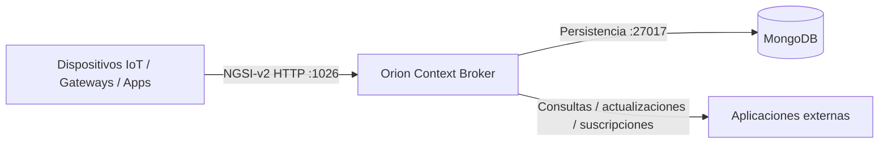
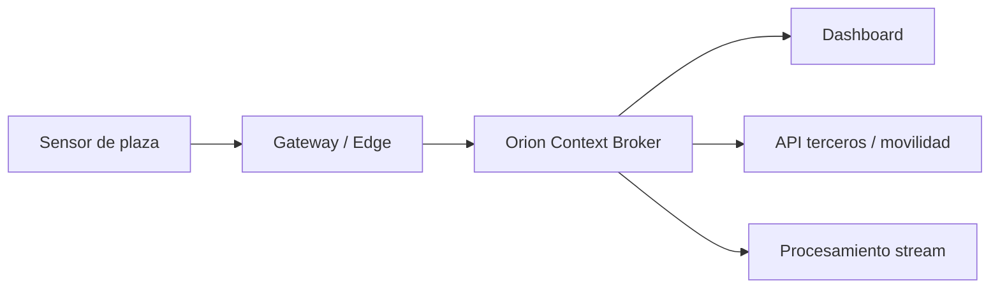

# Tema 4 - FIWARE: Plataforma de gestión de la IoT

## Contexto para agente IA

Este documento resume el contenido del Tema 4 para que un agente pueda usarlo como contexto técnico al diseñar, justificar o implementar el proyecto final de IoT. El foco está en FIWARE como plataforma de gestión de contexto para sistemas IoT, especialmente mediante Orion Context Broker y la API NGSI-v2.

## Ideas clave

- En sistemas IoT no basta con capturar datos: hay que gestionar dispositivos, datos y contexto de forma escalable y accesible.
- FIWARE es un ecosistema open source impulsado por la Unión Europea para construir soluciones inteligentes de IoT y smart cities.
- El componente central de FIWARE es Orion Context Broker.
- Orion gestiona información de contexto en tiempo real.
- FIWARE modela la información mediante entidades y atributos.
- La interacción con Orion se realiza mediante una API REST basada en NGSI.
- En esta asignatura se trabaja con NGSI-v2.

## Conceptos básicos

### FIWARE

FIWARE proporciona herramientas, estándares y componentes para desarrollar aplicaciones inteligentes basadas en IoT, big data y análisis de datos. Su objetivo es facilitar soluciones eficientes, interoperables y escalables.

### Contexto

En FIWARE, el contexto es la información actual sobre entidades relevantes del sistema. En un proyecto de smart parking, por ejemplo, el contexto puede incluir:

- Plaza de aparcamiento.
- Sensor asociado.
- Estado de ocupación.
- Ubicación.
- Nivel de batería.
- Última actualización.
- Confianza de la medición.

### Entidad

Una entidad representa un objeto físico o conceptual del mundo real.

Ejemplos:

- `ParkingSpot`
- `ParkingSensor`
- `StreetSegment`
- `Gateway`
- `ParkingZone`

### Atributo

Un atributo es una propiedad de una entidad.

Ejemplos:

- `status`: libre, ocupada, desconocida.
- `location`: coordenadas.
- `batteryLevel`: porcentaje.
- `temperature`: valor ambiental.
- `lastSeen`: fecha y hora de última comunicación.

## Arquitectura básica FIWARE

Un despliegue básico incluye:

- Aplicaciones o dispositivos externos que envían y consultan datos.
- Orion Context Broker como gestor de contexto.
- MongoDB como base de datos para persistencia de contexto.
- API REST NGSI-v2 como interfaz de comunicación.



## Orion Context Broker

Orion es el componente encargado de:

- Crear entidades.
- Consultar entidades.
- Actualizar atributos.
- Eliminar entidades.
- Notificar cambios mediante suscripciones.
- Mantener la información de contexto actualizada.

## NGSI-v2

NGSI-v2 es la especificación REST usada para interactuar con Orion. Permite operaciones CRUD sobre entidades y atributos.

Operaciones habituales:

- Crear entidad.
- Consultar entidad por `id`.
- Consultar entidades por `type`.
- Actualizar atributos.
- Eliminar entidad.
- Crear suscripciones para notificar cambios.

## Aplicación al proyecto smart parking

Para el proyecto final, FIWARE puede actuar como capa de gestión de contexto entre la sensorización y las aplicaciones consumidoras.

### Entidades recomendadas

#### `ParkingSpot`

Representa una plaza de aparcamiento.

```json
{
  "id": "ParkingSpot:UCLM:001",
  "type": "ParkingSpot",
  "status": {
    "type": "Text",
    "value": "free"
  },
  "location": {
    "type": "geo:json",
    "value": {
      "type": "Point",
      "coordinates": [-1.8585, 38.9943]
    }
  },
  "lastUpdated": {
    "type": "DateTime",
    "value": "2026-05-16T10:00:00Z"
  }
}
```

#### `ParkingSensor`

Representa un sensor físico desplegado en una plaza o zona.

```json
{
  "id": "ParkingSensor:UCLM:001",
  "type": "ParkingSensor",
  "sensorType": {
    "type": "Text",
    "value": "magnetic"
  },
  "batteryLevel": {
    "type": "Number",
    "value": 87
  },
  "assignedSpot": {
    "type": "Relationship",
    "value": "ParkingSpot:UCLM:001"
  }
}
```

## Patrón de integración recomendado

1. El sensor mide ocupación.
2. El gateway valida, filtra o agrega el dato.
3. El gateway actualiza la entidad correspondiente en Orion mediante NGSI-v2.
4. Orion mantiene el contexto actualizado.
5. Las aplicaciones consultan Orion o reciben notificaciones por suscripción.
6. Un componente de streaming, como Apache Flink, puede procesar eventos si se requiere analítica en tiempo real.



## Decisiones que debe justificar el agente

Al usar FIWARE en una propuesta técnica, justificar:

- Por qué se usa un broker de contexto en lugar de una base de datos directa.
- Cómo se modelan entidades y atributos.
- Qué datos se guardan como contexto actual y qué datos se derivan a histórico o analítica.
- Cómo se gestionan cambios frecuentes de estado.
- Qué consumidores reciben datos por consulta y cuáles por suscripción.
- Cómo se escala Orion y MongoDB en escenario ciudad.

## Riesgos y consideraciones

- Orion gestiona contexto actual; para históricos masivos conviene integrar otros componentes.
- MongoDB debe dimensionarse correctamente.
- Las suscripciones pueden generar alto volumen de notificaciones si el estado cambia muy rápido.
- Es necesario validar datos en edge para evitar ruido, duplicados o falsas detecciones.
- Hay que definir identificadores estables para entidades.
- La API expuesta a terceros debe tener autenticación, autorización y control de cuota.

## Checklist para el proyecto final

- [ ] Definir entidades principales: plazas, sensores, zonas, gateways.
- [ ] Definir atributos mínimos de cada entidad.
- [ ] Especificar API NGSI-v2 usada para crear, consultar y actualizar contexto.
- [ ] Incluir Orion Context Broker en el diagrama de arquitectura.
- [ ] Incluir MongoDB como persistencia de contexto.
- [ ] Explicar el flujo sensor -> edge -> Orion -> consumidores.
- [ ] Añadir suscripciones para notificación de cambios.
- [ ] Separar contexto actual de históricos y analítica.
- [ ] Justificar escalabilidad para piloto y ciudad.

## Referencia

- FIWARE Foundation. "Getting Started With NGSI-v2". https://fiware-tutorials.readthedocs.io/en/latest/getting-started.html
