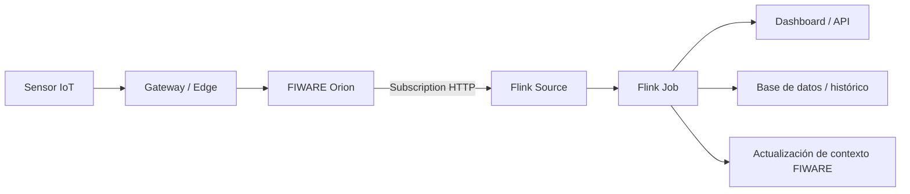

# Tema 5 - Apache Flink: streaming, ventanas, sinks e integración con FIWARE

## Contexto para agente IA

Este documento resume el Tema 5 para que un agente pueda usarlo como contexto técnico al diseñar el procesamiento en tiempo real del proyecto final de IoT. El foco está en Apache Flink como motor de procesamiento de flujos, especialmente cuando FIWARE genera notificaciones frecuentes mediante suscripciones.

## Ideas clave

- FIWARE permite notificar cambios de contexto mediante `subscriptions`.
- En entornos IoT, los cambios pueden llegar como flujo continuo de eventos.
- Cuando el volumen o frecuencia de datos crece, una aplicación tradicional puede no ser suficiente.
- Apache Flink permite procesar flujos en tiempo real y escalar a grandes volúmenes.
- Flink puede integrarse con FIWARE recibiendo notificaciones HTTP desde Orion.
- Las ventanas permiten agregar eventos por intervalos de tiempo o actividad.

## Por qué usar Apache Flink

Apache Flink es útil cuando el sistema necesita:

- Procesamiento en tiempo real.
- Agregaciones sobre flujos continuos.
- Escalabilidad horizontal.
- Baja latencia.
- Cálculos por ventanas temporales.
- Detección de anomalías o eventos compuestos.
- Enriquecimiento de datos antes de almacenarlos o publicarlos.

En el proyecto smart parking, Flink puede procesar:

- Ocupación por zona.
- Porcentaje de plazas libres.
- Tiempo medio de ocupación.
- Detección de sensores que no comunican.
- Cambios anómalos o inconsistentes.
- Predicción o estimación de disponibilidad.

## Integración FIWARE -> Flink

FIWARE puede enviar notificaciones a Flink mediante una suscripción configurada en Orion. Flink debe disponer de un `source` capaz de recibir o consumir esos eventos.



## Conceptos de Flink

### Source

Entrada de datos del programa Flink.

Ejemplos:

- Endpoint HTTP que recibe notificaciones de Orion.
- Cola Kafka.
- MQTT.
- Archivo o generador de datos para prototipo.

### Stream

Secuencia continua de eventos.

En smart parking, un evento podría ser:

```json
{
  "spotId": "ParkingSpot:UCLM:001",
  "zoneId": "Zone:UCLM:A",
  "status": "occupied",
  "timestamp": "2026-05-16T10:00:00Z",
  "confidence": 0.97
}
```

### Transformación

Operación aplicada sobre el flujo.

Ejemplos:

- `map`: transformar un evento.
- `filter`: descartar eventos inválidos.
- `keyBy`: agrupar por clave.
- `window`: definir ventanas.
- `reduce`, `aggregate`, `process`: calcular resultados.

### Sink

Destino de salida.

Ejemplos:

- Base de datos.
- API REST.
- Dashboard.
- Kafka.
- Actualización de entidad FIWARE.
- Almacenamiento histórico.

## Operaciones con ventanas

Las ventanas agrupan eventos para poder calcular agregados.

### Tumbling Windows

Ventanas fijas sin solapamiento.

Uso recomendado:

- Calcular ocupación media cada 5 minutos.
- Generar métricas periódicas por zona.

### Sliding Windows

Ventanas solapadas.

Uso recomendado:

- Calcular la disponibilidad de los últimos 10 minutos cada minuto.
- Suavizar métricas en tiempo casi real.

### Session Windows

Ventanas basadas en actividad.

Uso recomendado:

- Modelar sesiones de ocupación de una plaza.
- Medir duración de estacionamientos.

### Global Windows

Ventanas sobre todo el flujo, normalmente con disparadores explícitos.

Uso recomendado:

- Contadores acumulados.
- Métricas globales con lógica personalizada.

## Patrón típico de ventana en Flink

1. Agrupar eventos con `keyBy`.
2. Definir ventana con `window`.
3. Aplicar agregación con `reduce`, `aggregate` o `process`.
4. Emitir resultado hacia uno o varios `sinks`.

Ejemplo conceptual:

```scala
sensorTempData
  .keyBy(_.id)
  .window(SlidingProcessingTimeWindows.of(Time.seconds(10), Time.seconds(5)))
  .process(new AverageSlideWindowTemp)
```

Función de procesamiento:

```scala
class AverageSlideWindowTemp
  extends ProcessWindowFunction[
    SensorTempReading,
    AverageSensorTempReading,
    String,
    TimeWindow
  ] {
  override def process(
    key: String,
    context: Context,
    elements: Iterable[SensorTempReading],
    out: Collector[AverageSensorTempReading]
  ): Unit = {
    val sum = elements.map(_.temperature).sum
    val count = elements.size
    val average = sum / count
    out.collect(AverageSensorTempReading(key, average))
  }
}
```

## Aplicación al proyecto smart parking

### Procesamientos recomendados

- Calcular plazas libres por zona cada 30 segundos.
- Calcular ocupación media por zona cada 5 minutos.
- Detectar sensores inactivos si no comunican en un intervalo.
- Filtrar cambios repetidos sin variación real.
- Detectar plazas con cambios demasiado frecuentes.
- Generar eventos agregados para el dashboard.
- Generar alertas para mantenimiento.

### Ejemplo de agregación por zona

Entrada:

```json
{
  "spotId": "ParkingSpot:UCLM:001",
  "zoneId": "Zone:UCLM:A",
  "status": "free",
  "timestamp": "2026-05-16T10:00:00Z"
}
```

Salida agregada:

```json
{
  "zoneId": "Zone:UCLM:A",
  "freeSpots": 42,
  "occupiedSpots": 118,
  "occupancyRate": 0.738,
  "windowStart": "2026-05-16T10:00:00Z",
  "windowEnd": "2026-05-16T10:01:00Z"
}
```

## Ejecución de ejemplo de la asignatura

Repositorio:

```bash
git clone https://github.com/franciscodelicado/MUBDyCN-ICA-Flink-Examples.git
cd MUBDyCN-ICA-Flink-Examples/5th-Example
```

Compilación y despliegue:

```bash
./mvn8.sh clean package -DskipTests
docker compose up -d
JOB_ID=$(./launchjarinflink.sh target/5th-Example-1.0-SNAPSHOT.jar example.org.StreamingJob)
```

Monitorización:

```bash
docker logs -f flink-taskmanager
```

Cancelación del job:

```bash
docker exec -it flink-jobmanager flink cancel ${JOB_ID}
```

## Decisiones que debe justificar el agente

- Si Flink se usa en piloto o solo en escenario ciudad.
- Qué eventos procesa Flink y cuáles se gestionan solo en FIWARE.
- Qué ventanas se usan y por qué.
- Qué latencia se espera.
- Qué sinks reciben resultados.
- Cómo se evitan duplicados, eventos fuera de orden o datos corruptos.
- Cómo se monitoriza el pipeline.

## Riesgos y consideraciones

- Un diseño con demasiadas notificaciones desde Orion puede saturar la capa de procesamiento.
- Si se usa tiempo de procesamiento en lugar de tiempo de evento, los retrasos de red pueden distorsionar las métricas.
- El prototipo puede simular eventos, pero la memoria debe explicar cómo se conectaría con sensores reales.
- Los datos agregados no sustituyen al contexto actual mantenido por FIWARE.
- Para escenario ciudad puede ser recomendable introducir Kafka o un broker intermedio entre FIWARE y Flink.

## Checklist para el proyecto final

- [ ] Definir eventos de entrada de parking.
- [ ] Definir si Flink recibe datos desde FIWARE, MQTT, Kafka o simulador.
- [ ] Seleccionar ventanas para métricas de ocupación.
- [ ] Definir agregaciones por zona y por intervalo.
- [ ] Definir sinks: dashboard, histórico, API o FIWARE.
- [ ] Explicar escalabilidad del procesamiento.
- [ ] Incluir tratamiento de errores y sensores inactivos.
- [ ] Justificar latencia esperada.

## Referencias

- Apache Flink. "Windows". https://nightlies.apache.org/flink/flink-docs-release-1.20/docs/dev/datastream/operators/windows/
- Fabian Hueske y Vasiliki Kalavri. "Stream Processing with Apache Flink: Fundamentals, Implementation, and Operation of Streaming Applications". O'Reilly Media, 2020.
